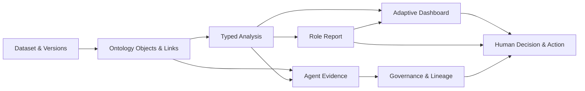

# 제품 개요

## 해결하려는 문제

일반적인 Dashboard 도구는 데이터를 정해진 카드와 차트에 연결하지만 다음 질문에는 충분히 답하지 못한다.

- 임원과 실무자가 같은 첫 화면을 봐야 하는가?
- 보고서의 문장과 판단 근거가 실제 데이터·시각화와 연결돼 있는가?
- Dataset과 업무 Domain이 바뀌었을 때 화면 자체가 달라지는가?
- 같은 역할의 사용자도 자신의 화면을 유지할 수 있는가?
- AI 답변과 운영 판단의 근거, 버전과 행동 이력을 추적할 수 있는가?

Ontology Dashboard는 이 문제를 하나의 연결된 제품 흐름으로 검증한다.

## 제품 흐름



## 역할 모델

| 역할 | 로그인 첫 화면 | 주된 질문 | 주요 행동 |
|---|---|---|---|
| 조직 관리자 | Admin Control Plane | 누가 어떤 범위와 권한을 갖는가 | 가입 승인, 역할·권한·scope 관리 |
| 임원 Viewer | Reports | 조직 위험과 운영 영향은 무엇인가 | 보고서 검토, Dashboard drill-down |
| 운영 매니저 | Reports | 무엇을 우선 처리하고 누가 맡아야 하는가 | 보고서 검토, 판단과 에스컬레이션 |
| 도메인 엔지니어 | Dashboards | 어떤 신호가 왜 비정상적인가 | 분석, 근거 검토, 보고서 작성 |
| 현장 작업자 | Dashboards | 어떤 작업을 어떤 절차로 해야 하는가 | 체크리스트, 측정, 작업 기록 |
| 품질·감사 Viewer | Reports | 근거와 버전, 행동 이력이 추적되는가 | Evidence·Lineage·감사 확인 |
| 데이터 사이언티스트 | Dashboards | 모델과 Dataset은 신뢰 가능한가 | Threshold·Slice·Drift 검증 |
| FDE | Dashboards | 고객 workflow와 Ontology가 올바르게 연결됐는가 | Binding, Template, Integration 진단 |

## 제품의 세 가지 핵심

### 1. 역할별 업무 산출물 중심 화면

임원과 운영 매니저는 Dashboard의 모든 세부 정보를 먼저 탐색하는 대신, 실무자가 원래 작성해야 했던 보고서 형태를 메인으로 본다. 보고서 문장, Evidence field, 추세와 기여 요인이 연결되어 있으며 상세 분석은 Dashboard로 이동한다. 문서 번호, 발행일, 의사결정 요약, 후속 조치와 Print/PDF 레이아웃을 포함해 회의 자료로 검토할 수 있는 형태를 지향한다.

실무자는 Dashboard가 메인이며, 분석 결과를 공용 보고서 revision으로 저장할 수 있다.

### 2. Dataset schema 기반 UI Composition

화면을 Dataset 이름만 바꿔 재사용하지 않는다. 다음 신호로 Board Catalog를 조합한다.

```text
시간 필드 + 수치 필드
→ 시계열·이상 타임라인

관계 Projection
→ Ontology Relationship

문서·Vector 신호
→ Evidence Table·Planner Assistant

Prediction·Risk 신호
→ Factor Contribution·Model Details

품질 오류
→ Data Quality Warning
```

### 3. Role Default와 Personal Preference의 분리

```text
Role Template
→ 사용자의 최초 기본 화면

User Preference
→ Board 배치·즐겨찾기·Filter·시각화·Display 설정
```

로그인 Landing은 역할 정책을 따르며, Dashboard 내부 구성은 사용자별로 복원된다.

## 제품 경계

현재 저장소는 운영 흐름과 제품 구조를 검증하는 MVP다.

- 실제 설비 제어를 수행하지 않는다.
- 예측과 권고는 사람의 검토가 필요하다.
- Forecast UI는 실제 Prediction Result Contract 연결을 전제로 한다.
- 외부 Graph·LLM·Managed DB는 환경이 없을 때 로컬 deterministic fallback을 사용한다.
- 내부 관리자 알림은 구현됐지만 이메일·Slack 전송은 후속 통합이다.

