# 구현 기능 화면 투어

> 브라우저 인터랙티브 버전: `http://127.0.0.1:3100/team-share`
>
> 전체 HTML Story 캡처: [`assets/screenshots/00-team-share-story.png`](./assets/screenshots/00-team-share-story.png)

모든 이미지는 Playwright 격리 DB와 demo seed에서 1440×1000 화면으로 생성했다. 재생성 명령은 문서 마지막에 있다.

## 인터랙티브 Story

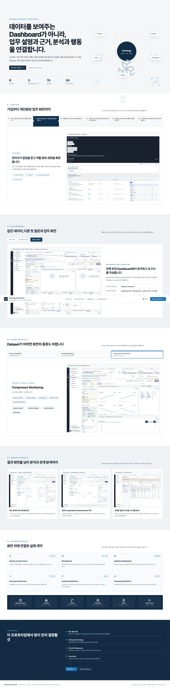

`/team-share`는 아래 기능을 제공한다.

- 현재 섹션을 표시하는 Sticky Navigation
- `#user-flow`, `#roles`, `#adaptive`, `#workbenches`, `#capabilities` Deep Link
- 캡처 클릭 확대와 원본 열기
- 검증 Tag·날짜·테스트 결과
- 역할·Dataset·User Flow 탭
- 팀 리뷰 양식 복사

모바일 검증 화면:

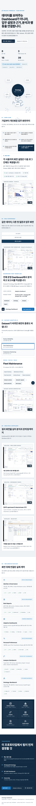

## 1. 가입자가 희망 역할을 요청한다

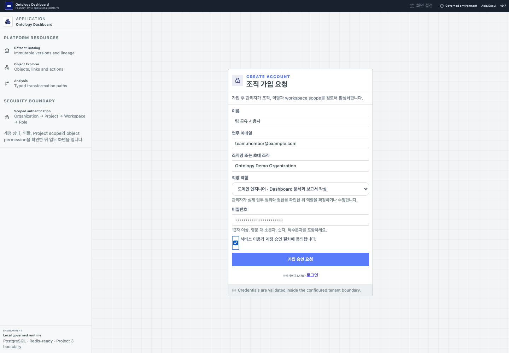

구현 내용:

- 이름, 업무 이메일, 조직, 비밀번호 입력
- 임원·매니저·엔지니어·현장·감사·데이터 사이언티스트·FDE 역할 요청
- `tenant_admin` 자체 요청 차단
- 가입 상태를 즉시 활성화하지 않고 `pending_approval`로 저장

핵심 파일: `web/src/features/auth/RegisterPage.tsx`, `api/ontology_dashboard/identity_models.py`

## 2. 승인 전에는 로그인할 수 없다

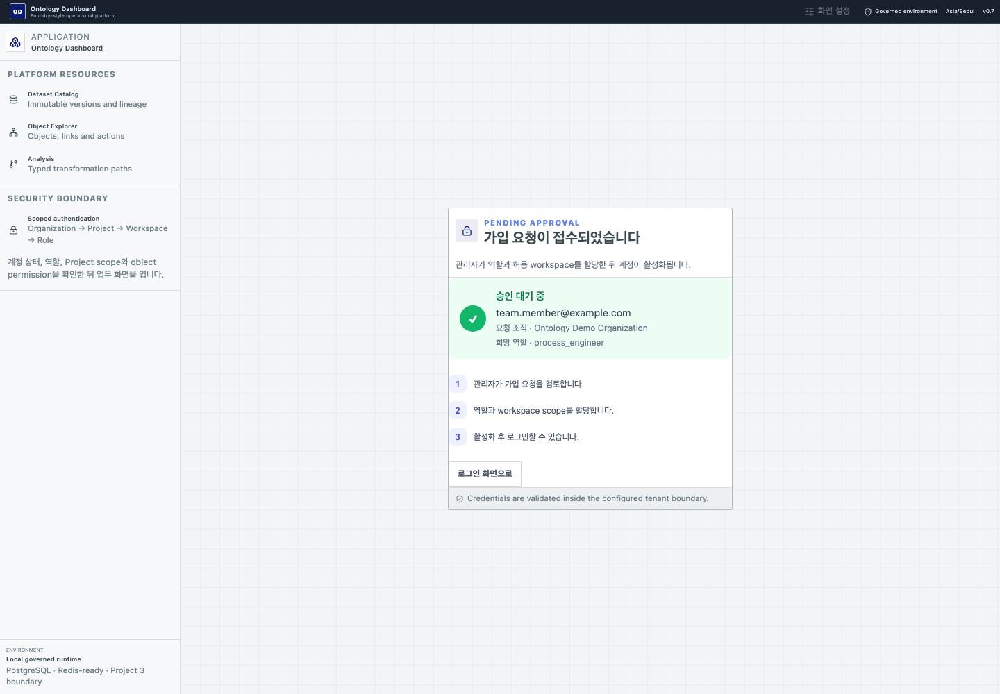

가입 요청 조직과 희망 역할을 표시한다. 승인 전 로그인은 서버에서 `pending_approval` 오류로 차단된다.

## 3. 관리자에게 가입 알림이 생성된다

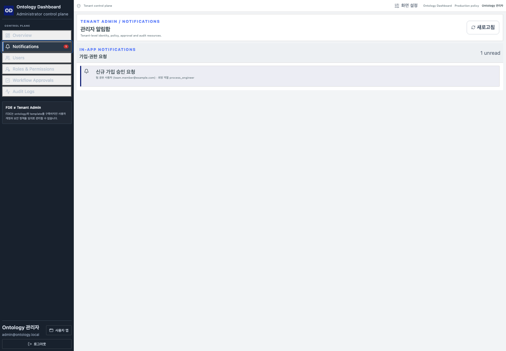

구현 내용:

- `admin_notifications`에 가입 요청 영속 저장
- 미확인 알림 수 표시
- 가입자·이메일·희망 역할 확인
- 알림 선택 시 사용자 승인 화면으로 이동

외부 이메일이나 Slack 알림은 포함하지 않는다.

## 4. 관리자가 역할·Workspace·개별 권한을 확정한다

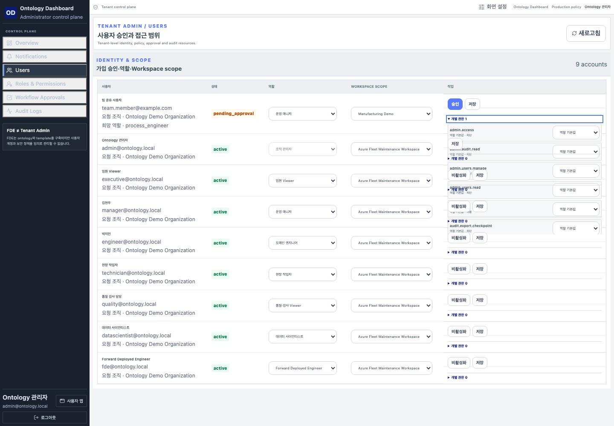

관리자는 요청 역할을 그대로 승인하거나 변경할 수 있고, Workspace scope와 권한 override를 설정한다.

```text
역할 기본값 / 개별 허용 / 개별 차단
```

관리자 자기 잠금과 알 수 없는 permission은 서버에서 차단된다.

## 5. 운영 매니저와 임원은 Reports로 진입한다

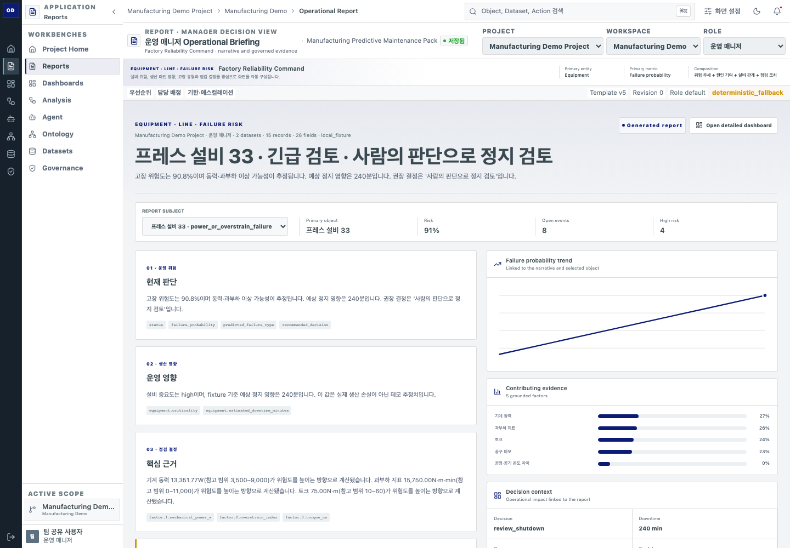

보고서에는 다음이 함께 표시된다.

- 텍스트 제목·요약·섹션
- 섹션별 Evidence field ID
- Primary metric 추세
- Contributing evidence
- Decision context
- 위험도, 미종결·고위험 Event 수
- 담당자, Downtime, Confidence

핵심 파일: `web/src/features/reports/RoleReportWorkbench.tsx`

## 6. 보고서에서 상세 Dashboard로 내려간다

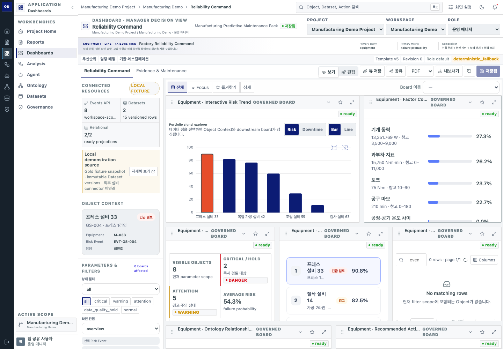

`Open detailed dashboard`는 같은 Project와 Workspace 범위를 유지한다. 다음 로그인에서는 마지막 화면이 아니라 역할 정책에 따라 다시 Reports로 진입한다.

## 7. 엔지니어는 Dashboard로 진입한다

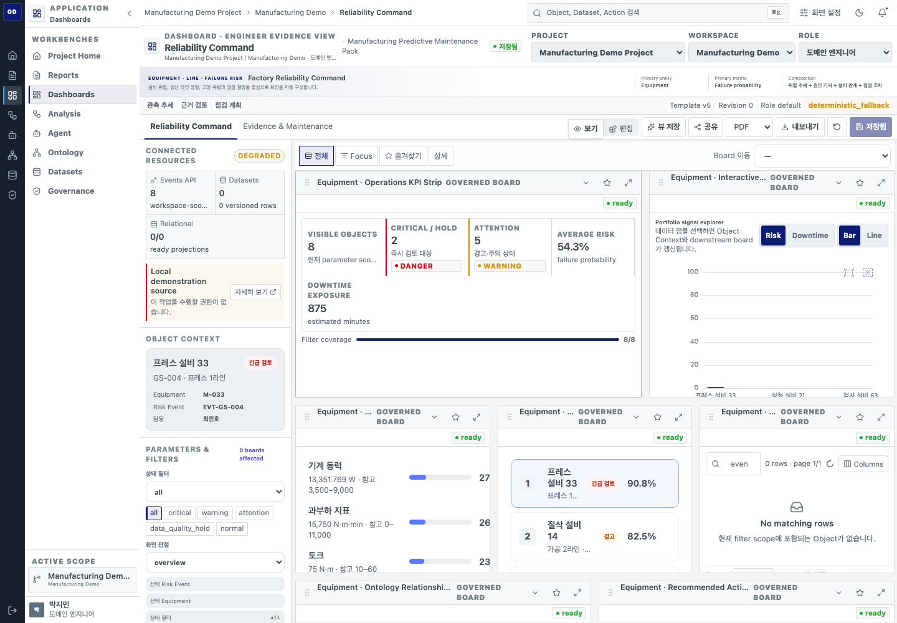

엔지니어는 설비 상태, 위험 추세, 원인 기여, 관계와 점검 조치를 먼저 본다. Analysis, Ontology와 Dataset으로 근거를 확장할 수 있다.

## 8. 실무자는 공용 보고서를 수정한다

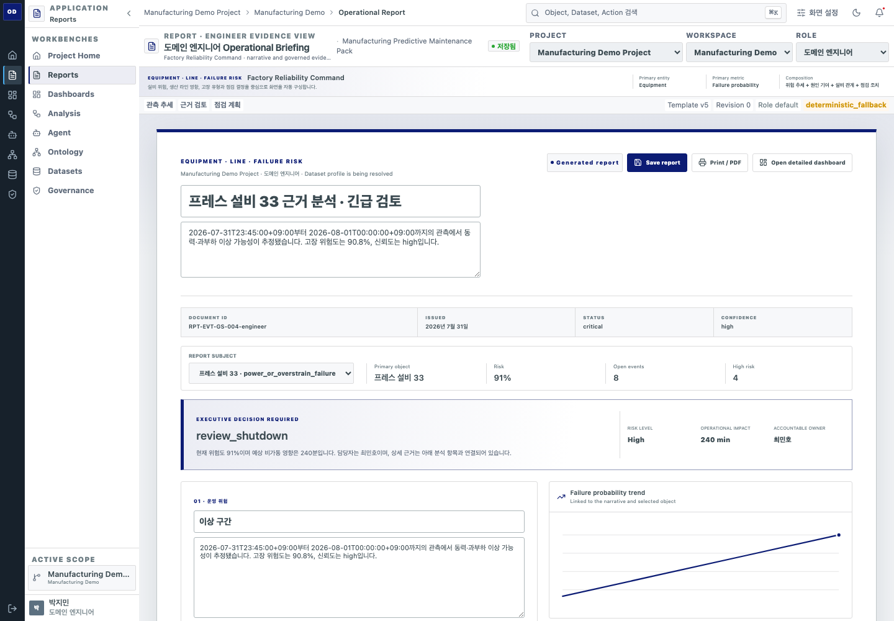

수정 가능 항목:

- 보고서 제목과 전체 요약
- 섹션 제목과 본문
- 기존 Evidence field 연결 유지

저장 key는 `Organization + Project + Workspace + Event`이며 revision conflict를 감지한다. 매니저는 같은 수정본을 읽지만 편집 권한이 없으면 버튼이 나타나지 않는다.

## 9. 사용자별 Dashboard와 Display 설정을 저장한다

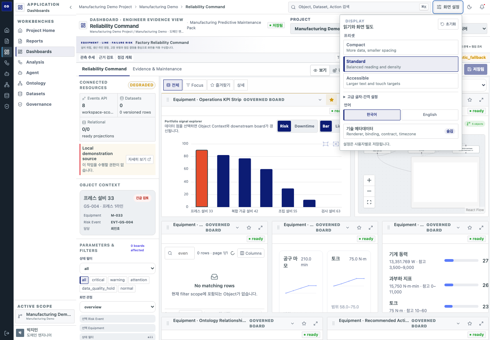

서버에 저장되는 Dashboard preference:

- Tab과 Board 구성
- 위치와 크기
- 숨김·즐겨찾기
- 개인 Board
- Parameter·Filter·시각화

계정에 저장되는 Display preference:

- Text size
- Density
- 기술 메타데이터 표시

같은 역할 사용자 간에도 설정이 격리된다.

## 10. 제조 Dataset은 Reliability 화면을 만든다

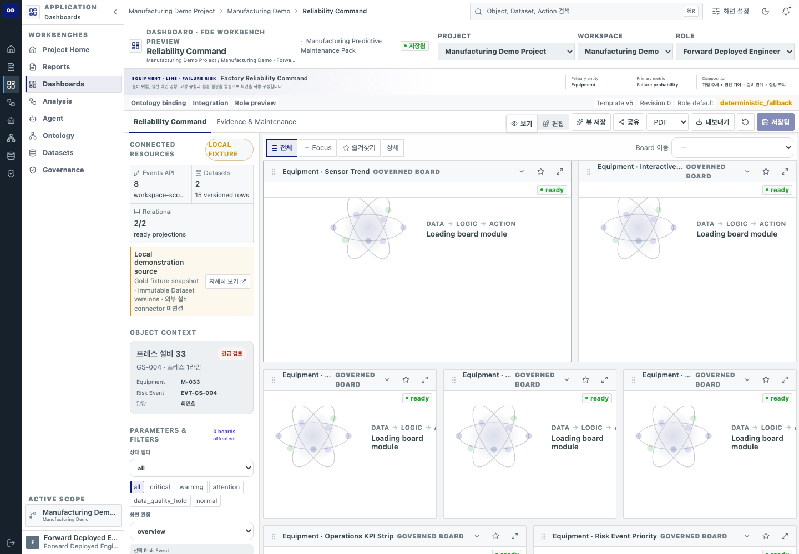

대표 구성:

- Operations KPI
- Risk Trend
- Factor Contribution
- Priority List
- Event Data Grid
- Ontology Relationship
- Recommended Actions

## 11. 차량 Dataset은 Fleet 화면을 만든다

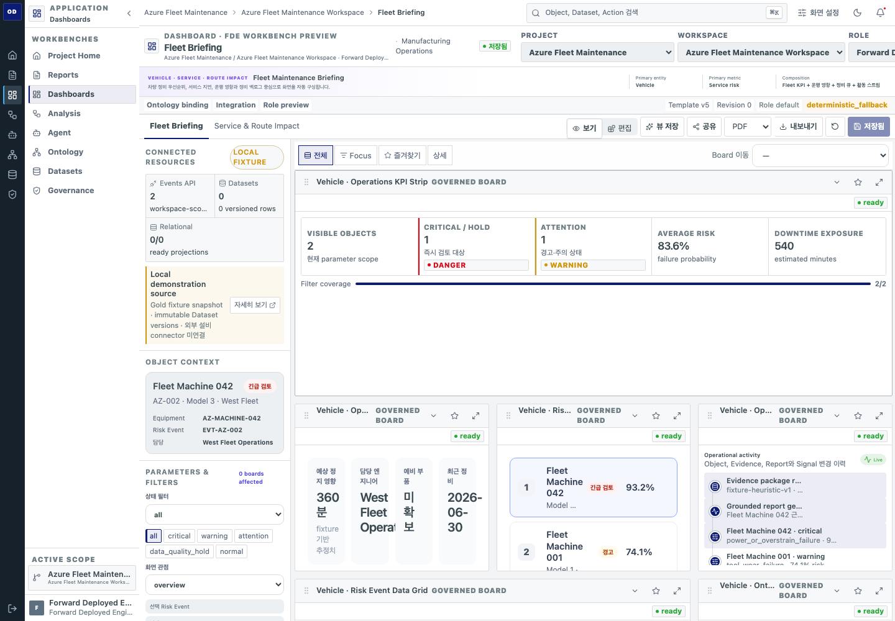

제조 화면과 Board definition이 다르며, Impact Summary, Maintenance Priority, Activity Stream과 Route·Service 영향 중심으로 구성된다.

## 12. 압축기 Telemetry는 시계열 중심 화면을 만든다

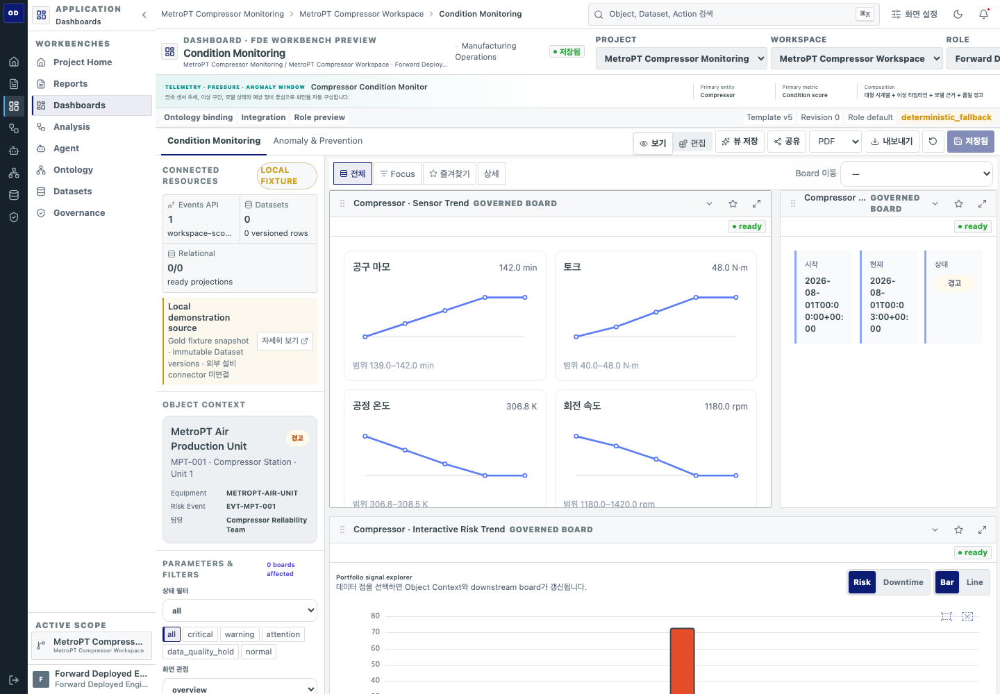

대표 구성:

- Sensor Line Chart
- Anomaly Timeline
- Model Details
- Evidence Table
- Data Quality Warning
- Preventive Action

구성 엔진: `web/src/features/manufacturing/adaptiveExperience.ts`

## 13. Analysis를 자유 배치 Canvas로 본다

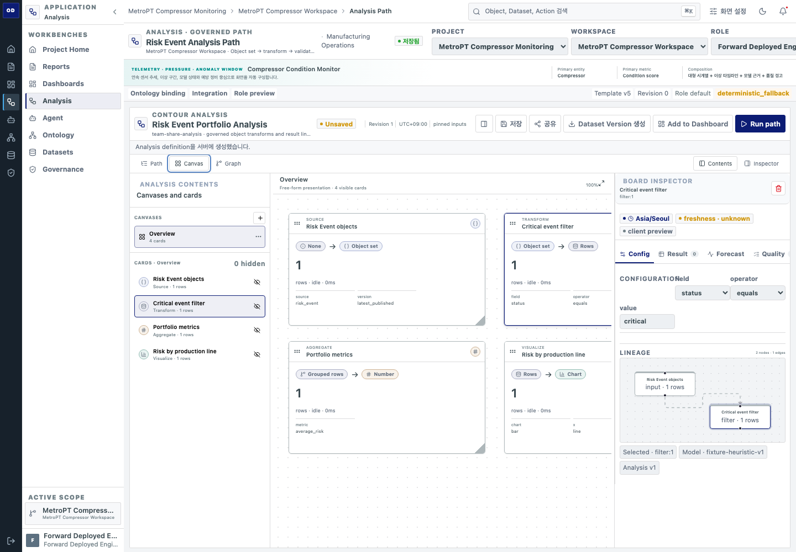

구현 내용:

- Typed DataPill
- Compatible next actions
- Multiple Canvas
- 카드 이동·크기 조절
- 계산용 노드 숨김
- 계산 정의와 표현 레이아웃 분리

## 14. 같은 Analysis를 Dependency Graph로 본다

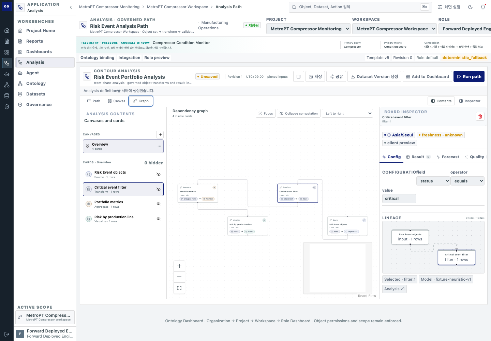

동일한 서버 `nodes/edges`를 Path, Canvas, Graph로 투영한다. 계산 노드를 접고 upstream/downstream과 Focus chain을 확인할 수 있다.

## 15. Ontology ObjectSet을 집합으로 조합한다

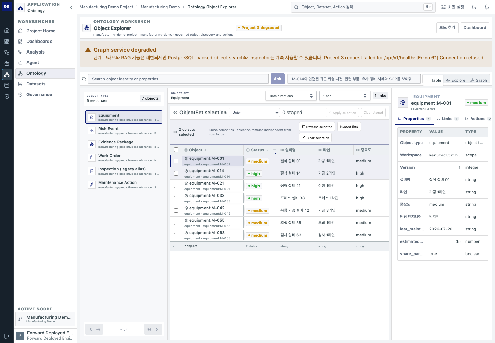

지원 연산:

- Replace
- Union
- Intersection
- Difference

선택 집합을 기준으로 여러 객체의 관계를 traversal하고 중복 Object와 Edge를 병합할 수 있다.

## 캡처 재생성

```bash
cd web
CAPTURE_TEAM_SHARE=1 \
PLAYWRIGHT_WEB_PORT=3260 \
PLAYWRIGHT_API_PORT=8260 \
npx playwright test e2e/team-share-captures.spec.ts --project=chromium
```

캡처는 코드와 테스트가 동작할 때만 갱신되므로 설명 문서와 실제 화면의 차이를 줄인다.

