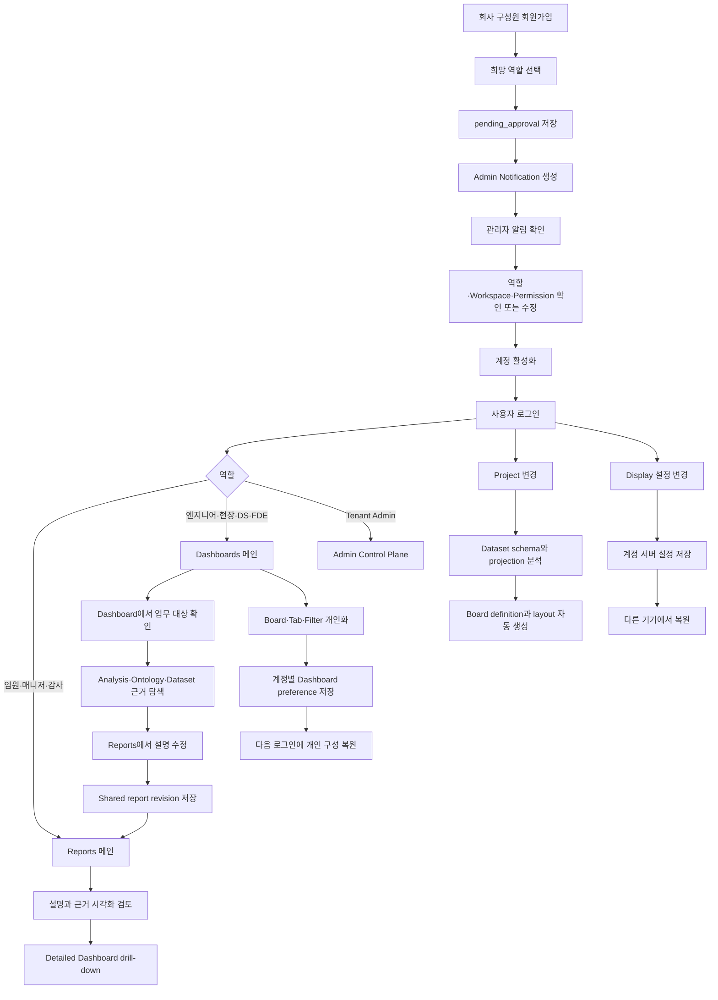

# Ontology Dashboard User Flow

이 문서는 기능 목록이 아니라, 회사 구성원이 가입한 뒤 관리자 승인을 받고 실제 업무를 수행하는 전체 흐름을 사용자 관점에서 설명한다.

## 1. 가입 요청

```text
회사 구성원이 회원가입 페이지에 접속
→ 이름·업무 이메일·조직명·비밀번호 입력
→ 본인이 희망하는 업무 역할 선택
→ 가입 승인 요청 제출
```

가입자가 선택할 수 있는 역할:

- 임원 Viewer
- 운영 매니저
- 도메인 엔지니어
- 현장 작업자
- 품질·감사 Viewer
- 데이터 사이언티스트
- FDE

`tenant_admin`은 가입자가 직접 요청할 수 없다. 조직 관리자 권한은 기존 관리자가 별도로 부여해야 한다.

가입 요청이 제출되면 계정은 즉시 활성화되지 않는다.

```text
status = pending_approval
requested_organization_name = 가입자가 입력한 조직
requested_role_code = 가입자가 선택한 희망 역할
```

승인 전 로그인은 차단된다.

## 2. 관리자 알림과 승인

가입 요청이 생성되면 관리자용 영속 알림이 함께 생성된다.

```text
신규 가입 요청
→ Admin Notification Center
→ 미확인 알림 badge 증가
→ 가입자 이름·이메일·희망 역할 표시
```

현재 알림은 애플리케이션 내부 Notification Center 방식이다. 이메일이나 Slack 전송이 없어도 관리자가 Admin Control Plane에 접속하면 신규 요청을 놓치지 않도록 구성되어 있다.

관리자는 알림을 선택해 `Admin > Users`로 이동한다.

```text
희망 역할 사전 선택
→ 관리자가 실제 역할 확인 또는 변경
→ Workspace scope 선택
→ 개별 permission 확인
→ 승인
```

관리자가 확정할 수 있는 항목:

- 계정 상태: pending / active / disabled
- 역할
- Workspace scope
- Project membership
- 역할 기본 권한
- 사용자별 permission override

개별 permission은 세 가지 상태를 지원한다.

```text
역할 기본값
개별 허용
개별 차단
```

예를 들어 같은 `process_engineer`라도 한 사용자에게는 `events.note`를 차단하거나, 별도로 `governance.read`를 허용할 수 있다.

관리자 본인의 핵심 관리자 권한을 차단해 스스로 잠기는 변경은 서버에서 거부한다.

승인이 완료되면 가입 알림은 읽음 처리되고 모든 변경은 관리자 감사 로그에 기록된다.

## 3. 역할별 로그인 메인 화면

로그인 landing과 마지막 방문 화면은 서로 분리되어 있다.

Dashboard 안의 개인 배치와 필터는 복원되지만, 로그인 직후 메인 Workbench는 항상 역할 정책을 따른다.

```text
임원 Viewer
운영 매니저
품질·감사 Viewer
→ Reports 메인
```

```text
도메인 엔지니어
현장 작업자
데이터 사이언티스트
FDE
→ Dashboards 메인
```

```text
조직 관리자
→ Admin Control Plane
```

따라서 운영 매니저가 이전 세션에서 Dashboard를 마지막으로 열었더라도 다음 로그인은 다시 Reports에서 시작한다. 엔지니어가 Reports를 마지막으로 열었더라도 다음 로그인은 Dashboard에서 시작한다.

## 4. 운영 매니저·임원 Report 흐름

```text
로그인
→ Reports 메인
→ 실무자가 작성한 공용 보고서 확인
→ 설명과 근거 시각화를 함께 검토
→ 더 자세한 분석이 필요하면 Open detailed dashboard
```

보고서에서 확인할 수 있는 정보:

- 보고서 제목과 요약
- 섹션별 설명
- 각 섹션이 참조한 Evidence field
- 위험 또는 상태 시계열
- 주요 기여 요인
- 권고 결정
- 담당자
- 예상 정지 시간
- 모델 신뢰도
- 현재 고위험·미종결 Event 수

`Open detailed dashboard`를 선택하면 동일한 Project, Workspace와 Event context를 유지한 채 Dashboard로 이동한다.

## 5. 엔지니어·실무자 업무 흐름

```text
로그인
→ Dashboard 메인
→ 위험·상태·작업 대상 확인
→ Analysis에서 계산과 의존성 검토
→ Ontology에서 연결 객체 탐색
→ Dataset version과 lineage 확인
→ Reports에서 업무 설명 작성
```

`events.note` 권한이 있는 실무자는 다음 내용을 수정할 수 있다.

- 보고서 제목
- 전체 요약
- 섹션 제목
- 섹션 본문

저장 흐름:

```text
Edit report
→ 설명 수정
→ Save report
→ shared report revision 증가
→ 운영 매니저·임원이 같은 revision 열람
```

Report는 다음 범위로 저장된다.

```text
Organization + Project + Workspace + Event
```

동시 수정 시 revision conflict를 감지해 한 사용자의 변경이 다른 사용자의 최신 수정본을 덮어쓰지 않도록 한다.

## 6. Project와 Dataset에 따른 화면 자동 구성

사용자가 Project를 변경하면 단순히 같은 Dashboard에 다른 데이터만 연결하지 않는다.

```text
Project 변경
→ Dataset Catalog 조회
→ 최신 Dataset version schema 조회
→ projection과 품질 상태 조회
→ semantic signal 추론
→ Board 종류·제목·배치 자동 생성
```

자동으로 분석하는 신호:

- 시간 필드
- 수치 필드
- 범주 필드
- 식별자 필드
- 위치·경로 필드
- 텍스트·문서 필드
- Graph projection 준비 여부
- Vector projection 준비 여부
- Relational projection 준비 여부
- Prediction·Risk 신호
- Anomaly 신호
- Quarantine·실패 등 품질 문제

이 신호를 사용해 기존 Board의 크기만 바꾸는 것이 아니라 `definition_id` 자체를 교체한다.

### 제조 설비 Project

```text
Operations KPI
Risk Trend
Factor Contribution
Priority List
Event Data Grid
Ontology Relationship
Recommended Actions
Activity Stream
```

### 차량 정비 Project

```text
Operations KPI
Impact Summary
Maintenance Priority
Activity Stream
Fleet Event Grid
Ontology Relationship
Recommended Actions
Planner Assistant
```

### 압축기 Telemetry Project

```text
Sensor Line Chart
Anomaly Timeline
Risk Trend
Model Details
Evidence Table
Data Quality Warning
Recommended Actions
Activity Stream
```

알려지지 않은 신규 Dataset도 이름만으로 정해진 화면을 선택하는 것이 아니라 schema의 시간·수치·범주·관계 신호를 기반으로 Generic Operations 구성을 만든다.

서버 Template의 필수 Board ID는 유지하므로 권한, 필수 Board 정책과 개인 preference 저장 계약은 깨지지 않는다. 대신 각 슬롯의 실제 Board definition, 제목, layout과 settings가 Dataset에 맞게 변경된다.

사용자가 이미 개인 Dashboard preference를 저장한 경우 자동 구성 엔진은 해당 화면을 덮어쓰지 않는다.

## 7. 사용자별 Dashboard Preference

같은 역할의 사용자는 처음에는 같은 Role Template과 Dataset 적응형 기본 구성을 받는다.

이후 사용자가 화면을 수정하면 다음 key로 서버에 저장된다.

```text
user_id + workspace_id + template_id
```

저장되는 항목:

- 활성 Tab
- Tab 순서와 구성
- Board 위치와 크기
- Board 숨김
- 즐겨찾기
- 개인 Board
- Parameter state
- Filter state
- 차트 종류와 Visualization settings

편집 후 1.4초 동안 추가 변경이 없으면 자동 저장된다. 다음 로그인에는 동일한 개인 Dashboard가 복원된다.

같은 역할을 가진 두 사용자라도 preference는 서로 격리된다.

```text
엔지니어 A가 개인 Board와 Filter 저장
→ 엔지니어 A에게만 복원

엔지니어 B 로그인
→ 역할 기본 화면
→ 엔지니어 A 설정 노출 안 됨
```

## 8. 계정 단위 Display Preference

Text size, Density, 기술 메타데이터 표시 설정도 사용자 계정에 저장된다.

```text
사용자가 Display 설정 변경
→ user_display_preferences 서버 저장
→ localStorage에는 오프라인 cache 저장
→ 다른 브라우저·기기에서 같은 계정 로그인
→ 서버 설정 복원
```

다른 사용자의 Display preference와도 격리된다.

## 9. 좌측 Navigation

어두운 Platform rail과 밝은 Resource navigation은 같은 순서로 구성된다.

```text
Project Home
Reports
Dashboards
Analysis
Agent
Ontology
Datasets
Governance
```

활성 아이콘과 활성 메뉴 행의 세로 중심선 차이는 Playwright에서 3px 이하로 검증한다.

## 10. 전체 User Flow



## 11. 구현 상태

| 핵심 요구사항 | 상태 |
|---|---|
| 가입 후 관리자 승인 | 구현 완료 |
| 가입자가 희망 역할 선택 | 구현 완료 |
| 관리자 신규 가입 알림 | 구현 완료 · In-app Notification Center |
| 관리자가 역할·scope 확인 및 수정 | 구현 완료 |
| 사용자별 permission 허용·차단 | 구현 완료 |
| 매니저·임원 Report 중심 로그인 | 구현 완료 |
| 엔지니어 Dashboard 중심 로그인 | 구현 완료 |
| Report 설명과 근거 시각화 연동 | 구현 완료 |
| 실무자 Report 편집과 관리자 열람 | 구현 완료 |
| Dataset schema 기반 Board 종류 자동 구성 | 구현 완료 |
| 사용자별 Dashboard preference 저장 | 구현 완료 |
| 같은 역할 사용자 간 preference 격리 | 구현 완료 |
| 다른 기기에서 Display preference 복원 | 구현 완료 |
| 좌측 양쪽 Navigation 정렬 | 구현 완료 |

## 12. 현재 핵심 범위 밖의 후속 기능

다음 항목은 이번 핵심 사용자 흐름의 미구현으로 분류하지 않으며, 별도 제품 범위로 관리한다.

- 가입 알림의 이메일·Slack 외부 전송
- Report 전체 revision history 조회 화면
- Report 정식 결재·반려·코멘트 workflow
- Report Action의 담당자 배정과 SLA 추적
- 조직 초대 링크와 요청 Project 사전 선택
