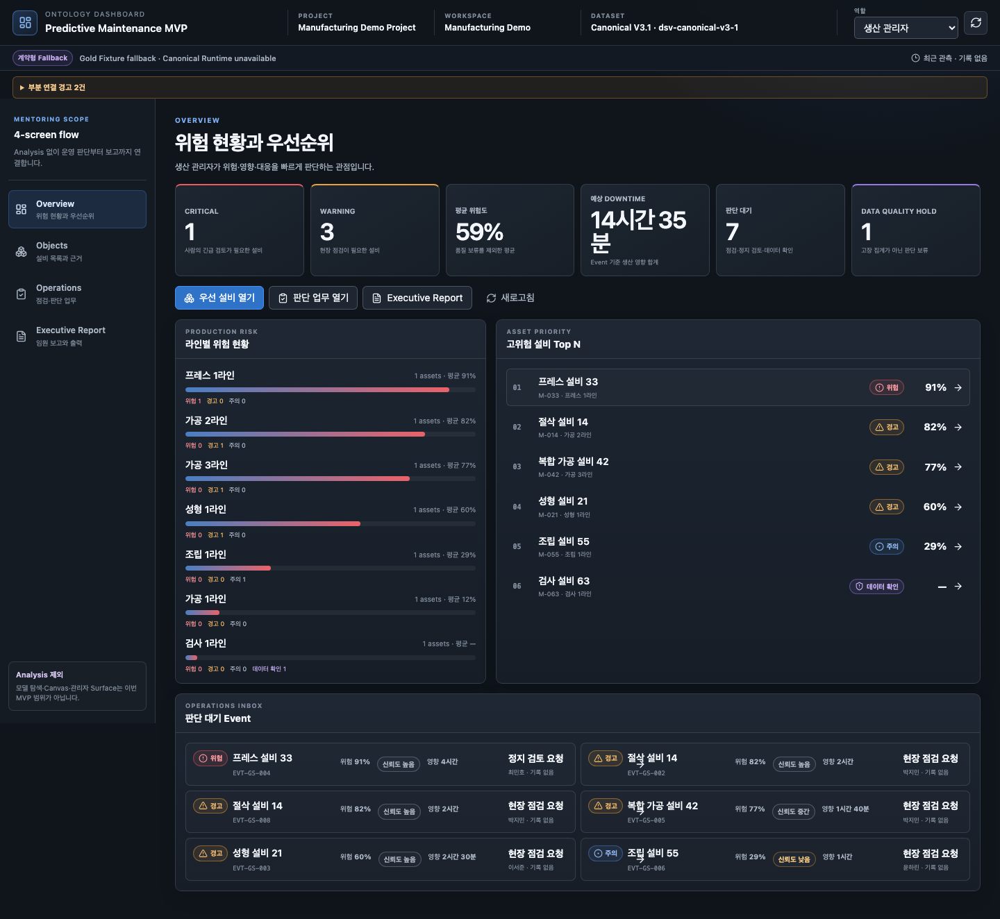
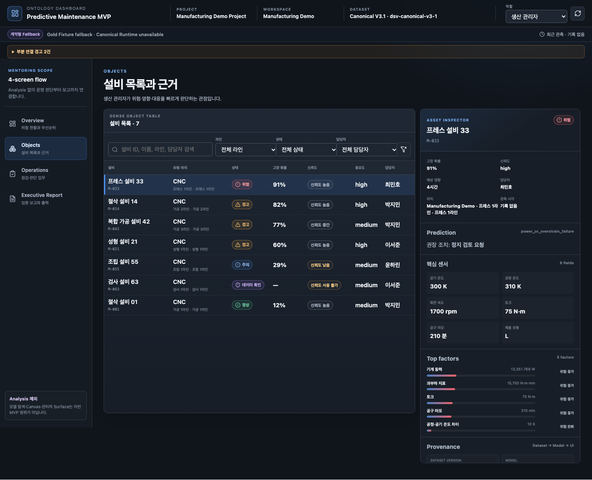
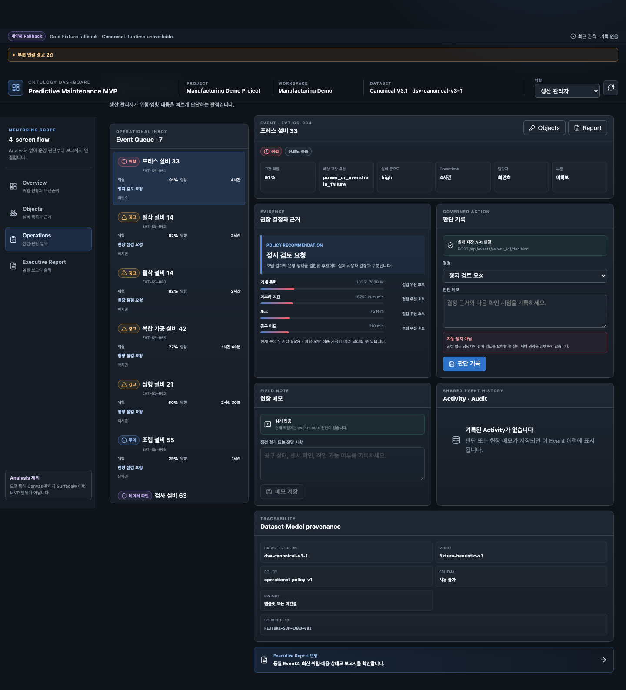
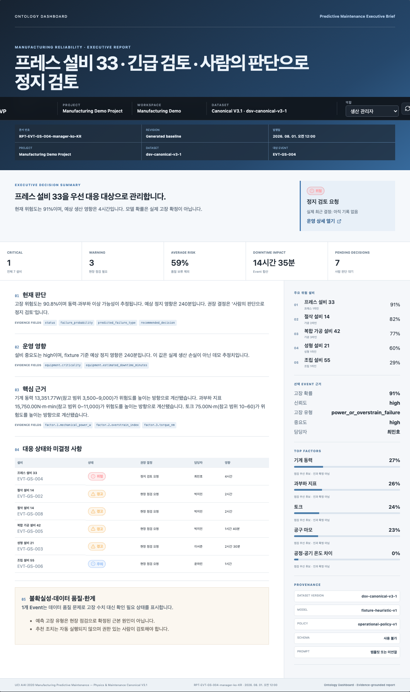
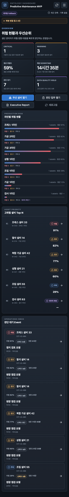

# Week 2 MVP 프론트엔드 통합·재구성 구현 보고서

- 구현 기준일: 2026-08-06
- 기준 브랜치: `feature/predictive-maintenance-adaptive-modeling`
- 신규 경로: `/app/projects/:projectId/mvp`
- 구현 범위: `Overview → Objects → Operations → Executive Report`
- 제외 범위: `Analysis`, 모델 작성 Canvas, 관리자 Control Plane, V4 상용화 기능

## 1. 결과 요약

기존 V1·V2·V3·V4 화면을 수정하거나 기본 경로로 덮어쓰지 않고, 멘토링 기준 최종 MVP를 별도 lazy-loaded route로 구현했다.

```text
/app/projects/:projectId/mvp
  ?view=overview
  ?view=objects&asset_id=...&event_id=...
  ?view=operations&asset_id=...&event_id=...
  ?view=executive-report&asset_id=...&event_id=...
```

화면 구조는 V2를 기준으로 삼고 다음 요소만 선별해 합쳤다.

| 출처 | 재사용한 요소 | MVP 적용 방식 |
|---|---|---|
| V1 | 임원 보고서 흐름 | 같은 Event·Evidence로 생성되는 A4 Executive Report View |
| V2 | Overview·Objects·Operations 정보 구조 | 네 화면의 기본 IA와 운영 흐름 |
| V3 | 고밀도 Table·Inspector | 가상 목록, 선택 설비 Inspector, Evidence·Provenance 패널 |
| V4 | Context·Navigation·부분 오류 격리 | Project/Workspace/Dataset/Role Context, 4개 메뉴, 패널 단위 실패 상태 |

## 2. 구현 파일 구조

```text
web/src/features/mvp/
├── MvpApplication.tsx
├── api/
│   ├── mvpContracts.ts
│   ├── mvpAdapters.ts
│   ├── mvpAdapters.test.ts
│   └── mvpApi.ts
├── components/MvpUi.tsx
├── context/
│   ├── MvpSelectionContext.tsx
│   └── MvpSelectionContext.test.ts
├── shell/MvpShell.tsx
├── overview/MvpOverviewPage.tsx
├── objects/MvpObjectsPage.tsx
├── operations/MvpOperationsPage.tsx
├── report/MvpExecutiveReportPage.tsx
└── mvp.css
```

라우팅은 `web/src/routing.ts`, `web/src/App.tsx`에 독립 경계로 추가했다. `MvpApplication`은 별도 chunk로 지연 로딩되므로 기존 초기 App Shell 번들에 전체 MVP 코드가 포함되지 않는다.

## 3. 데이터 연결과 Adapter 우선순위

프론트엔드는 Canonical 파일을 직접 읽지 않는다. API 응답을 MVP View Model로 정규화한다.

### 3.1 Bootstrap 우선순위

1. `GET /api/projects/{project_id}/workspaces/{workspace_id}/predictive-maintenance/dashboard`
2. `GET /api/projects/{project_id}/workspaces/{workspace_id}/predictive-maintenance/results/latest`
3. Canonical Runtime이 사용할 수 없을 때만 기존 `GET /api/projects/{project_id}/events` Gold Fixture API로 명시적 fallback

화면 상단에는 데이터 출처를 다음 중 하나로 표시한다.

- `실제 Result Artifact`
- `계약형 Fallback`

Fallback은 숨기지 않으며 부분 연결 경고에 실패 API와 원인을 표시한다.

### 3.2 Event 상세 우선순위

Event를 선택하면 다음 호출을 독립적으로 수행한다.

- Predictive Maintenance Dashboard selected detail
- `GET /api/events/{event_id}/evidence`
- `GET /api/events/{event_id}/report?use_llm=true`
- LLM 실패 시 `use_llm=false`
- 두 Report API가 모두 실패하면 검증된 Template Report
- `GET /api/events/{event_id}/activity`

Evidence·Report·Activity 중 하나가 실패해도 전체 화면은 유지되고 해당 패널과 경고만 실패 상태로 바뀐다.

## 4. URL·상태 계약

선택 상태 우선순위는 다음과 같다.

```text
URL Query > sessionStorage > 기본 선택
```

지원 Query:

- `view=overview|objects|operations|executive-report`
- `workspace_id`
- `asset_id`
- `event_id`
- `role=process_manager|field_operator`

직접 링크와 새로고침에서 선택 상태를 재현한다. 존재하지 않는 `asset_id` 또는 `event_id`는 임의의 다른 항목으로 바꾸지 않고 Safe Empty State를 표시한다. `view=analysis` 등 지원하지 않는 view는 `overview`로 정규화한다.

## 5. 화면별 구현

### 5.1 Overview

- Critical, Warning, 평균 위험도, 예상 Downtime, 판단 대기, Data Quality Hold KPI
- 라인별 평균 위험과 위험 등급 분포
- 고위험 설비 Top N
- 판단 대기 Event Inbox
- Objects·Operations·Executive Report 직접 이동

`data_quality_hold`는 고장 건수로 합산하지 않고 별도 판단 보류로 표시한다.

### 5.2 Objects

- 검색, 라인, 상태, 담당자 필터
- 설비 ID, 유형, 위치, 상태, 실패 확률, 신뢰도, 중요도, 담당자
- `@tanstack/react-virtual` 기반 고밀도 가상 목록
- 고정 Inspector에서 센서, Top factor, Failure Type, 권장 결정, Provenance 확인
- 낮은 신뢰도와 데이터 품질 보류를 별도 Callout으로 표시
- 연결 Event가 있을 때만 Operations 이동 활성화

### 5.3 Operations

- 위험 우선순위 Event Queue
- 예측·신뢰도·생산 영향·담당자·부품 상태
- Policy recommendation과 실제 사용자 Decision을 분리
- Decision enum 고정:
  - `continue_monitoring`
  - `request_inspection`
  - `review_shutdown`
  - `hold_for_data_check`
- 실제 저장 API:
  - Manager: `POST /api/events/{event_id}/decision`
  - Field operator: `POST /api/events/{event_id}/notes`
- Activity에서 Decision·Note·Conversation을 하나의 Audit Timeline으로 표시

`review_shutdown`은 자동 제어가 아니라 권한자의 정지 검토 요청임을 Action 입력 영역에 명시한다.

### 5.4 Executive Report

- 동일 Bootstrap·Event Detail View Model을 사용해 화면 간 숫자 불일치 방지
- 임원 요약, 현재 위험 수치, 주요 설비, 생산 영향, 대응 현황, 미결정 사항, 불확실성, Provenance
- LLM / Deterministic fallback / Verified template fallback 상태 표시
- Evidence field ID를 보고서 Section별로 표시
- `@page size: A4`와 Print 전용 CSS 제공

## 6. 역할·권한 경계

| 사용자 관점 | 우선 화면 | 실제 쓰기 기능 |
|---|---|---|
| 생산 관리자 | Overview, Operations, Executive Report | Decision API (`events.decision`) |
| 현장 담당자 | Objects, Operations | Note API (`events.note`) |

화면의 역할 Lens를 바꾸는 것과 로그인 사용자의 실제 권한은 분리했다. Role Lens가 바뀌어도 권한이 없는 API 버튼은 읽기 전용으로 유지된다.

## 7. 오류·빈 상태·성능

- Project/Workspace Bootstrap 실패: Route Error + Retry
- Canonical Runtime 실패: Gold Fixture fallback + 상단 경고
- Evidence/Report/Activity 실패: 패널 단위 Error 또는 Template fallback
- 잘못된 ID: Safe Empty State
- Low confidence: 확정 판단 금지 안내
- Data quality hold: 추론 억제 및 데이터 확인 안내
- Stale observation: 상단 Freshness 경고
- Object 목록: 가상화
- MVP: 독립 lazy chunk
- 초기 JS: `309.99 KiB / 310 KiB` 예산 통과

## 8. 검증 결과

### 8.1 Frontend

| 검증 | 결과 |
|---|---:|
| TypeScript lint | 통과 |
| Vitest 전체 | 17 files, 49 tests 통과 |
| MVP Adapter·Query 단위 테스트 | 10 tests 통과 |
| MVP E2E | 7 tests 통과 |
| 기존 V1·V2·V3·V4·비교 회귀 E2E | 11 tests 통과 |
| Production build | 통과 |
| Initial bundle gate | `309.99 KiB / 310 KiB` 통과 |

MVP E2E는 다음을 검증한다.

- Overview → Objects → Operations → Executive Report
- Analysis 메뉴 부재
- 실제 Manager Decision 저장
- 실제 Engineer Note 저장
- Direct URL·Reload 재현
- 잘못된 ID Safe Empty State
- Canonical API 부분 실패 격리
- LLM·Deterministic Report 실패 시 Template fallback
- 390px 모바일 문서 폭 초과 없음
- A4 Print mode
- V1·V2·V3·V4·비교 경로 보존

### 8.2 Backend

| 검증 | 결과 |
|---|---:|
| `tests/test_mvp.py` | 통과 |
| Predictive Maintenance Runtime capability | 통과 |
| Canonical V3.1 compatibility | 통과 |
| 합계 | 23 tests 통과 |

Starlette TestClient deprecation warning 1건은 기존 테스트 의존성 경고이며 이번 구현 실패가 아니다.

## 9. 시각 검증 산출물

공개 또는 로컬 주소에서 다음 명령으로 동일 스크린샷을 재생성한다.

```bash
cd web
MVP_CAPTURE_BASE_URL=https://dashboard.oosu.dev \
  node scripts/capture-mvp-evidence.mjs
```

생성 경로:

```text
docs/10-product/mentoring-mvp-2026-08/assets/week2-mvp-frontend-convergence/
├── 01-overview-desktop.png
├── 02-objects-inspector-desktop.png
├── 03-operations-desktop.png
├── 04-executive-report-a4.png
└── 05-overview-mobile.png
```

### Overview



### Objects · Inspector



### Operations



### Executive Report · A4



### Mobile · 390px



## 10. 기존 화면 보존

| 버전 | 경로 | 상태 |
|---|---|---|
| V1 | `/app/projects/:projectId` | 보존 |
| V2 | `/app/projects/:projectId/blueprint` | 보존 |
| V3 | `/app/projects/:projectId/blueprint-v2` | 보존 |
| V4 | `/app/projects/:projectId/blueprint-v4` | 보존 |
| 비교 | `/app/projects/:projectId/blueprint-compare` | 보존 |
| 최종 MVP | `/app/projects/:projectId/mvp` | 신규 |

## 11. 배포 주의사항

기존 Checkout에 다른 세션의 미커밋 변경이 있으면 `stash`, `reset`, 강제 checkout, 덮어쓰기를 수행하지 않는다. 이 경우 검증된 `web/dist`만 공개 서비스 경로에 원자적으로 교체하고 launchd 서비스를 재시작한다. API 소스 변경이 없는 이번 작업은 기존 API Checkout을 그대로 재시작·검증할 수 있다.
