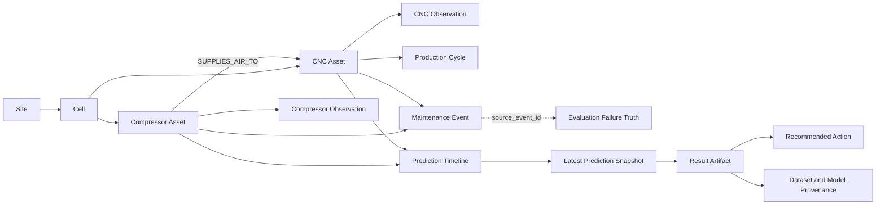

# Predictive Maintenance Canonical V3.1 Data Guide

## 문서 목적

이 문서는 GitHub Release로 배포된 `predictive_maintenance_canonical_v3.1.zip`에
어떤 데이터가 들어 있고, 각 파일이 어떤 키로 연결되며, Canonical source와
평가 정답·모델 결과를 왜 분리했는지 설명한다.

Release:

<https://github.com/oosuhada/agentic-ontology-dashboard/releases/tag/predictive-maintenance-canonical-v3.1-20260805>

이 패키지는 Microsoft Azure Predictive Maintenance 계열의 압축기 센서·열화
패턴과 UCI AI4I 2020의 CNC 물리 관계·공구 마모·고장 조건을 참고해 생성한
**압축기–CNC 통합 합성 데이터셋**이다. 두 원본 CSV의 행을 단순히 합친 것이
아니라, 서로 다른 설비를 공통 Asset·Observation·Failure·Maintenance·Prediction
계약으로 분석할 수 있게 재구성했다.

## 1. 한눈에 보는 범위

| 항목 | 값 |
|---|---:|
| Dataset version | `canonical-ai4i-physics-v3.1` |
| 생성 기간 | 2026-08-01 00:00 ~ 2026-08-31 00:00 KST |
| 관측 간격 | 10분 |
| 생성 seed / profile | `42` / `balanced_demo` |
| 사이트 | 4개 (`S01`~`S04`) |
| 전체 자산 | 100개 |
| 압축기 | 20개 |
| CNC | 80개 |
| `SUPPLIES_AIR_TO` 관계 | 80개 |
| 압축기 센서 관측 | 86,400행 |
| CNC 센서 관측 | 345,600행 |
| 전체 센서 관측 | 432,000행 |
| CNC 생산 cycle | 170,875행 |
| 정비 event | 790건 |
| 실제 발생한 failure truth | 76건 |
| Prediction timeline | 68,208행 |
| 최신 Prediction / Result Artifact | 자산별 100건 |
| Agent public case | 20건 |

자산 구성은 사이트당 압축기 5대와 CNC 20대다. 20대의 압축기는 각각 4대의
CNC에 연결되어 총 80개의 `SUPPLIES_AIR_TO` topology 관계를 만든다.

## 2. 데이터 계층

패키지는 원천 관측, 평가 정답, 모델 결과, 실험 자산을 섞지 않는다.

| 계층 | 경로 | 용도 | 제품 기본 노출 |
|---|---|---|---|
| Canonical source | `canonical/dataset/` | 설비, 관계, 센서, 생산, 정비의 관측 가능한 사실 | 노출 |
| Evaluation truth | `canonical/evaluation_truth/` | 고장 label 생성과 검증용 숨은 정답 | 기본 비노출 |
| Derived model outputs | `canonical/model_outputs/` | 위험도, 기여 factor, timeline, Result Artifact | 노출 |
| Agent benchmark | `experiments/connected_air_supply/` | 상류 관계 추론 positive/negative case | public case만 노출 |
| Validation outputs | `canonical/validation/` | checksum, 물리 조건, 재현성, evaluator 결과 | 검증용 |

Canonical sensor CSV에는 failure probability, 예정 고장 시각, SHAP 값,
synthetic effect, scenario 정답을 넣지 않는다. 모델 결과도 Canonical source에
역기입하지 않는다.

## 3. 핵심 관계 구조



`SUPPLIES_AIR_TO`는 설비 배치와 공기 공급 경로를 뜻하는 topology다. 관계가
존재한다는 사실만으로 압축기가 CNC 고장의 원인이라고 단정하지 않는다.

## 4. 파일별 데이터 사전

### 4.1 Canonical source

| 파일 | 행 수 | 주요 내용 | 핵심 연결 키 |
|---|---:|---|---|
| `asset_master.csv` | 100 | 자산 ID, 유형, 사이트, 셀 | `asset_id` |
| `asset_relation.csv` | 80 | 압축기에서 CNC로 향하는 관계 | `from_asset_id`, `to_asset_id` |
| `compressor_sensor_observation.csv` | 86,400 | 10분 단위 압축기 센서·운전 상태 | `asset_id`, `observed_at` |
| `cnc_sensor_observation.csv` | 345,600 | 10분 단위 CNC 물리 센서·공구 마모 | `asset_id`, `observed_at` |
| `cnc_production_cycle.csv` | 170,875 | 제품 cycle, 절삭 시간, wear 증가량 | `cnc_asset_id`, cycle 시각 |
| `maintenance_event.csv` | 790 | 계획 공구 교체와 고장 복구 | `maintenance_id`, `asset_id`, `source_event_id` |
| `dataset_manifest.json` | 1 | 버전, 기간, seed, 물리 계약, 파일 checksum | `dataset_version` |

#### 압축기 센서

| 필드 | 의미 |
|---|---|
| `voltage_raw` | 전압 계열 원시 관측값 |
| `rotation_raw` | 회전 계열 원시 관측값 |
| `pressure_raw` | 압력 계열 원시 관측값 |
| `vibration_raw` | 진동 계열 원시 관측값 |
| `relative_vibration_z` | 자산 기준 상대 진동 z-score |
| `relative_vibration_zone` | 진동 상태 구간 `A`~`D` |

압축기 관측은 `running` 85,446행, `maintenance` 954행이며, 상대 진동 zone은
`A` 58,616행, `B` 23,667행, `C` 3,829행, `D` 288행이다.

#### CNC 센서와 물리 관계

| 필드 | 의미 |
|---|---|
| `air_temperature_k` | 주변 공기 온도 |
| `process_temperature_k` | 공정 온도 |
| `rotational_speed_rpm` | 회전 속도 |
| `torque_nm` | 토크 |
| `tool_wear_min` | 누적 공구 마모 시간 |
| `product_type` | 제품 유형 `L`, `M`, `H` |

V3.1은 air/process 온도와 RPM/torque를 독립 난수로 생성하지 않는다.

```text
process_temperature ≈ baseline_process + 0.68 × air_deviation + residual
ideal_rpm = power_target × 60 / (2π × torque)
rpm ≈ baseline_rpm + 0.30 × (ideal_rpm - baseline_rpm) + residual
power = torque × rpm × 2π / 60
```

CNC 관측은 `running` 341,819행, `maintenance` 3,781행이다. 제품 유형은
관측 기준 `L` 173,044행, `M` 104,063행, `H` 68,493행이며 생산 cycle 기준
`L` 85,557건, `M` 51,471건, `H` 33,847건이다.

#### 정비 이력

| 정비 유형 | 건수 | 의미 |
|---|---:|---|
| `planned_tool_change` | 714 | 계획 공구 교체 |
| `failure_recovery` | 76 | 실제 고장 이후 복구 정비 |

전체 정비 790건 중 `tool_replaced=1`은 731건이다. 공구 교체에 따른 wear reset은
정비 시작 시각의 `operating_state=maintenance` tick과 정렬된다. 가동 중 연속
관측에서 1분을 초과하는 비정상 wear 감소는 허용하지 않는다.

### 4.2 Evaluation truth

| 파일 | 행 수 | 역할 |
|---|---:|---|
| `failure_schedule.csv` | 115 | 생성기에 입력한 잠재 고장 일정 |
| `compressor_failure_truth.csv` | 20 | 실제 기간 안에 발생한 압축기 고장 정답 |
| `cnc_failure_truth.csv` | 56 | 실제 기간 안에 발생한 CNC 고장과 AI4I 조건 정답 |

압축기 failure truth 분포:

| 고장 유형 | 건수 |
|---|---:|
| `pressure_control_degradation` | 8 |
| `bearing_degradation` | 6 |
| `drive_degradation` | 4 |
| `electrical_anomaly` | 2 |

CNC failure truth 분포:

| 고장 유형 | AI4I 대응 | 건수 |
|---|---|---:|
| `heat_dissipation_failure` | HDF | 21 |
| `power_failure` | PWF | 14 |
| `overstrain_failure` | OSF | 11 |
| `tool_wear_failure` | TWF | 6 |
| `random_failure` | RNF | 4 |

AI4I 조건 계약:

```text
PWF: power < 3,500W or power > 9,000W
HDF: process_temperature - air_temperature < 8.6K and rpm < 1,380
OSF: tool_wear × torque > L 11,000 / M 12,000 / H 13,000
TWF: tool_wear between 200 and 240 minutes
RNF: condition-independent random failure
```

Evaluation truth는 모델 학습 label과 검증에만 사용하며 Dataset API 기본 설정에서는
외부에 노출하지 않는다.

### 4.3 Derived model outputs

| 파일 | 행 수 | 역할 | 연결 키 |
|---|---:|---|---|
| `prediction_snapshot.jsonl` | 100 | 자산별 최신 24시간 위험도 | `prediction_id`, `asset_id` |
| `prediction_factor.jsonl` | 300 | 최신 예측별 Top-3 factor | `prediction_id` |
| `prediction_timeline.jsonl` | 68,208 | Historical Replay용 시간별 위험도 | `prediction_id`, `asset_id`, `observed_at` |
| `result_artifact.jsonl` | 100 | 대시보드·에이전트·보고서 공통 결과 | `artifact_id`, `asset_id`, provenance의 `prediction_id` |
| `model_metrics.json` | 1 | leave-one-site-out sanity benchmark | `model_version` |
| `model_contract.json` | 1 | 입력·출력 checksum과 모델 계약 | dataset/model version |

모델 버전은 `independent-logreg-v3.1`, 예측 task는
`binary_failure_within_horizon`, horizon은 24시간이다.

`Result Artifact` 한 행은 다음 정보를 함께 제공한다.

- 자산과 예측 기준 시각
- `failure_probability`
- `normal`, `attention`, `warning`, `critical` 상태 등급
- 위험을 올리거나 내린 Top-3 factor
- 점검·정지 검토 등 권장 행동과 우선순위
- Dataset, Model, Prediction provenance

현재 `predicted_failure_type`은 `failure_risk` 또는 `no_significant_risk`인
binary 결과다. PWF/HDF/OSF/TWF를 분류하는 multiclass 결과가 아니다.

## 5. 주요 조인 규칙

| 출발 | 대상 | 조인 |
|---|---|---|
| `asset_master` | 모든 센서·정비·예측·Result Artifact | `asset_id` |
| `asset_relation` | `asset_master` | `from_asset_id = asset_id`, `to_asset_id = asset_id` |
| `cnc_production_cycle` | CNC asset | `cnc_asset_id = asset_id` |
| `maintenance_event` | asset | `maintenance_event.asset_id = asset_master.asset_id` |
| failure recovery 정비 | evaluation truth | `maintenance_event.source_event_id = *_failure_truth.event_id` |
| prediction factor | snapshot/timeline | `prediction_factor.prediction_id = prediction_*.prediction_id` |
| Result Artifact | prediction | `result_artifact.provenance.prediction_id = prediction_id` |

시간 정렬 시에는 센서와 예측의 `observed_at`, 생산 cycle의
`cycle_started_at`/`cycle_completed_at`, 정비의 `started_at`/`completed_at`,
고장 정답의 `failure_occurred_at`을 사용한다.

## 6. Agent benchmark

`experiments/connected_air_supply/`에는 다음 두 유형의 case가 있다.

| 유형 | 건수 | 의미 |
|---|---:|---|
| `positive_upstream_relation` | 16 | 상류 압축기 변화와 하류 CNC 변화가 함께 존재 |
| `negative_local_only` | 4 | CNC 자체 변화만 있고 상류 압축기는 정상 |

Negative case의 정답은 `NO_UPSTREAM_RELATION`, `claim_status=unlikely`다.
에이전트 evidence는 센서뿐 아니라 canonical `maintenance_event.csv`의 정비 ID,
자산, 유형, 시작·완료 시각, 공구 교체 여부까지 일치해야 유효하다.

## 7. 검증 결과

| 검증 항목 | 결과 |
|---|---:|
| PWF 조건 충족 | 14/14 |
| HDF 조건 충족 | 21/21 |
| OSF 조건 충족 | 11/11 |
| TWF 조건 충족 | 6/6 |
| RNF 생성 | 4/4 |
| Tool replacement event | 731 |
| 정비 시작과 정렬된 wear reset | 731 |
| 가동 중 비정상 wear reset | 0 |
| Positive upstream accuracy | 1.0 |
| Negative rejection accuracy | 1.0 |
| False upstream claim rate | 0.0 |
| Maintenance evidence accuracy | 1.0 |

모델 sanity benchmark는 압축기 ROC-AUC `0.734353`, CNC ROC-AUC
`0.813453`이다. 이는 합성 데이터가 시간 예측 실험에 사용할 수 있는지를 확인하는
sanity benchmark이며 실제 운영 성능 보장이 아니다.

## 8. 다운로드와 checksum

Release asset:

- `predictive_maintenance_canonical_v3.1.zip`
- `predictive_maintenance_canonical_v3.1.zip.sha256`

ZIP archive SHA-256:

```text
7f60ff5e8e921d66e009441877c02c61eb0ad1ba18a4a10ffc871b4b9731f7c6
```

검증:

```bash
shasum -a 256 -c predictive_maintenance_canonical_v3.1.zip.sha256
unzip predictive_maintenance_canonical_v3.1.zip
cd predictive_maintenance_canonical_v3.1
python3 scripts/validate_package.py
```

제품 Dataset Version에 기록된 bundle checksum은
`12734b1eec67ae5ccf322221967d5628ba5cf1ecb0401e6daef5c3dd7a855682`다.
이 값은 ZIP 파일 자체의 checksum과 목적이 다르다. ZIP SHA-256은 다운로드한
archive의 무결성을 확인하고, bundle checksum은 제품이 적재한 Canonical bundle의
동일성을 추적한다.

## 9. 소비 경로

Dataset API는 다음 경로를 제공한다.

```text
GET /manifest
GET /assets
GET /relations
GET /observations/compressors
GET /observations/cnc
GET /production
GET /maintenance
GET /predictions
GET /prediction-factors
GET /prediction-timeline
GET /result-artifacts
GET /experiments
```

Ontology Dashboard는 Canonical source를 PostgreSQL Dataset Version으로 적재하고,
`Result Artifact`를 Dashboard·Agent·Report의 공통 결과 계약으로 사용한다.
Neo4j projection이 지연되더라도 relational Dashboard와 Historical Replay는 계속
사용할 수 있다.
