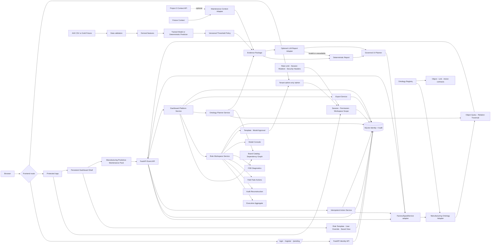

# Current Architecture

## Product frame

```text
Ontology Dashboard Platform
└── Manufacturing Predictive Maintenance Pack
    ├── Equipment
    ├── Risk Event
    ├── Evidence Package
    ├── Inspection
    └── Maintenance Action
```

기존 제조 예지보전 vertical slice는 첫 domain pack으로 유지한다. Python package와 기존 Evidence·Report·Layout import 경로는 회귀 안정성을 위해 아직 변경하지 않았다.



## Runtime boundaries

- `api/factory_signal_board/identity_models.py`: identity constants, request models, principal and role·permission definitions
- `api/factory_signal_board/identity_repository.py`: SQLite schema, credentials, sessions, scopes and administrator audit persistence
- `api/factory_signal_board/identity.py`: authentication service, CSRF and permission policy facade
- `api/factory_signal_board/ontology.py`: domain-neutral Object·Link·Action·Evidence·Dashboard·Board contracts and manufacturing registry
- `api/factory_signal_board/ontology_adapter.py`: fixture·Evidence·운영 activity를 ObjectRecord와 LinkRecord로 투영
- `api/factory_signal_board/ontology_repository.py`: Action invocation idempotency와 결과 persistence
- `api/factory_signal_board/ontology_service.py`: workspace-aware object query, traversal, Action validation·execution·audit
- `api/factory_signal_board/dashboard_models.py`: strict template·tab·board·preference·share contracts
- `api/factory_signal_board/dashboard_catalog.py`: 역할별 catalog와 version 3 default template seed
- `api/factory_signal_board/dashboard_repository.py`: template version, user override, saved view와 share persistence
- `api/factory_signal_board/dashboard_service.py`: resolved dashboard, override merge, mandatory policy, dependency graph와 share scope
- `api/factory_signal_board/role_workflow_models.py`: Executive·Audit·Field·FDE·Model workspace와 approval contracts
- `api/factory_signal_board/role_workflow_repository.py`: export checkpoint, field Action, template·model approval persistence
- `api/factory_signal_board/role_workflow_service.py`: 역할별 aggregate·reconstruction·diagnostic·release orchestration
- `api/factory_signal_board/ontology_planner_models.py`: typed Object query·Board recommendation·Dashboard draft·grounded narrative contracts
- `api/factory_signal_board/ontology_planner_service.py`: registry·Catalog·Evidence whitelist와 provider fail-closed planning
- `api/factory_signal_board/security.py`: login·Planner·Export·session rate limit
- `api/factory_signal_board/export_models.py`: export request·checkpoint contracts
- `api/factory_signal_board/export_repository.py`: snapshot·content hash checkpoint persistence
- `api/factory_signal_board/export_service.py`: permission-scoped JSON·CSV·PDF artifact와 audit
- `api/factory_signal_board/service.py`: existing manufacturing Evidence·Report·Layout adapter
- `ml/`: input audit, training, predictor, policy, Evidence
- `web/src/features/auth/`: login, register, pending approval and session context
- `web/src/features/manufacturing/`: authenticated manufacturing data orchestration and governed renderer adapter
- `web/src/features/dashboard/`: workspace header, tabs, context panel, 12-column canvas, inspector, catalog and personalization
- `web/src/features/roles/`: Executive·Audit·Field·FDE·Model 전용 board contracts와 renderer
- `web/src/features/planner/`: Object query·Board 추천·grounded narrative·Dashboard draft UI
- `web/src/features/admin/`: tenant administrator control plane와 template·model approval queue
- `web/src/features/ontology/`: TypeScript ontology contracts
- `schemas/`: input, Evidence, Report, Layout, ontology, dashboard, role workspace, Planner and export JSON Schema
- `evaluation/`: accepted product behavior

## Identity and authorization flow

```text
Email + password
→ Argon2id verification
→ active account check
→ HttpOnly SameSite session cookie
→ 12h absolute expiry + 60m idle timeout + user-agent binding
→ server-side permission check
→ server-side workspace scope check
→ ontology object query·Action, resolved Dashboard, role workspace 또는 Planner intent validation
→ domain service·template merge·role aggregate·approval·export workflow
→ administrator or operational audit
```

- 회원가입 상태는 `pending_approval`이다.
- 가입 화면에서 역할을 선택하지 않는다.
- 관리자가 역할과 `manufacturing-demo` workspace scope를 할당한 뒤 활성화한다.
- `tenant_admin`만 `/api/admin/*`를 사용할 수 있다.
- FDE는 ontology·integration·template 역할이며 admin permission이 없다.
- state-changing cookie 요청은 CSRF cookie/header 검증을 통과해야 한다.
- Ontology object 조회는 `ontology.objects.read`와 workspace scope를 함께 검사한다.
- Action은 대상 object type, parameter type, required permission, idempotency key를 서버에서 검증한다.
- Dashboard API는 `dashboards.read|personalize|share|templates.manage|templates.request|templates.approve`와 workspace scope를 검사한다.
- 일반 사용자는 자기 역할 template만 사용한다. FDE는 다른 역할 template을 preview·편집하고 승인 요청하지만 직접 publish할 수 없다.
- Tenant admin 승인 시에만 immutable template version이 게시되고 model release request가 approved 상태가 된다.
- Executive·Audit·Field·FDE·Model API는 각각 별도 permission과 workspace scope를 검사한다.
- 현장 완료·문제·blocked 상태는 Ontology Action idempotency와 operational audit를 사용한다.
- Audit export checkpoint는 재구성 snapshot의 SHA-256 hash와 요청자를 보존한다.
- 자연어 Planner는 registered Object·property·Board Catalog·Evidence reference만 사용하고 자동 저장하지 않는다.
- Dashboard draft는 FDE·tenant admin preview이며 별도 save 또는 approval request가 필요하다.
- JSON·CSV·PDF export는 permission-scoped snapshot·artifact SHA-256와 `export.created` audit를 남긴다.
- Login·Planner·Export·session management는 fixed-window rate limit을 적용한다.
- Session refresh는 old token·CSRF를 revoke하고 active session 목록·다른 session revoke를 지원한다.
- 사용자 override는 optimistic revision으로 저장되고 template update 시 stable board ID 기준으로 병합된다.
- share token은 hash만 저장하고 조회 때 현재 사용자의 object scope를 다시 검사한다.
- `APP_ENV=production`에서는 demo account seed가 금지된다.

## Model modes

1. `ai4i-random_forest-v1`: benchmark model with its own threshold policy
2. `fixture-heuristic-v1`: offline Gold regression predictor with a separate policy

Model and threshold versions are coupled and recorded in Evidence.

## Failure behavior

- unauthenticated request → `401 authentication_required`
- role or action denied → `403 permission_denied`
- workspace outside scope → `403 workspace_scope_denied`
- reused idempotency key with different Action payload → `409 idempotency_key_conflict`
- concurrent dashboard preference update → `409 dashboard_revision_conflict`
- mandatory board removed or hidden → `409 mandatory_board_required`
- catalog·role·binding·plain-text validation failure → `403` 또는 `422`
- FDE direct template publish → `403 permission_denied`
- duplicate approval decision → `422 contract_validation_failed`
- pending or disabled account → login blocked
- invalid input → `data_quality_hold`
- Project 3 unavailable → fixture context fallback
- LLM unavailable/invalid/ungrounded → deterministic report fallback
- legacy UI Planner unavailable/invalid → deterministic layout fallback
- Ontology Planner provider·schema·Catalog·grounding 실패 → deterministic preview fallback, persistence 없음
- rate limit 초과 → `429 rate_limit_exceeded` + `Retry-After`
- idle session → `401 session_idle_timeout`
- user-agent mismatch → `401 session_client_mismatch`
- unknown block/data field → validation failure
- unsupported or unsafe follow-up → bounded refusal and overview layout

## Deployment surfaces

- local: API 8100, Web 3100
- routes: `/login`, `/register`, `/pending`, `/app`, `/admin`
- Docker: host API 8100 → container 8000, Web 3100
- CI/E2E: dynamic local ports and temporary SQLite DB to avoid collision
