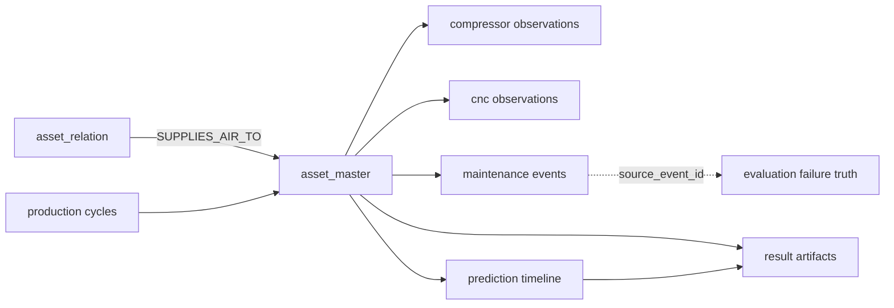

# Predictive Maintenance Canonical V3.1

Azure Predictive Maintenance 계열의 압축기 센서·열화 패턴과 UCI AI4I 2020의 CNC 물리 관계·공구 마모·고장 조건을 반영해 생성한 **압축기–CNC 통합 합성 데이터 패키지**입니다. 두 원본 CSV의 행을 단순히 합친 것이 아니라, 서로 다른 설비를 공통 Asset·Observation·Failure·Maintenance·Prediction 계약으로 분석할 수 있도록 Canonical V3.1 구조로 재구성했습니다.

## 데이터 범위

| 항목 | 값 |
|---|---:|
| Dataset version | `canonical-ai4i-physics-v3.1` |
| 기간 / 간격 | 2026-08-01 ~ 2026-08-31 KST / 10분 |
| 사이트 / 자산 | 4개 / 100개 |
| 압축기 / CNC | 20개 / 80개 |
| `SUPPLIES_AIR_TO` 관계 | 80개 |
| 압축기 / CNC 관측 | 86,400 / 345,600행 |
| 생산 cycle | 170,875행 |
| 정비 event | 790건 |
| 실제 failure truth | 76건 |
| Prediction timeline | 68,208행 |
| Result Artifact | 100건 |

20대의 압축기는 각각 4대의 CNC에 연결됩니다. `SUPPLIES_AIR_TO`는 설비 topology이며, 관계 존재만으로 고장의 인과관계를 확정하지 않습니다.

## 데이터 구조와 관계



### Canonical source

| 파일 | 행 수 | 포함 데이터 | 조인 키 |
|---|---:|---|---|
| `asset_master.csv` | 100 | 자산 유형, 사이트, 셀 | `asset_id` |
| `asset_relation.csv` | 80 | 압축기 → CNC 공급 관계 | `from_asset_id`, `to_asset_id` |
| `compressor_sensor_observation.csv` | 86,400 | 전압, 회전, 압력, 진동, 상대 진동 zone | `asset_id`, `observed_at` |
| `cnc_sensor_observation.csv` | 345,600 | 공기·공정 온도, RPM, 토크, 공구 마모 | `asset_id`, `observed_at` |
| `cnc_production_cycle.csv` | 170,875 | 제품 유형, 절삭 시간, wear 증가량 | `cnc_asset_id` |
| `maintenance_event.csv` | 790 | 계획 공구 교체, 고장 복구 | `asset_id`, `source_event_id` |
| `dataset_manifest.json` | 1 | 기간, seed, 물리 계약, 파일 checksum | `dataset_version` |

정비 790건은 계획 공구 교체 714건과 고장 복구 76건으로 구성됩니다. 공구 교체 731건의 wear reset은 모두 정비 시작 tick과 정렬되며, 가동 중 비정상 reset은 0건입니다.

### Evaluation truth

Evaluation truth는 label 생성·검증 전용이며 Dataset API 기본 설정에서는 노출하지 않습니다.

| 파일 | 행 수 | 내용 |
|---|---:|---|
| `failure_schedule.csv` | 115 | 생성기에 입력한 잠재 고장 일정 |
| `compressor_failure_truth.csv` | 20 | 압력·베어링·구동·전기 고장 정답 |
| `cnc_failure_truth.csv` | 56 | PWF 14, HDF 21, OSF 11, TWF 6, RNF 4 |

### Derived model outputs

| 파일 | 행 수 | 내용 |
|---|---:|---|
| `prediction_snapshot.jsonl` | 100 | 자산별 최신 24시간 위험도 |
| `prediction_factor.jsonl` | 300 | 최신 예측별 Top-3 기여 factor |
| `prediction_timeline.jsonl` | 68,208 | Historical Replay용 시간별 위험도 |
| `result_artifact.jsonl` | 100 | Dashboard·Agent·Report 공통 결과 계약 |

모델은 `independent-logreg-v3.1`, task는 `binary_failure_within_horizon`, Result Artifact schema는 `result-artifact-v1.0`입니다. `predicted_failure_type`은 현재 `failure_risk` 또는 `no_significant_risk`이며 PWF/HDF/OSF/TWF multiclass 결과가 아닙니다.

Result Artifact에는 자산, 위험 확률, 상태 등급, Top-3 factor, 권장 행동, Dataset·Model·Prediction provenance가 함께 들어 있습니다. 추천 행동은 정책 기반 파생값이며 자동 설비 정지 명령이 아닙니다.

## AI4I 물리 계약

```text
power = torque × rpm × 2π / 60
PWF: power < 3,500W or power > 9,000W
HDF: process - air < 8.6K and rpm < 1,380
OSF: tool_wear × torque > L 11,000 / M 12,000 / H 13,000
TWF: tool_wear between 200 and 240 minutes
RNF: condition-independent random failure
```

모든 CNC failure truth가 해당 조건을 통과했습니다.

## 패키지 폴더

```text
predictive_maintenance_canonical_v3.1/
├── canonical/
│   ├── dataset/            # 관측 가능한 원천 사실
│   ├── evaluation_truth/   # 평가기 전용 고장 정답
│   ├── model_outputs/      # 예측·factor·Result Artifact
│   └── validation/         # checksum·물리·재현성 검증
├── experiments/connected_air_supply/
├── model/
├── agent/
├── api/
├── scripts/
├── dashboard/
├── SCHEMA.md
└── RESULT_ARTIFACT_SCHEMA.md
```

더 자세한 파일별 필드, 관계도, 조인 규칙, failure 분포, Agent benchmark는 [Canonical V3.1 Data Guide](https://github.com/oosuhada/agentic-ontology-dashboard/blob/docs/canonical-v3.1-release-data-guide/docs/10-product/predictive-maintenance-canonical-v3.1-data-guide.md)에서 확인할 수 있습니다.

## 다운로드 및 무결성

Release asset:

- `predictive_maintenance_canonical_v3.1.zip`
- `predictive_maintenance_canonical_v3.1.zip.sha256`

ZIP SHA-256:

```text
7f60ff5e8e921d66e009441877c02c61eb0ad1ba18a4a10ffc871b4b9731f7c6
```

```bash
shasum -a 256 -c predictive_maintenance_canonical_v3.1.zip.sha256
unzip predictive_maintenance_canonical_v3.1.zip
cd predictive_maintenance_canonical_v3.1
python3 scripts/validate_package.py
```

제품 Dataset Version의 bundle checksum은 `12734b1eec67ae5ccf322221967d5628ba5cf1ecb0401e6daef5c3dd7a855682`입니다. ZIP SHA-256은 다운로드 archive의 무결성, bundle checksum은 적재된 Canonical bundle의 동일성을 검증합니다.

## 주의사항

- 합성 데이터이며 실제 설비 운영 성능을 보장하지 않습니다.
- Evaluation truth와 experiment hidden truth는 제품 입력으로 사용하지 않습니다.
- `SUPPLIES_AIR_TO`는 topology이지 자동 인과 판정이 아닙니다.
- 모델 sanity benchmark는 데이터의 예측 가능성을 확인하기 위한 값입니다.
