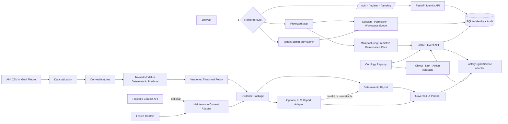

# Current Architecture

## Product frame

```text
Ontology Dashboard Platform
└── Manufacturing Predictive Maintenance Pack
    ├── Equipment
    ├── Risk Event
    ├── Evidence Package
    ├── Inspection
    └── Maintenance Action
```

기존 제조 예지보전 vertical slice는 첫 domain pack으로 유지한다. Python package와 기존 Evidence·Report·Layout import 경로는 회귀 안정성을 위해 아직 변경하지 않았다.



## Runtime boundaries

- `api/factory_signal_board/identity_models.py`: identity constants, request models, principal and role·permission definitions
- `api/factory_signal_board/identity_repository.py`: SQLite schema, credentials, sessions, scopes and administrator audit persistence
- `api/factory_signal_board/identity.py`: authentication service, CSRF and permission policy facade
- `api/factory_signal_board/ontology.py`: domain-neutral Object·Link·Action·Evidence·Dashboard·Board contracts and manufacturing registry
- `api/factory_signal_board/service.py`: existing manufacturing Evidence·Report·Layout adapter
- `ml/`: input audit, training, predictor, policy, Evidence
- `web/src/features/auth/`: login, register, pending approval and session context
- `web/src/features/manufacturing/`: authenticated role landing and existing Gold dashboard
- `web/src/features/admin/`: tenant administrator control plane foundation
- `web/src/features/ontology/`: TypeScript ontology contracts
- `schemas/`: input, Evidence, Report, Layout and ontology core JSON Schema
- `evaluation/`: accepted product behavior

## Identity and authorization flow

```text
Email + password
→ Argon2id verification
→ active account check
→ HttpOnly SameSite session cookie
→ server-side permission check
→ server-side workspace scope check
→ domain service
→ administrator or operational audit
```

- 회원가입 상태는 `pending_approval`이다.
- 가입 화면에서 역할을 선택하지 않는다.
- 관리자가 역할과 `manufacturing-demo` workspace scope를 할당한 뒤 활성화한다.
- `tenant_admin`만 `/api/admin/*`를 사용할 수 있다.
- FDE는 ontology·integration·template 역할이며 admin permission이 없다.
- state-changing cookie 요청은 CSRF cookie/header 검증을 통과해야 한다.
- `APP_ENV=production`에서는 demo account seed가 금지된다.

## Model modes

1. `ai4i-random_forest-v1`: benchmark model with its own threshold policy
2. `fixture-heuristic-v1`: offline Gold regression predictor with a separate policy

Model and threshold versions are coupled and recorded in Evidence.

## Failure behavior

- unauthenticated request → `401 authentication_required`
- role or action denied → `403 permission_denied`
- workspace outside scope → `403 workspace_scope_denied`
- pending or disabled account → login blocked
- invalid input → `data_quality_hold`
- Project 3 unavailable → fixture context fallback
- LLM unavailable/invalid/ungrounded → deterministic report fallback
- Planner unavailable/invalid → deterministic layout fallback
- unknown block/data field → validation failure
- unsupported or unsafe follow-up → bounded refusal and overview layout

## Deployment surfaces

- local: API 8100, Web 3100
- routes: `/login`, `/register`, `/pending`, `/app`, `/admin`
- Docker: host API 8100 → container 8000, Web 3100
- CI/E2E: dynamic local ports and temporary SQLite DB to avoid collision
