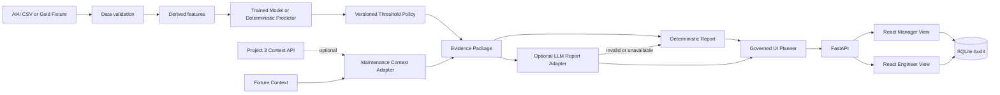

# Current Architecture

## Runtime boundaries

- `ml/`: input audit, training, predictor, policy, Evidence
- `api/`: context, reports, LLM, planner, repository, routes
- `web/`: registered React block renderer and role flows
- `schemas/`: input, Evidence, Report and Layout contracts
- `evaluation/`: accepted product behavior

## Model modes

1. `ai4i-random_forest-v1`: benchmark model with its own threshold policy
2. `fixture-heuristic-v1`: offline Gold regression predictor with a separate policy

Model and threshold versions are coupled and recorded in Evidence.

## Failure behavior

- invalid input → `data_quality_hold`
- Project 3 unavailable → fixture context fallback
- LLM unavailable/invalid/ungrounded → deterministic report fallback
- Planner unavailable/invalid → deterministic layout fallback
- unknown block/data field → validation failure
- unsupported or unsafe follow-up → bounded refusal and overview layout

## Deployment surfaces

- local: API 8100, Web 3100
- Docker: host API 8100 → container 8000, Web 3100
- CI/E2E: dynamic local ports to avoid collision
