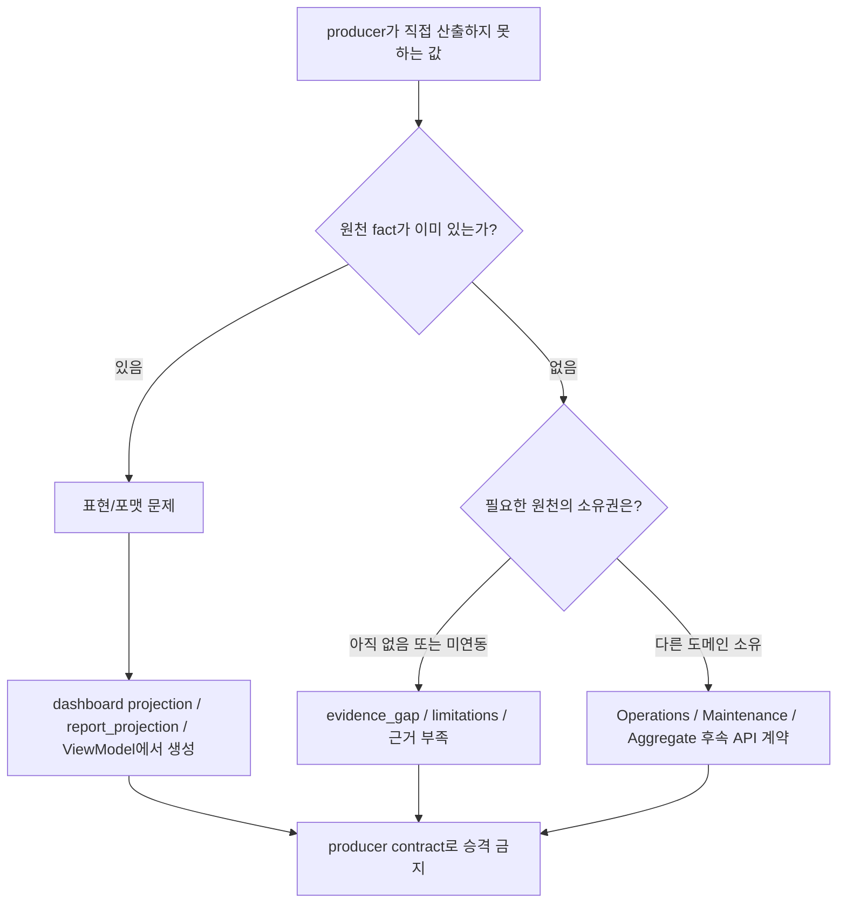
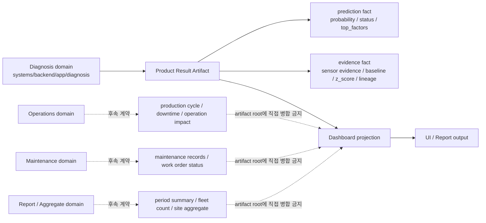
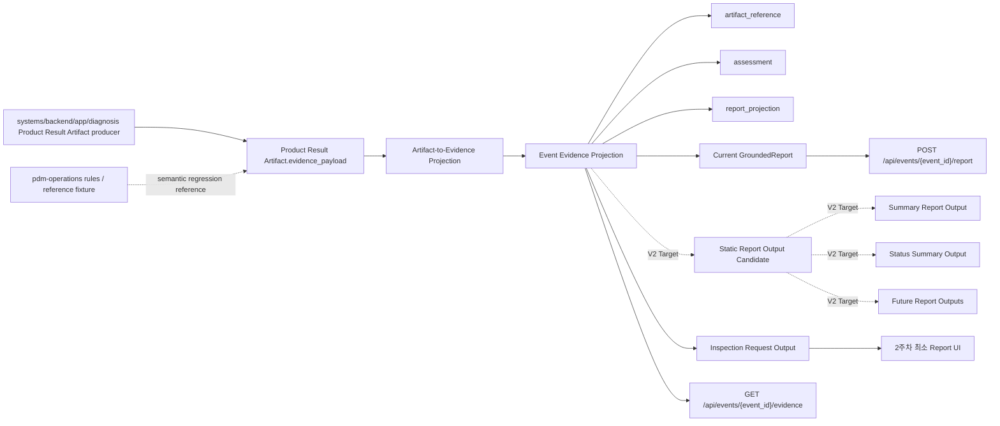
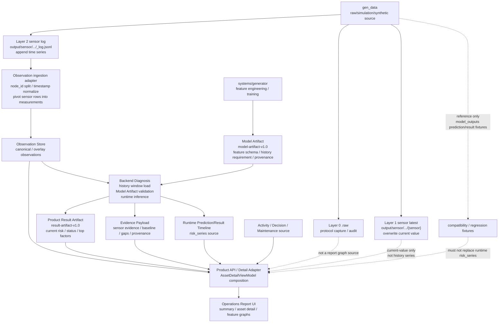
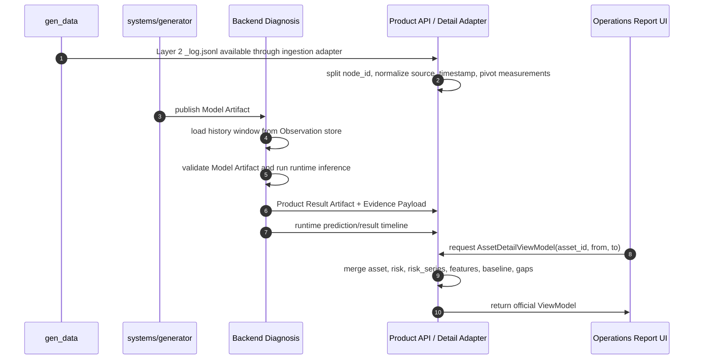
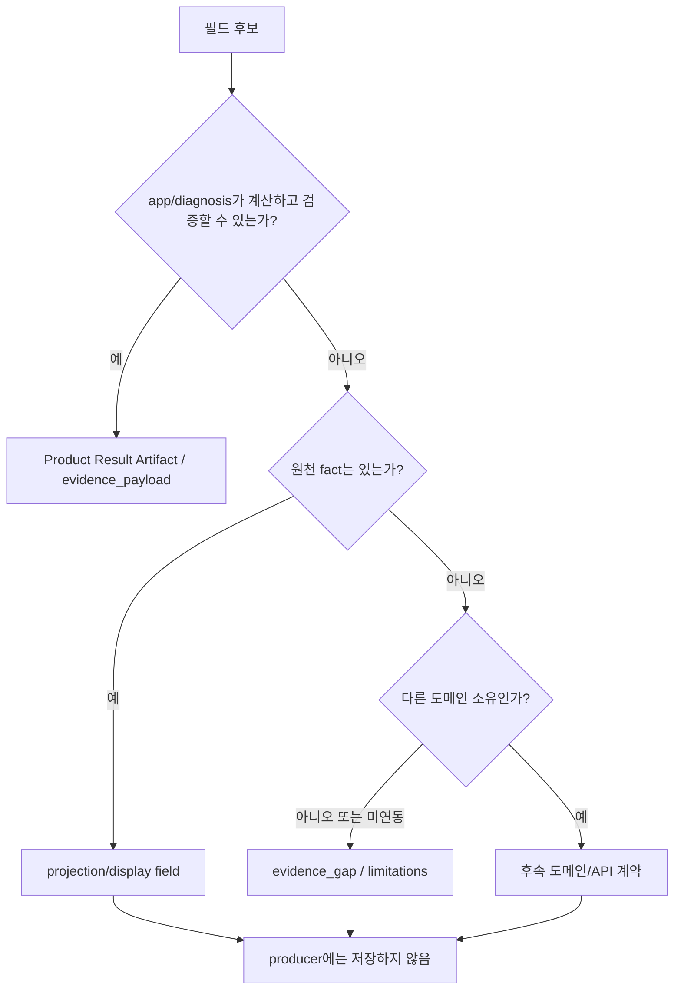

# PdM Producer-side Evidence Enrichment와 Report UI 통합 계획

작성일: 2026-08-10
상태: 제안
범위: `ontology-dashboard`의 Product Result Artifact producer인 `systems/backend/app/diagnosis`에 `pdm-operations` Evidence Package에서 검증한 근거 산출 규칙을 이식하고, enriched Product Result Artifact에서 dashboard Event Evidence projection과 legacy compatibility projection을 파생하기 위한 2주차 Operations 구현 계획이다.

여기서 "대체"는 `pdm-operations` 원본 payload를 dashboard evidence 루트에 그대로 덮어쓴다는 뜻이 아니다. `pdm-operations`의 sensor evidence, baseline, component hypothesis, source field 산출 규칙을 운영 producer 경계로 옮겨 Product Result Artifact의 `evidence_payload`를 생성하고, 화면/리포트용 Evidence는 그 enriched Artifact에서 파생한다.

## 1. 확인된 현재 기준선 및 데이터 흐름

### 1.1 시스템 간 데이터 흐름 (Target)

```text
gen_data Layer 2 log (file handoff)
  ↓
Generator Target Observation/Feature Series
  ↓
Backend Diagnosis Runtime Result (Runtime inference + Evidence)
  ↓
Backend Report ViewModel (Composition via read port)
  ↓
Dashboard UI
```

### 1.2 책임 경계 및 상태 구분

- `ontology-dashboard`는 제품 API, 프론트엔드, 역할별 리포트 스키마, Operations 화면을 담당한다.
- `systems/generator`는 센서/프로토콜 로그로부터 정제된 Observation/Feature Series를 생성하고 Model Artifact를 발행하는 목표 생산자(Target Producer)다.
- Generator의 Observation/Feature Series는 후속 구현 목표인 **Target 산출물**이며, 현재 `main`에서는 Model Artifact 발행 위주로 운영 중이다.
- Product Result Artifact/Evidence의 운영 producer는 `systems/backend/app/diagnosis`이며, Generator가 발행한 Observation/Feature와 Model Artifact를 기반으로 runtime feature 재현 및 inference를 수행한다.
- `risk_series`는 Generator의 Feature Series가 아니라, **Backend Diagnosis Prediction History**에서 생성되는 런타임 진단 시계열이다.
- Backend Report 및 프론트엔드는 raw `gen_data` 로그를 직접 읽지 않으며, 공식 read boundary를 통해 ViewModel을 구성한다.
- `pdm-operations`는 운영 producer가 아니라 Evidence Package 필드 의미, source field, deterministic 역할별 리포트 블록의 reference implementation이다.
- `pdm-operations/report_generator.py`는 판단 억제 로직 없이 사실을 제시하며, optional context가 없으면 값을 임의 생성하지 않고 `근거 부족` 블록으로 남긴다.
- `pdm-operations/scripts/load_v3_result_artifacts.py`는 자산 유형별 센서 스키마, 동종 집단 비교, 정비 문맥, top factor 기반 `component_hypotheses`, 규칙 기반 `failure_type_candidates`, lineage를 생성한다.
- 현행 Event API 경계는 다음과 같다.
  - `GET /api/events/{event_id}/evidence`
  - `POST /api/events/{event_id}/report`
- 현행 dashboard evidence schema는 fixture 중심 구조다. 주요 필드는 `equipment`, `observation`, `history`, `top_factors`, `maintenance_context`, `lineage`다.
- `pdm-operations` Evidence Package는 Result Artifact 중심 구조다. 주요 필드는 `asset_id`, `sensor_evidence`, `model_prediction`, `top_factors`, `maintenance_context`, `recommended_actions`, `status_flags`, `lineage`다.
- `map-report-ui-prototype`은 정적 React 프로토타입이다. 2주차에는 화면별 필요 필드 후보를 역추적하는 참고 자료로만 사용하고, 하드코딩된 데이터 생성 로직은 제품 데이터 소스가 될 수 없다.

### 1.1 현재 dashboard 값의 검증 수준

현행 dashboard fixture, diagnosis, artifact, evidence는 무검증 값이 아니다. 다만 검증의 성격은 운영 truth 검증이 아니라 2주차 Operations의 schema, fixture, deterministic fallback, compatibility regression 검증에 가깝다.

| 대상 | 현재 검증 수준 | 2주차 계획에서의 해석 |
|---|---|---|
| dashboard fixture | `data/fixtures/GS-*.json` schema/audit, expected prediction, 의도된 data-quality fixture 검증 | demo/gold regression 기준. 운영 source of truth로 취급하지 않음 |
| diagnosis | `systems/backend/app/diagnosis`가 Result Artifact/Evidence producer 책임을 갖고 schema validation 수행 | producer 책임은 공식. 운영 Model Artifact 주입 기반 검증은 별도 단계 |
| Product Result Artifact | `result-artifact-v1.0`, `prediction_task`, `canonical_source_mutated=false`, top factor shape 검증 | 제품 예측 결과 공식 기록. 예측 성능 검증과는 구분 |
| dashboard Evidence | `contracts/schemas/evidence-package.schema.json`과 Operations report/layout 테스트로 검증 | 현행 consumer를 깨뜨리지 않는 compatibility 기준. `pdm-operations` 필드 의미와 완전 일치한다고 보지는 않음 |

따라서 producer-side enrichment와 Event Evidence projection은 기존 dashboard 검증 경계를 버리는 작업이 아니다. 현행 schema/fixture/fallback으로 검증된 흐름을 유지하면서, 현재 Artifact/Evidence에 부족한 `sensor_evidence`, baseline, z-score, component hypothesis, source field trace 같은 의미를 Product Result Artifact의 producer 산출 필드와 projection 경계에서 흡수하는 작업이다.

### 1.2 기존 dashboard artifact/evidence 분리 근거

기존 dashboard artifact/evidence fixture는 이름과 달리 순수 Product Result Artifact 원천 계약이라기보다 Operations 화면과 report consumer가 바로 쓰기 쉬운 compatibility/projection payload에 가깝다. 설비 표시 정보, observation/history 요약, evidence trace, 카드용 label, report section에 가까운 값이 섞여 있으므로 이를 그대로 `systems/backend/app/diagnosis` producer contract로 승격하지 않는다.

이번 계획에서 분리하는 기준은 다음과 같다.

| 구분 | 처리 | 근거 |
|---|---|---|
| producer가 계산 가능한 진단/근거 fact | Product Result Artifact 또는 `evidence_payload` 후보 | `app/diagnosis`가 값과 provenance를 보증할 수 있음 |
| 원천값은 있으나 화면 표현인 값 | dashboard projection, `report_projection`, ViewModel에서 생성 | 카드 제목, 한국어 문장, 표시 label은 producer fact가 아님 |
| 원천이 없거나 미연동인 값 | `evidence_gap`, `limitations`, `근거 부족`으로 표시 | 0, 정상, 평균값으로 보정하면 검증 불가능한 truth가 됨 |
| 다른 도메인이 소유할 값 | 후속 Operations/Maintenance/Aggregate API 계약으로 분리 | 정비 이력, 생산량, downtime, work order는 diagnosis producer 책임이 아님 |

따라서 "검증 함수 이식"은 기존 dashboard 화면 payload를 producer로 옮기는 뜻이 아니다. `pdm-operations`와 기존 dashboard fixture에서 확인한 규칙 중 producer가 산출 가능한 순수 evidence fact만 `app/diagnosis` 경계로 옮기고, 화면/report 친화 필드는 projection/UI 경계에 남긴다.

산출 불가능한 값을 세 가지로 나누는 근거는 값의 원천 유무와 소유 도메인이 다르기 때문이다. 같은 "producer가 직접 산출하지 못하는 값"이라도 원천값이 이미 있으면 projection 문제이고, 원천이 없으면 evidence gap이며, 원천이 다른 도메인에 있으면 후속 도메인/API 계약 문제다.



## 2. 목표 방향

`systems/backend/app/diagnosis`가 Product Result Artifact와 `evidence_payload`를 함께 생성한다. `pdm-operations` Evidence Package는 운영 입력이 아니라 근거 산출 규칙과 reference fixture 비교 기준이다. 현행 fixture 기반 dashboard Evidence Package는 enriched Artifact에서 파생되는 Event Evidence projection으로 대체한다. 제품 API, 권한, 화면, report endpoint 경계는 `ontology-dashboard`가 유지한다.

프론트엔드는 raw JSONL이나 producer 원본 payload를 직접 파싱하지 않는다. 기존 API/service 계층이 안정적인 Event Evidence projection, 현행 GroundedReport, Report UI ViewModel을 만들어 제공한다.

Report 생성은 단일 화면에 바로 붙는 구조가 아니라 다음 계층을 분리한다. 2주차 구현 범위는 1~5번까지다.

1. 기존 Product Result Artifact 필수 필드와 validation 조건은 유지한다.
2. 기존 dashboard artifact/evidence fixture에서 화면용 필드와 producer 산출 가능한 fact를 분리한다.
3. `systems/backend/app/diagnosis`가 `sensor_evidence`, `component_hypotheses`, `status_flags`, `recommended_actions.basis`, lineage 같은 근거 필드를 `evidence_payload`로 산출한다.
4. enriched Artifact에서 Event Evidence projection의 `assessment`와 `report_projection`을 만든다.
5. Event Evidence projection에서 현행 `GroundedReport`, 점검 요청 ViewModel, Evidence trace ViewModel을 파생한다.
6. 상태 요약, 기간 요약 보고서, 확장 report UI output은 V2 Target으로 보류한다.

따라서 Product Result Artifact의 producer-side `evidence_payload`가 우선 안정화 대상이며, Event Evidence는 독립 source가 아니라 Artifact-derived projection이다. 정적 Report Output 후보와 기간 기반 report views는 downstream 확장 후보로만 둔다.

### 2.1 도메인 분리와 채택 상태

이번 통합은 모든 dashboard 도메인 계약을 새로 정의하지 않는다. 기존 dashboard 문서의 Current/V2 분리를 따르고, `pdm-operations`는 Product Result Artifact `evidence_payload`의 산출 규칙 reference로만 사용한다.

| 도메인 | Source of truth | 이번 계획의 처리 | 상태 |
|---|---|---|---|
| Prediction / Evidence | `systems/backend/app/diagnosis` Product Result Artifact | producer가 Artifact와 `evidence_payload`를 함께 산출하고 Event Evidence projection을 파생. `pdm-operations`는 산출 규칙과 reference fixture로 비교 | 1차 구현 대상 |
| Asset / Object | dashboard ontology/runtime 조회 | `asset_id`, 표시명, line, 담당자 같은 결합 필드는 있으면 연결하고 없으면 임의 생성하지 않음 | 현행 API와 결합 |
| Overview / Aggregate | dashboard 조회·집계 API | 2주차 계획에서 새로 설계하지 않음. 상태 분포, 전체 설비 수, top risk list는 V2 `ReportInput` 후보로 보류 | V2 Target |
| Operations | 현행 Event action/note/activity, 이후 production/maintenance API | 2주차에는 `정비이력 추가`를 별도 Operations 도메인 API가 아니라 Event action/note/activity에 연결하는 최소 액션 초안으로만 정의 | 최소 액션 초안 |
| Report | 현행 `GroundedReport`, V2 `ReportInput`/`ReportOutput` 후보 | Artifact-derived Event Evidence projection을 현행 Event Report로 변환하고, 기간 기반 ReportOutput은 검증된 집계 입력이 있을 때만 파생 | Current + V2 Target 분리 |

따라서 Operations 도메인의 `production_cycle_count`, `maintenance_event_count`, 기간별 정비 목록, 운영 영향 집계는 이번 주 설계하지 않는다. 화면에 정비 문맥이 필요하면 `pdm-operations.maintenance_context`를 근거로 표시하고, 사용자가 남기는 정비 기록은 현행 Event action/note/activity 흐름에 연결한다. 숫자를 0이나 추정값으로 채우지 않는다.

Product Result Artifact의 도메인을 제한하는 이유는 이 artifact가 전체 설비 운영 기록이 아니라 diagnosis producer가 보증하는 예측/진단 공식 기록이기 때문이다. 운영/정비/집계 값을 같은 artifact에 섞으면 source of truth, 검증 기준, 화면 요구가 한 루트에 섞여 dashboard fixture 같은 종합 payload로 되돌아간다.





## 3. 반드시 지킬 경계

- `evaluation_truth`와 `hidden_truth`는 dashboard, API, LLM 입력, Evidence Package, frontend ViewModel에 노출하지 않는다.
- `review_shutdown`은 자동 설비 정지가 아니다. 사람의 정지 검토 요청으로만 표현한다.
- 리포트 추천으로 Work Order를 자동 생성하지 않는다.
- 단일 Evidence Package를 기간 기반 Executive Report로 취급하지 않는다. 기간 합계, 운영/비운영 설비 수, 정비 건수, site/cell 집계는 별도 집계 소스가 필요하다.
- 2주차에는 Operations 도메인의 생산·정비 기간 집계 계약을 새로 정의하지 않는다. producer-side enrichment와 projection layer가 `production_cycle_count`, `maintenance_event_count`, 운영 영향 수치를 만들지 않는다.
- 이 작업에서 현행 Event Report 계약을 V2 기간 기반 Executive Report 계약으로 대체하지 않는다.
- `pdm-operations`가 `근거 부족`으로 남기는 optional context를 producer-side enrichment 또는 dashboard projection layer가 임의 수치나 정상 상태로 보정하지 않는다.
- `failure_type_candidates`는 측정값에 대한 규칙 기반 조건 판정이며 모델 출력이 아니다. `predicted_failure_type` 또는 root cause처럼 취급하지 않는다.
- `map-report-ui-prototype`의 그래프 생성 로직, fixture series, prototype adapter를 제품 runtime source로 승격하지 않는다. UI는 공식 ViewModel에 있는 series만 그리며, 없는 그래프는 `evidence_gap` 또는 `data_status.warnings`로 표시한다.
- `gen_data`의 raw/simulation/synthetic Observation은 센서 시계열의 source fact로 사용할 수 있지만, `gen_data/canonical/model_outputs/*`의 `prediction_timeline`, `prediction_snapshot`, `result_artifact`는 운영 최신 결과가 아니라 compatibility/regression/migration fixture다. 제품 화면에서 위험도 시계열로 직접 소비하지 않는다.
- `gen_data`의 최종 저장 형식은 곧바로 Product API ViewModel이 아니다. `.raw`는 프로토콜 원본, Layer 1 `output/sensor/.../{센서명}`은 최신값 overwrite, Layer 2 `output/sensor/.../_log.jsonl`은 append-only 센서 시계열이다. 이 세부 저장 형태는 Issue #6의 Source Data Producer 수렴 target으로 보고, Asset Detail Report의 실제 의존성은 내부 파일명이 아니라 Backend canonical/overlay Observation read contract와 Backend Feature Executor result에 둔다. `systems/generator`는 Feature/Label 의미, History Requirement, transform contract, Model Artifact publish를 소유하지만 제품 runtime series를 Product API source로 publish하지 않는다.

### 3.1 Asset Detail Report ViewModel 계약 후보

`map-report-ui-prototype`을 Operations 리포트 화면에 이식할 때 필요한 공식 경계는 프론트 컴포넌트 계약이 아니라 Backend composition 계약이다. 프론트엔드는 Product Result Artifact, Observation API, runtime prediction series, maintenance/activity source를 직접 조합하지 않고, `AssetDetailViewModel`을 소비한다.

계약 객체명에는 `Operations` 접두어를 붙이지 않는다. 기존 Operations 프론트엔드의 `Operations*`
타입은 현재 화면이 소비 중인 필드 기준선을 조사하기 위한 구현명으로만 사용하고,
신규 Product API/View 계약은 `AssetDetailViewModel`처럼 접두어 없는
도메인 객체명으로 정의한다.

상태: V2 변경 제안. 현행 Event Report API를 대체하지 않으며, 설비 상세 화면과 요약 리포트의 피쳐 그래프 연결을 위한 후보 계약이다.

최종 흐름은 다음과 같다. 센서 그래프는 Observation 계열에서 오고, 위험도 그래프와 현재 판단은 Backend Diagnosis가 만든 runtime Result/Evidence 계열에서 온다. 두 계열은 Product API/Report adapter에서만 합쳐진다.





```ts
type AssetDetailViewModel = {
  asset: {
    asset_id: string
    asset_type: "compressor" | "cnc"
    display_name?: string
    site_id?: string
    cell_id?: string
    observed_at: string
  }
  risk: {
    current: number | null
    threshold: number | null
    status_grade: "normal" | "attention" | "warning" | "critical"
    prediction_horizon_hours: number | null
  }
  risk_series: Array<{
    observed_at: string
    failure_probability: number
    status_grade: string
    prediction_id: string
    source_kind: "runtime_inference" | "compatibility_fallback"
    source_ref?: string
  }>
  features: Array<{
    key: string
    label: string
    unit: string
    current: {
      observed_at: string
      value: number | null
      quality_status: "good" | "bad" | "unknown"
    }
    baseline?: {
      mean: number
      std: number
      lower: number
      upper: number
      reference: string
    }
    history: {
      source_ref?: string
      points: Array<{
        observed_at: string
        value: number | null
        quality_status: "good" | "bad" | "unknown"
      }>
    }
    top_factor?: {
      rank: number
      contribution: number
      direction: "risk_up" | "risk_down"
      explanation_method: string
      evidence_field_id?: string
    }
  }>
  equipment_history: Array<{
    occurred_at: string
    kind: string
    tone: "critical" | "warning" | "attention" | "normal" | "hold"
    description: string
    source: string
    memo?: string
  }>
  evidence: {
    artifact_id: string | null
    evidence_payload_reference?: string
    model_version: string | null
    dataset_version: string | null
    source_kind: "runtime_inference" | "compatibility_fallback"
    gaps: Array<{
      field: string
      reason: string
      owner_domain: "diagnosis" | "dataset" | "maintenance" | "report" | "frontend"
    }>
  }
  data_status: {
    source: "canonical" | "fallback"
    is_stale: boolean
    is_data_quality_hold: boolean
    warnings: string[]
  }
}
```

필드 산출 책임은 다음과 같이 나눈다.

| 필드 묶음 | 공식 원천 | 책임 | 없는 경우 |
|---|---|---|---|
| `asset`, 표시명, line/cell | Asset/Object read model | Dataset/Equipment API | 필드 생략 또는 `data_status.warnings` |
| `features[].history.points` | Backend canonical/overlay Observation read contract + Backend Feature Executor result | `systems/backend` | 빈 배열과 `evidence.gaps[]` |
| `risk.current`, `top_factor`, `baseline` | Product Result Artifact와 `evidence_payload.sensor_evidence` | `systems/backend/app/diagnosis` | null과 `evidence.gaps[]` |
| `risk_series` | (미구현) Backend Diagnosis Runtime Prediction History Query Contract. canonical source는 `pm_result_artifacts` append-only Product Result history이며, detail payload가 필요할 때만 `prediction_result_id`로 `prediction_results`를 join | `systems/backend/app/diagnosis` | 빈 배열과 `evidence.gaps[]`; `pm_prediction_timeline`, `precomputed_prediction_timeline`, gen_data `model_outputs/prediction_timeline` 직접 대체 금지 |
| `equipment_history` | Activity, Decision, Maintenance, WorkOrder source | Operations/Maintenance API | 빈 배열과 `evidence.gaps[]` |

`features[].history.points`는 센서/피처 시계열이고, `risk_series`는 runtime inference 결과의
누적이다. 따라서 센서 Observation series는 Backend canonical/overlay Observation read contract에서
읽고, 파생 Feature series는 versioned Feature Schema/transform contract를 적용한 Backend Feature
Executor result에서 제공한다. `systems/generator`는 Feature/Label 의미, History Requirement,
transform contract, Model Artifact publish를 소유하지만 제품 runtime series를 Product API source로
publish하지 않는다. `risk_series`는 Backend Diagnosis가 Model Artifact와 Observation/Feature
입력으로 runtime inference를 수행해 생성한 Product Result history에서 파생한다. 현재 canonical
source는 `pm_result_artifacts`의 asset별 append-only Product Result history이며, 상세 payload가
실제로 필요할 때만 `prediction_result_id`로 `prediction_results`를 조회한다. Product API는 내부
테이블 shape를 직접 노출하지 않는다.
기존 legacy `/timeline`의 `precomputed_prediction_timeline`, PostgreSQL `pm_prediction_timeline`,
`gen_data/canonical/model_outputs/*`는 compatibility/regression/migration fixture이며 제품 runtime
risk source로 승격하지 않는다.

현재 Evidence만으로 채울 수 있는 범위와 추가로 필요한 source는 다음과 같다.

| 화면 요구 | 현재 Evidence로 충족 | 필요한 추가 source | 계약 처리 |
|---|---|---|---|
| 기존 Operations 상세 정보 | 가능 | 없음 | 기존 Event detail 기준선 유지 |
| 현재 risk/status/action | 가능 | 없음 | Product Result Artifact 사용 |
| 현재 센서 카드 | 가능 | 없음 | `observation` 또는 `sensor_evidence` 사용 |
| top factor와 report 근거 | 가능 | 없음 | `evidence_field_id` 유지 |
| feature baseline | 부분 가능 | Evidence Payload API 노출 | feature별 누락은 `evidence.gaps[]` |
| 피쳐별 그래프 | 불가 | Backend Observation read contract + Feature Executor result | `features[].history.points=[]`와 gap 표시 |
| 위험도 그래프 | 불가 | Backend Diagnosis Runtime Prediction History Query Contract (`pm_result_artifacts` append-only history + optional `prediction_results` detail join) | `risk_series=[]`와 gap 표시 |
| 범위 이탈 마커 | 불가 | feature history + baseline | history 없이 계산 금지 |
| 설비 정비/점검 전체 이력 | 부분 가능 | Activity/Maintenance source | 현재 activity 외 누락은 gap 표시 |

Backend Observation read contract와 Feature Executor result의 최소 규칙은 다음과 같다.

- `node_id`는 `{asset_id}.{sensor_key}`로 해석한다. 예: `CNC-S01-L01-01.torque_nm`.
- `source_timestamp`는 canonical `observed_at` 후보이며, `server_timestamp`가 있으면 ingestion/provenance 필드로 보존한다.
- 같은 `asset_id`와 `source_timestamp`에 속한 센서 row는 하나의 Observation으로 pivot해 `measurements` map을 만든다.
- `status_code=Bad`, `value=null`, `reason`은 0 또는 정상값으로 보정하지 않고 null value와 data-quality warning/gap으로 전달한다.
- gen_data의 센서 key와 Product feature key가 다를 수 있으므로 `rpm` -> `rotational_speed_rpm` 같은 Feature Schema 또는 ingestion mapping을 별도 계약으로 둔다.
- Layer 1 최신값은 `latest_observation` 또는 현재값 보조 확인에는 사용할 수 있지만, `features[].history.points`의 history source로 사용하지 않는다.
- `.raw`는 protocol audit/debug provenance로 보존할 수 있으나 report graph source가 아니다.

### 3.2 구현 순서

1. `AssetDetailViewModel` 문서 계약과 테스트 fixture를 먼저 추가한다.
2. `gen_data` source/protocol record 샘플을 Backend Observation ingestion fixture로 정규화하고, Feature Schema/transform contract fixture를 추가한다.
3. `node_id` 파싱, `source_timestamp` 정규화, 센서 row pivot, `status_code`/`reason` data-quality mapping을 Backend Observation ingestion/Feature Executor contract test로 고정한다.
4. Backend adapter가 Result Artifact/Evidence, Backend Observation read contract와 Feature Executor result, Backend Diagnosis Runtime Prediction History Query Contract(`pm_result_artifacts` append-only history + optional `prediction_results` detail join)를 병합한다.
5. Product API endpoint는 현행 compatibility path에 바로 고정하지 않고 `/objects/{asset_id}/detail-view` 후보로 둔다.
6. 프론트 report UI는 단일 ViewModel을 소비하도록 전환한다.
7. `map-report-ui-prototype`에서 임시로 가져온 synthetic graph fallback은 제거한다.
8. E2E는 그래프가 존재하는지만 보지 않고 `source_kind`, `evidence.gaps`, series source를 함께 검증한다.

## 4. Producer-side Enrichment 계약 설계

### 4.1 Product Result Artifact

`contracts/schemas/product-result-artifact.schema.json`은 Canonical V3.1 runtime output과 맞춘다. step 7 결정은 기존 required 필드를 깨지 않고 producer가 optional `evidence_payload`를 추가 산출하는 v1.0-compatible enrichment다. `result-artifact-v1.1` schema version bump는 이번 2주차 producer contract 범위에 넣지 않는다.

여기서 `evidence_payload`는 dashboard projection layer가 reference package를 읽어 운영 근거를 채워 넣는 뜻이 아니다. Product Result Artifact의 공식 생성 책임은 `systems/backend/app/diagnosis`에 유지하고, 같은 producer 경계에서 `sensor_evidence`, `component_hypotheses`, `maintenance_context`, `recommended_actions.basis`, `source_fields`를 산출한다. PR #92 이후 현행 canonical 구현 경로는 `systems/backend/app/diagnosis`와 Product API adapter이며, 제거된 `systems/backend/ontology_dashboard/...` 경로는 historical evidence로만 기록한다.

필수 확인 필드는 다음과 같다.

- `artifact_id`
- `asset_id`
- `asset_type`
- `observed_at`
- `prediction_horizon_hours`
- `prediction_task=binary_failure_within_horizon`
- `failure_probability`
- `predicted_failure_type`
- `status_grade`
- `confidence`
- `top_factors`
- `recommended_action`
- `provenance`

호환용 optional root 필드는 `generated_at`, `threshold`다. 두 값은 기존 consumer를 깨지 않는 범위에서만 허용하며 `evidence_payload` 아래로 복제하지 않는다.

`top_factors`는 Product Result Artifact의 공식 판단 요약이며 canonical consumer의 기본 기준은 top 3이다. 사용자가 보는 근거표, report/detail/audit, legacy Evidence Package 호환에는 같은 `prediction.factors` 원천에서 결정적으로 파생한 `ranked_factor_evidence` top 5를 사용한다. `ranked_factor_evidence`는 새 위험 판단이나 보정값이 아니라 producer-derived 설명 근거이며, canonical 판단 요약 계약을 대체하지 않는다.

Producer-side `evidence_payload` 후보 필드는 다음과 같다.

- `evidence_payload.sensor_evidence`: sensor별 window 평균, z-score, baseline basis
- `evidence_payload.component_hypotheses`: top factor 기반 점검 후보. root cause로 승격하지 않음
- `evidence_payload.status_flags`: `multiple_risk_factors`, `insufficient_data` 표시 보조 flag. step 7 contract에서는 임의 flag 확장을 허용하지 않는다
- `evidence_payload.maintenance_context`: 단일 설비 정비 문맥. 기간 정비 집계가 아니며, 원천이 없으면 생략하거나 `null`로 두고 `evidence_gaps[]`에 기록한다
- `evidence_payload.recommended_actions[].basis`: action 문구의 출처
- `evidence_payload.source_fields`: report/evidence trace에서 참조할 source field ID
- `evidence_payload.evidence_gaps[]`: producer가 산출할 수 없는 값의 명시적 결손 기록
- `provenance.evidence_payload_reference`: 근거 산출 기준과 reference fixture 비교 기준

`evidence_payload`는 위 7개 후보 필드로 제한한다. 단, `maintenance_context`는 source가 없을 수 있으므로 optional/nullable이다. `event_id`, `scenario_id`, `equipment`, `observation`, `history`, `detected_interval`, `generated_at`, `threshold`, `model`, `top_factors`, `data_quality_warnings`, `lineage`는 payload 아래로 복제하지 않는다. 특히 `top_factors`는 Product Result Artifact root의 공식 판단 필드이고, `equipment` 표시 정체성은 dashboard Asset/Object 조회 또는 artifact identity fallback으로 결합한다.

`evidence_payload`와 `provenance.evidence_payload_reference`는 동반 존재해야 한다. legacy v1.0 Artifact처럼 둘 다 없는 상태는 허용하지만, 한쪽만 존재하는 enriched Artifact는 계약 위반이다.

Step 7 owner decision:

- `event_id`, `scenario_id`: Product Result Artifact schema에는 추가하지 않고 Event Evidence projection/API 경계에서 부여한다.
- Product Result Artifact root는 v1.0 forward-compatible open schema로 유지한다. 따라서 unknown root property를 JSON Schema에서 물리적으로 모두 거부하지는 않지만, `event_id`, `scenario_id`, `equipment`, `observation`, `history`, `detected_interval`, `lineage`는 canonical defined property가 아니다.
- `threshold`, `generated_at`: 기존 Artifact consumer를 깨지 않는 optional root compatibility field로만 허용한다. `evidence_payload`에는 복제하지 않는다.
- `observation`, `history`, `detected_interval`: raw source snapshot으로 보존할지 여부는 step 8 구현에서 producer input context로 다루며, `evidence_payload`에는 복제하지 않는다.
- `lineage`, `data_quality_warnings`: Product Result Artifact root/provenance 또는 producer diagnostics 후보로 남기고, `evidence_payload`에는 복제하지 않는다.
- 구현 위치: `build_product_result_artifact()`가 공식 producer entrypoint로 남고, `build_product_result_evidence_payload()`는 신규 `systems/backend/app/diagnosis/evidence_enrichment.py` 내부 helper로 둔다. `build_evidence_package()`는 legacy/dashboard compatibility 경로로 유지한다.
- `basis` grounding: `component_hypotheses[].basis`와 `recommended_actions[].basis`의 모든 ID는 `evidence_payload.source_fields[].field_id`에 존재해야 한다. 이 cross-field invariant는 JSON Schema가 아니라 contract test로 검증한다.
- `maintenance_context` gap invariant: `maintenance_context`가 없거나 `null`이면 `evidence_gaps[]`에 `field=evidence_payload.maintenance_context`, `owner_domain=maintenance` 항목이 있어야 한다. 이 조건은 JSON Schema가 아니라 step 8 producer validator/test가 검증한다.

공식 판단 필드는 Product Result Artifact producer 출력만 사용한다. `status_grade`, `failure_probability`, `confidence`, `predicted_failure_type`, `top_factors`, `recommended_action`은 `pdm-operations` reference fixture나 dashboard projection layer가 덮어쓰지 않는다. `ranked_factor_evidence`는 이 판단 필드에서 결론을 새로 만들지 않고, 동일 predictor ranking과 observation/derived feature 값을 reportable evidence row로 펼친다.

Top factor 산출 결정 변경:

- `top_factors`는 Product Result Artifact root의 공식 판단 필드이지만, Model Artifact의 전역 feature importance 자체를 공식 event top factor로 보지 않는다.
- 3주차 현재 Model Artifact explanation contract와 API 이식은 완료되지 않았다. 따라서 PR #40은 한계를 인정하고 `model_artifact_local_proxy_attribution`을 우선 계약/구현한다. 이 PR은 SHAP, logit contribution, probability contribution을 제공한다고 주장하지 않는다.
- Model Artifact 경로에서 `feature_importances_` 또는 `coef_`는 후보 feature의 모델 가중치로만 사용한다. 최종 rank/score는 현재 관측치가 history baseline에서 벗어난 정도를 곱한 local proxy로 산출한다.
- 이 값은 SHAP/logit contribution 같은 완전한 instance attribution이 아니므로 `explanation_method="model_artifact_local_proxy_attribution"`으로 낮춰 표기한다. 전역 가중치를 그대로 써서 모든 설비가 같은 factor/rank/score를 받는 구현은 금지한다.
- 현재 proxy score는 모델 가중치와 baseline 이탈 규모를 함께 반영하므로, 전역 가중치가 낮은 `tooling` 또는 `thermal_path` 계통 feature가 top 5 밖으로 밀릴 수 있다. 이는 "해당 계통에 문제가 없다"는 증거가 아니라 현재 ranking 방법의 coverage 한계이며, UI/detail/audit에서는 top factor 부재를 정상 판정으로 해석하지 않는다.
- `risk_down` 방향 factor는 위험을 낮추는 보호 요인 또는 반대 방향 증거다. component hypothesis나 점검 후보를 만들 때 `risk_down` factor를 고장 의심 원인처럼 승격하지 말고, 필요하면 "위험 완화 근거" 또는 "판단 보조 근거"로 분리한다.
- Heuristic fallback 경로는 기존 `deterministic_component_score`를 유지한다.
- history baseline은 현재 observation timestamp와 같은 history row를 제외한 과거 row만 사용한다. GS-002의 `baseline_n=3`은 의도된 값이며, current row를 baseline에 포함한 `n=4` 또는 `history+observation` 중복 산출은 쓰지 않는다.
- producer sensor evidence와 Model Artifact local proxy는 같은 history baseline helper를 사용한다. 같은 Artifact 안에서 sensor evidence와 top factor proxy가 서로 다른 dedupe, mean/std, zero-variance 정책을 갖지 않는다.

Product Result Artifact consumer는 이 값을 다음처럼 해석한다.

- 가능: "이번 예측 판단을 설명하는 proxy factor 후보"
- 불가: "모델 예측값을 수학적으로 분해한 정확한 feature contribution", "정비 root cause", "인과 원인"
- 후속 조건: 공식 local attribution으로 승격하려면 Model Artifact에 explanation method, feature space, output space, background/reference dataset, explainer version이 계약되고 API consumer가 이를 소비해야 한다.

후속 SHAP 분리:

- SHAP은 Product Result Artifact `top_factors`의 현재 proxy 구현에 섞지 않는다.
- SHAP 도입은 Model Artifact explanation contract의 별도 후속 작업으로 다룬다.
- 후속 계약은 `explanation.method`, `scope`, `output_space`, `feature_space`, `background_dataset_version`, `explainer_version`, `model_version` 결합을 명시해야 한다.
- 해당 계약이 생기기 전까지 Product Result Artifact는 `model_artifact_local_proxy_attribution`만 제공한다.

Producer에 올리지 않는 필드는 다음 기준으로 처리한다.

| 값의 성격 | 예시 | 처리 |
|---|---|---|
| 화면/report 표현값 | 카드 제목, 한국어 설명 문장, role별 report section body, display label | `report_projection`, `GroundedReport`, frontend ViewModel에서 생성 |
| 현재 원천이 없는 값 | fleet baseline 미연동, 동종 설비 평균, 운영 영향 수치 | `evidence_gap` 또는 `limitations`로 표시하고 임의 생성 금지 |
| 다른 도메인 소유 값 | 정비 이력 목록, 생산 사이클 수, downtime, work order 상태 | Operations/Maintenance/Aggregate 후속 API 계약으로 분리 |
| reference fixture 값 | `pdm-operations` sample의 화면 친화 action/text/source label | producer fact로 복사하지 않고 semantic regression 기준으로만 사용 |

금지 사항은 다음과 같다.

- 기존 dashboard artifact/evidence fixture의 화면 맞춤 루트를 Product Result Artifact root로 승격하지 않는다.
- 산출 불가능한 값을 `0`, `정상`, 평균값, reference fixture 값으로 보정하지 않는다.
- LLM으로 누락된 numeric fact, 위험 판단, 추천 근거를 보완하지 않는다.
- Product Result Artifact 하나로 Operations 기간 집계나 Maintenance record를 대체하지 않는다.

산출 불가능한 값 처리 결정은 다음 순서를 따른다.



`evidence_payload.evidence_gaps[]`의 최소 필드는 다음과 같다.

| 필드 | 의미 |
|---|---|
| `gap_id` | 안정적인 결손 식별자 |
| `field` | 산출하지 못한 후보 필드 또는 화면 요구 |
| `reason` | `missing_source`, `not_producer_owned`, `not_in_week2_scope`, `insufficient_context` 중 하나 |
| `required_source` | 필요한 원천 데이터 또는 API |
| `owner_domain` | `diagnosis`, `dashboard`, `operations`, `maintenance`, `aggregate`, `unknown` 중 하나 |
| `display_policy` | `show_as_unavailable`, `hide_section`, `show_limitation` 중 하나 |

Event Evidence projection은 `evidence_payload.evidence_gaps[]`를 `limitations`와 evidence trace의 `근거 부족` 표시로 파생한다. `evidence_gaps[]`는 numeric fact, 정상 상태, 기본 집계값을 대신하지 않는다.

구현 시 검증해야 할 조건은 다음과 같다.

- `provenance.canonical_source_mutated=false`
- `prediction_task=binary_failure_within_horizon`
- `schema_version=result-artifact-v1.0`
- runtime payload에 evaluation-only 필드가 없음
- `evidence_payload`가 없어도 기존 artifact consumer는 깨지지 않음
- `evidence_payload`는 `evaluation_truth`와 `hidden_truth`를 포함하지 않음

### 4.2 Event Evidence Projection

현행 fixture 기반 `contracts/schemas/evidence-package.schema.json`은 dashboard Evidence Package 역할을 해 왔지만, 실제로는 리포트 입력과 화면 표시용 값이 섞인 구조다. 이 작업에서는 이를 enriched Product Result Artifact에서 파생되는 Event Evidence projection으로 대체한다.

Event Evidence projection은 다음 계층을 분리한다.

- `event_id`, `scenario_id`: 제품 Event 식별자
- `subject`: 설비 식별 및 표시명
- `assessment`: 상태, 확률, 신뢰도, 권장 판단
- `artifact_reference`: Product Result Artifact ID, prediction ID, schema version, checksum/reference
- `report_projection`: report/UI가 바로 쓰는 표시용 근거 카드, 점검 target, sensor card
- `provenance`: dataset/model/prediction/artifact/source reference
- `limitations`: 고장 미확정, 자동 정지 아님, 데이터 품질 한계

이전 Event Evidence v2 초안의 `source_evidence` 역할은 이번 producer-side enrichment 프레임에서는 Product Result Artifact 원본과 `artifact_reference`가 맡는다. projection 응답 루트에는 producer 원본 payload를 복제하지 않고, consumer가 필요한 표시·리포트 필드만 파생한다.

projection이 Artifact에서 읽어야 할 원천 필드는 다음을 포함한다. `pdm-operations` Evidence Package의 동일 의미 필드는 reference fixture로 비교한다.

- `asset_id`
- `asset_type`
- `observed_at`
- `prediction_horizon_hours`
- `evidence_payload.sensor_evidence`
- prediction summary: `failure_probability`, `status_grade`, `confidence`, `predicted_failure_type`
- `top_factors`
- `ranked_factor_evidence`
- `evidence_payload.component_hypotheses`
- `evidence_payload.maintenance_context`
- `recommended_action`, `evidence_payload.recommended_actions`
- `evidence_payload.status_flags`
- `lineage`

`assessment`와 `report_projection`이 파생해야 할 제품 필드는 다음을 포함한다.

- `event_id`
- `scenario_id`
- `subject` 또는 `equipment`
- `status`
- `recommended_decision`
- `confidence`
- `failure_probability`
- `threshold`, 있으면 보존하고 없으면 임의 생성하지 않음
- `detected_interval`
- `data_quality_warnings`

권장 구조는 Product Result Artifact를 공식 원천으로 보존하고, 프론트엔드 표시용 필드는 projection layer가 `assessment`와 `report_projection`으로 파생하는 방식이다. Artifact 원천 필드와 화면 표시용 필드를 같은 루트에 섞지 않는다.

canonical Event Evidence의 `assessment.top_factors`는 Product Result Artifact의 공식 top 3 판단 요약을 유지한다. `report_projection`과 향후 ReportOutput/ViewModel은 기본적으로 top 3 요약을 우선 표시하되, 상세 EvidenceTable/audit 또는 legacy compatibility가 필요할 때 `ranked_factor_evidence`에서 top 5 factor rows를 파생한다. 이 top 5 자료는 `artifact_reference` 같은 public reference 필드에 복제하지 않고, legacy compatibility 변환 또는 명시적 detail ViewModel 경계에서만 사용한다.

### 4.3 Event Evidence Projection 전환 호환성

현행 `GET /api/events/{event_id}/evidence` endpoint 경계는 유지하지만, 응답 shape를 즉시 바꾸면 기존 Operations 화면과 report consumer가 깨질 수 있다. 2주차 구현은 다음 전환 기준을 둔다.

- Event Evidence projection은 `schema_version="event-evidence-projection-v1"`와 `contract_type="event_evidence_projection"` 같은 명시적 discriminator를 포함한다.
- projection layer는 canonical Event Evidence projection과 legacy evidence compatibility projection을 동시에 만들 수 있어야 한다.
- 2주차 기본 응답은 기존 legacy evidence shape를 유지한다.
- canonical Event Evidence projection은 명시적 `schema_version`, `contract_type`, query/header/feature flag 같은 contract selector가 있을 때만 반환한다.
- legacy projection은 새 수치를 만들지 않고 enriched Product Result Artifact와 Event Evidence projection의 `assessment`, `report_projection`에서 현행 `contracts/schemas/evidence-package.schema.json` 호환 필드만 재배열한다.
- legacy Evidence Package의 top 5 factor는 Product Result Artifact의 `ranked_factor_evidence`를 legacy 변환 내부 입력으로 받아 생성한다. `legacy_compatible_top_factors` 같은 migration helper 이름이나 배열은 canonical Event Evidence public 응답에 노출하지 않는다.
- API contract regression test는 legacy evidence shape, Event Evidence projection shape, hidden/evaluation truth absence, report grounding source field를 함께 검증한다.
- canonical projection을 기본 응답으로 승격하고 legacy projection을 제거할지는 frontend/report consumer 전환 완료와 contract regression 통과 후 별도 PR에서 결정한다.

Runtime 저장 경계는 결과 계약과 Evidence detail 가용성을 분리한다. `pm_result_artifacts`로 검증된 Result Artifact의 `source_contract`, `artifact_id`, `schema_version`, `recommended_action`은 연결된 `prediction_results.payload_json`에 `evidence_payload`가 없다는 이유로 prediction snapshot compatibility로 강등하지 않는다. 저장된 producer Artifact와 `evidence_payload`가 있으면 dashboard detail을 만들고, 없으면 같은 Result API/화면 shape에서 detail을 unavailable로 표시한다. dashboard는 누락된 Evidence를 재생성하지 않는다.

신규 runtime 생성과 기존 precomputed bundle import는 내부 쓰기 전략으로 분리하되 public API나 frontend 화면 모드로 분기하지 않는다. 신규 데이터의 canonical 경로는 source ingestion 후 `systems/backend/app/diagnosis` runtime producer가 full Product Result Artifact를 저장하는 경로다. 기존 prediction/result 파일은 migration·회귀·과거 데이터 조회를 위한 imported compatibility 경로로 보존한다. 한 Dataset Version에서 두 writer를 동시에 사용하거나 runtime 실패를 imported 결과로 자동 fallback하지 않는다. PR #92/#97 이후 `materialization_strategy` persistence와 runtime-generated-only operationalization guard는 현행 기준에 포함된다. Product API와 frontend는 이 내부 전략으로 별도 화면을 만들지 않고 공통 Result/Evidence/ViewModel availability와 limitations만 소비한다.

#### 4.3.1 이전 구현 계획 대비 변경

PR #25 기반 원안의 producer/projection/UI 경계는 유지한다. 변경되는 부분은 PR #50에서 처음 구체화된 persistence writer와 runtime read path, 그리고 gen_data PR #7 이후 세분화된 source/protocol/Generator 입력 경계다. 이 세분화는 Product Result Artifact/Evidence의 최종 producer를 Generator로 옮기는 뜻이 아니다.

| 비교 항목 | PR #25 원안 | PR #50 초기 구현 | `59651ca` 대응 | 현재 결정 |
|---|---|---|---|---|
| Product Result source of truth | `systems/backend/app/diagnosis`가 Product Result Artifact와 Evidence를 생성 | 저장된 `prediction_result_payload`를 producer Artifact로 검증해 projection | `evidence_payload`가 없으면 전체 결과를 snapshot compatibility로 강등 | Result Artifact 계약과 공식 필드는 유지하고 Evidence detail 가용성만 별도 판정 |
| Persistence writer | 구체적인 runtime/import writer 차이는 계획 범위에 명시되지 않음 | demo runtime writer의 full payload 저장을 모든 Result Artifact row에 일반화 | dataset 전체 `full_artifact_count`로 payload completeness 추론 | 신규 runtime writer와 imported precomputed writer를 내부 전략으로 분리하고 한 Dataset Version에는 하나만 허용 |
| `prediction_results.payload_json` 의미 | canonical producer payload를 projection 입력으로 사용할 목표 | 모든 Result Artifact index가 full payload를 가리킨다고 전제 | payload shape를 `source_contract` discriminator로 사용 | writer별 저장 의미를 명시하고 payload shape로 Result 계약을 추론하지 않음 |
| Evidence 부재 | `evidence_gap`/`limitations` 또는 unavailable, consumer 합성 금지 | `_stored_producer_artifact()` validation error로 runtime 실패 | `None` fallback 후 Result 계약 전체 강등 | Result 목록·추천·schema는 보존하고 detail만 unavailable |
| API/UI | legacy 기본 응답과 selector 기반 canonical projection, typed ViewModel 하나 | runtime detail을 같은 API에 연결 | runtime/imported 결과가 서로 다른 계약처럼 보일 위험 발생 | 저장 전략은 frontend에 노출하지 않고 동일 API/ViewModel에서 availability와 limitations만 표시 |
| 검증 | fixture/contract 중심, PostgreSQL runtime replay 미완료 | full producer payload happy path 중심 | PostgreSQL service 추가 후 replay 3 failed, 1 passed, 1 skipped | runtime full-Evidence와 imported Evidence-unavailable 경로를 별도 PostgreSQL 회귀로 검증 |

Evidence-state 기준으로 PR #25 Step 1~13의 historical evidence는 보존하되, PR #92 이후 제거된 legacy 경로의 구현 위치는 `Superseded`로 본다. “모든 Result Artifact index가 full producer payload를 가리킨다”는 전제는 `Superseded`, `59651ca`의 dataset 전체 계약 강등은 `Rejected`다. PR #92/#97로 writer strategy persistence와 recommendation materialization guard는 현행 기준에 포함됐지만, 공통 read/API consumer 전환과 PostgreSQL runtime/imported availability 회귀는 아직 `In Progress` / `Partially Verified`다.

운영 시계열 입력 경계는 다음처럼 세분화한다.

- `gen_data`: SensorRecord / protocol record 생성과 source lineage 보존
- `systems/generator`: protocol/source record 검증, measurement 조립, quality policy, history window, Feature/Label 생성, Model Artifact publish
- `systems/backend/app/diagnosis`: Model Artifact와 Observation/Feature 입력을 소비해 runtime inference를 수행하고, Product Result Artifact/Evidence 생성, Runtime Prediction History 저장/조회, Result/Evidence read model 제공

```text
유지: Diagnosis Producer -> Product Result Artifact -> Event Evidence Projection -> Report/ViewModel
변경: Persistence writer 추론 -> 명시적 내부 writer 전략
금지: Evidence 부재 -> Result 계약 강등 또는 별도 UI 모드
```

### 4.4 Report Output 계층

현행 `contracts/schemas/report.schema.json`의 role-aware grounded report와 V2 제안 `ReportOutput`은 구분한다.

- 현행 Event Report: `schema_version=1.0`, `GroundedReport`, `sections/actions/citations/limitations` 중심
- V2 정적 Report Output: `executive-report-v1.0`, `generation_method`, `evidence_references`, `provenance` 중심
- 2주차 최소 화면 output: 점검 요청과 evidence trace에 필요한 Artifact-derived Event Evidence projection 기반 ViewModel
- V2 화면별 Report UI Output: 상태 요약, 요약 보고서, 향후 추가 report view에 맞춘 ViewModel

통합 작업에서는 Product Result Artifact `evidence_payload`와 Event Evidence projection을 먼저 안정화한 뒤, 현행 `GroundedReport` 호환 경로를 우선 연결한다. V2 정적 Report Output 후보는 문서상 후보로만 유지하고 2주차 구현 범위에 넣지 않는다.

```text
Enriched Product Result Artifact
→ Event Evidence Projection
→ Current GroundedReport
→ Inspection Request ViewModel
→ Evidence Trace ViewModel
→ Static Report Output Candidate (V2 Target)
→ Summary / Status Report ViewModel (V2 Target)
```

이 구조를 사용하면 2주차에는 Product Result Artifact `evidence_payload`, Event Evidence projection, 현행 Event Report만 안정화하고, 이후 report 화면이 늘어날 때 artifact/projection 경계를 다시 흔들지 않고 ViewModel만 추가할 수 있다.

## 5. 백엔드 구현 계획

### 5.1 최소 샘플 fixture 추가

dashboard 테스트 fixture 영역에 현행 dashboard fixture, Product Result Artifact sample, `pdm-operations` semantic regression reference, expected `evidence_payload`/projection 샘플을 최소 단위로 추가한다.

- critical Result Artifact sample
- normal Result Artifact sample
- critical enriched Product Result Artifact sample
- normal enriched Product Result Artifact sample, 사용 가능한 경우
- `pdm-operations` semantic regression reference sample: `tests/fixtures/product_result_evidence_projection/semantic_regression/`
- expected Event Evidence projection sample
- expected legacy evidence projection sample
- expected GroundedReport sample
- expected Report UI ViewModel sample, UI 이식 단계에서 추가

이 파일은 regression fixture이며 production data가 아니다. expected fixture는 원천 payload를 검증 없이 재작성하지 않고, producer-side `evidence_payload`와 projection 출력의 계약 회귀 테스트에만 사용한다. `pdm-operations` sample은 운영 입력이 아니라 field semantics와 report grounding 비교 기준이며, projection 입력 fixture와 분리된 `semantic_regression/` 하위에 둔다.

### 5.2 Producer Enrichment / Dashboard Projection 모듈 경계

후속 구현은 producer enrichment와 dashboard projection을 같은 모듈에 섞지 않는다.

Producer target은 다음 경계다.

`systems/backend/app/diagnosis/evidence_enrichment.py`

기존 `systems/backend/app/diagnosis/evidence.py`에는 이미 `build_product_result_artifact()`와 `build_evidence_package()`가 있다. 다음 구현은 이 관계를 다음처럼 고정한다.

- `build_product_result_artifact()`는 계속 Product Result Artifact의 공식 producer entrypoint다.
- `build_product_result_evidence_payload()`는 `systems/backend/app/diagnosis/evidence_enrichment.py`의 내부 helper로 두고, step 8에서 `build_product_result_artifact()`가 같은 diagnosis producer 흐름 안에서 호출한다.
- `build_evidence_package()`는 legacy/dashboard compatibility package 생성 경로로 해석하고, Product Result Artifact source of truth로 승격하지 않는다.
- `evidence_enrichment.py`는 `app/diagnosis` 내부 helper 모듈일 뿐이며, dashboard projection이나 reference package adapter를 포함하지 않는다.

책임은 다음과 같다.

- 기존 dashboard artifact/evidence fixture와 `pdm-operations` Evidence Package 필드를 producer fact, projection/display field, evidence gap, 후속 도메인 field로 분류한다.
- Product Result Artifact producer가 `evidence_payload`를 함께 산출한다.
- `pdm-operations` Evidence Package sample을 reference fixture로 받아 동일 의미의 sensor evidence, baseline, component hypothesis, source field가 producer 출력에 유지되는지 검증한다.
- 기존 dashboard 화면 맞춤 필드나 report 문장을 `evidence_payload`로 복사하지 않는다.
- 공식 판단 필드인 `status_grade`, `failure_probability`, `confidence`, `predicted_failure_type`, `top_factors`, `recommended_action`은 reference fixture로 덮어쓰지 않는다.
- source field를 producer 출력의 근거 ID와 dashboard `report_projection` source reference로 연결할 수 있게 만든다.
- lineage, prediction ID, artifact ID, model version, dataset version, source reference를 보존한다.
- `error_context`, `peer_comparison`, `maintenance_context`, `failure_type_candidates`가 없거나 unavailable인 경우 이를 `근거 부족` 또는 data-quality/evidence-gap 상태로 전달한다.

Dashboard projection의 historical evidence는 PR #18/#41 당시 다음 legacy 경로였다. PR #92 이후
이 패키지는 제거됐고, 현행 canonical Event Evidence Projection 경로는
`systems/backend/app/diagnosis/evidence_projection.py`다. 신규 Target 경로는 canonical
`systems/backend/app/diagnosis`와 Product API adapter로만 둔다.

`systems/backend/ontology_dashboard/product_result_evidence_projection.py` (removed legacy migration source)

책임은 다음과 같다.

- enriched Product Result Artifact에서 dashboard Event Evidence projection을 파생한다.
- Event Evidence projection에서 legacy evidence compatibility projection을 파생한다.
- source field를 frontend evidence field ID와 `report_projection` source reference로 매핑한다.
- `recommended_actions`를 action 실행 없이 `assessment.recommended_decision`으로 변환한다.
- 원본 numeric confidence는 보존하고, 화면 표시용 confidence는 별도로 정규화한다.
- projection layer는 `pdm-operations` reference package를 runtime-like 운영 입력으로 사용하지 않는다.

Producer 후보 함수는 다음과 같다.

```python
def classify_dashboard_evidence_fields(dashboard_payload: dict, reference_payload: dict) -> dict:
    ...

def build_product_result_evidence_payload(result: GovernedProductResult, context: DatasetVersionRuntimeContext) -> dict:
    ...

def build_sensor_evidence(result: GovernedProductResult, context: DatasetVersionRuntimeContext) -> dict:
    ...

def derive_component_hypotheses(top_factors: list[dict]) -> list[dict]:
    ...

def build_source_fields(result: GovernedProductResult, evidence_payload: dict) -> list[dict]:
    ...
```

Producer 이관 Notes:

projection cleanup에서 삭제한 이전 transition helper의 산출 규칙은 폐기된 것이 아니라 step 8 producer 구현의 회수 대상이다. 특히 다음 규칙은 `systems/backend/app/diagnosis/evidence_enrichment.py` 경계로 옮긴다.

| 회수 대상 규칙 | producer 회수처 | 회귀 테스트 |
|---|---|---|
| 센서 표시명·단위 매핑. 기존 `SENSOR_DISPLAY` 전체와 `contracts.py`의 `DISPLAY_NAMES`/`UNITS` 중복을 정리 | `build_sensor_evidence()` 또는 공용 diagnosis contract | sensor evidence payload contract test |
| feature → component_id/component_label 매핑. 기존 `COMPONENT_HINTS` 의미 보존 | `derive_component_hypotheses()` | component hypothesis semantic regression |
| top factor 정규화. `signed_contribution < 0`이면 `risk_down`, contribution normalization 보존 | `build_product_result_evidence_payload()`의 top factor builder | `signed_contribution` 방향 폴백 test |
| bool 관측값을 numeric sensor로 오인하지 않는 방어 | `build_sensor_evidence()` | boolean observation exclusion test |
| recommended action grounding. `immediate_inspection_and_stop_review`는 사람이 승인하는 shutdown review이지 자동 제어가 아님 | producer action/source-field builder와 projection decision mapper | recommended action basis/decision test |
| source field grounding. factor, sensor, recommended action basis가 producer source field ID로 연결됨 | `build_source_fields()` | source field grounding test |

이 목록은 PR #18 이후 cleanup에서 projection layer의 산출 책임을 제거하며 생긴 이관 목록이다. 이전 fix 커밋에서 고친 부호 방향 폴백, factor grounding, action grounding 버그를 producer 구현에서 반복하지 않기 위해 step 8 완료 조건에 포함한다.

Dashboard projection 후보 함수는 다음과 같다.

```python
def product_result_artifact_to_event_evidence_projection(artifact: dict) -> dict:
    ...

def event_evidence_projection_to_legacy_evidence(evidence: dict) -> dict:
    ...
```

Report/ViewModel 후보 함수는 다음과 같다.

```python
def event_evidence_projection_to_grounded_report(evidence: dict, role: str, locale: str) -> GroundedReport:
    ...

def role_blocks_to_grounded_report(blocks: list[dict], evidence: dict, role: str, locale: str) -> GroundedReport:
    ...

def event_evidence_projection_to_report_view_model(evidence: dict, report: GroundedReport | None = None) -> dict:
    ...

# V2 Target. 2주차 구현 범위에서는 호출하지 않는다.
def static_report_output_candidate_to_report_view_models(output: dict, evidence: dict) -> dict:
    ...
```

PR #18의 이전 transition helper는 producer 구현 API가 아니었다. 새 계획 기준 cleanup에서는 이 helper 경로를 projection 공개 API에서 제거하고, 동일 의미의 산출 규칙을 `systems/backend/app/diagnosis` producer 경계로 옮긴다. dashboard projection은 reference package나 dashboard fixture를 읽어 근거를 보강하지 않고, 이미 enriched된 Artifact만 입력으로 받는다.

### 5.3 Runtime Service 재사용

Historical PR #50 근거로는 legacy `systems/backend/ontology_dashboard/predictive_maintenance_runtime/service.py`에 PostgreSQL Result Artifact row를 dashboard evidence/report payload로 변환하는 `_dashboard_detail` 경로가 있었다. PR #92 이후 신규 구현 위치로 재사용하지 않는다.

이 매핑을 service 내부에 계속 두지 말고 producer enrichment 결과를 읽는 projection layer를 호출하도록 분리한다.

PR #18/#41 당시 `/api/events/{event_id}/evidence`와 `/api/events/{event_id}/report`는 legacy `systems/backend/ontology_dashboard/service.py`의 fixture service 경로도 사용했고, legacy `systems/backend/ontology_dashboard/product_result_evidence_projection.py`의 projection 계약을 우선 고정했다. PR #92 이후 현행 구현은 canonical `systems/backend/app/diagnosis/evidence_projection.py` 및 `systems/backend/app/...` service/adapter 경계로 수렴한다. 다음 구현은 runtime inference와 Product Result Artifact/Evidence 최종 생성 책임을 가진 `systems/backend/app/diagnosis`가 `evidence_payload`를 산출하도록 유지하고, Product API adapter도 canonical `systems/backend/app/...` 경계만 사용한다.

### 5.4 Report Generator 의미 병합

`pdm-operations/report_generator.py`는 역할별 deterministic block의 의미 출처로 참고한다. 1차 구현에서 코드를 그대로 병합하지 않고, `ontology-dashboard`의 Artifact-derived Event Evidence projection과 현행 `GroundedReport` renderer로 재구성한다. 운영 runtime은 `pdm-operations` 코드를 호출하지 않는다.

대상 블록은 다음과 같다.

- `manager`
- `engineer`
- block fields: `type`, `title`, `text`, `source_fields`

이 블록은 우선 Event Evidence projection의 `report_projection`과 현행 `GroundedReport` 호환 섹션으로 변환한다. V2 정적 Report Output은 그 다음 단계 후보로 둔다.

- `source_fields` -> `ReportSection.evidence_field_ids`
- `title` -> `ReportSection.title`
- `text` -> `ReportSection.body`
- mapped source field 기준으로 report citation 생성

LLM은 bounded renderer 또는 fallback으로만 둔다. 숫자 위험 판단이나 추천 실행의 주체가 되면 안 된다.

### 5.5 2주차 최소 Report/ViewModel 분기

Event Evidence projection의 `report_projection`을 기준으로 현행 `GroundedReport`, 점검 요청 ViewModel, Evidence trace ViewModel을 파생하는 mapper를 둔다.

```text
Enriched Product Result Artifact
-> Event Evidence Projection.report_projection
-> Current GroundedReport
-> Inspection Request ViewModel
-> Evidence Trace ViewModel
```

- 점검 요청 output: 대상 설비, top factor 기반 점검 target, sensor evidence, human approval 문구
- Evidence trace output: report section, evidence field ID, source path, lineage reference
- Factor display output: canonical 기본 화면은 `assessment.top_factors` top 3을 사용하고, 상세/audit/legacy 근거표는 `ranked_factor_evidence`에서 top 5를 파생한다.
- 상태 요약/요약 보고서 output: 2주차 구현 범위가 아니라 V2 Target으로 유지

분기 mapper는 새 수치를 계산하지 않는다. producer가 산출한 enriched Artifact와 Event Evidence projection 값을 표시 목적에 맞게 재배열한다. `probability_label`, `status_label`, `sensor_window_label`처럼 표시 형식만 바꾸는 값은 허용하되, 확률·등급·z-score·집계 count를 새로 추정하지 않는다.

특히 상태 요약/요약 보고서에서 집계 수치가 필요하면 단일 Evidence Package에서 만들지 않는다. 별도 조회·집계 API 또는 V2 mock `ReportInput`이 제공한 값만 사용한다. 2주차에는 해당 집계 화면을 필수 dependency로 두지 않는다.

### 5.6 정비이력 추가 최소 액션

2주차에는 별도 Operations 도메인 API를 설계하지 않는다. `정비이력 추가`는 Inspection Request 또는 Event Detail 화면에서 현행 Event action/note/activity 흐름에 연결하는 최소 액션 초안으로만 정의한다.

```json
{
  "action_id": "add_maintenance_note",
  "label": "정비이력 추가",
  "kind": "maintenance_note",
  "requires_human_approval": true,
  "source_refs": [
    "evidence.sensor_evidence.sensors.rotation_raw",
    "evidence.top_factors[0]"
  ]
}
```

이 액션은 정비 건수 집계, 기간별 정비 이력 API, Work Order 생성을 의미하지 않는다. 사용자가 남기는 기록은 Event activity와 note로 감사 가능하게 남기고, 이후 정식 maintenance record API가 확정되면 연결 대상을 교체한다.

## 6. 프론트엔드 구현 계획

### 6.1 ViewModel 생성

프론트엔드 ViewModel builder를 추가한다. 2주차에는 점검 요청과 evidence trace 화면에 필요한 최소 필드만 대상으로 한다.

1차 대상 경로는 실제 Operations 화면이 있는 `systems/frontend/src/features/operations/report/` 또는 `systems/frontend/src/features/operations/api/operationsAdapters.ts`다. `systems/frontend/src/features/predictive-maintenance/`는 replay panel 성격이 강하므로 report UI 이식의 기본 위치로 삼지 않는다.

입력은 다음과 같다.

- Event Evidence projection
- enriched Product Result Artifact, 필요한 경우
- 현행 `GroundedReport`, 필요한 경우

출력은 다음과 같다.

- 선택 설비 상세
- 점검 target
- sensor evidence card
- evidence trace card
- limitation
- 정비이력 추가 action descriptor

### 6.2 UI 컴포넌트 이식

`map-report-ui-prototype`에서 유용한 UI 블록을 2주차 Operations에 필요한 typed component로만 옮긴다.

- `InspectionRequestView.tsx`
- `EvidenceTracePanel.tsx`
- `SensorEvidencePanel.tsx`
- 이후 `MapReportView`, `StatusMap`, `SummaryReportView`는 V2 Target으로 보류한다.

이식하지 않을 항목은 다음과 같다.

- 정적 mock asset 생성 로직
- 하드코딩된 report text를 source data로 쓰는 방식
- prototype 전용 navigation state
- 기간/전체 설비 집계 표시 로직

### 6.3 기존 Operations 화면과 통합

새 report UI 묶음은 현행 Event API를 깨지 않는 방식으로 기존 Operations route에 붙인다.

초기 통합 방식은 다음을 권장한다.

- 기존 Event Executive Brief는 feature flag 또는 tab 뒤에 유지한다.
- producer enrichment/projection 테스트가 통과하면 점검 요청과 evidence trace를 현행 Event 화면에 연결한다.
- 정비이력 추가 액션은 기존 인증된 Event action/note/activity API 경계에 남긴다.
- 상태 요약, 요약 보고서, Operations 집계 화면은 V2 Target으로 보류한다.

## 7. 검증 계획

### 7.1 백엔드 테스트

- `systems/backend/app/diagnosis`가 critical Product Result Artifact sample에 `evidence_payload`를 산출한다.
- `systems/backend/app/diagnosis`가 normal Product Result Artifact sample에 `evidence_payload`를 산출한다.
- enriched Product Result Artifact가 Event Evidence projection으로 변환된다.
- `pdm-operations` reference sample과 동일 의미의 sensor evidence, top factor, source field가 producer `evidence_payload`와 Event Evidence projection에 보존되는지 비교한다.
- `pdm-operations` reference fixture는 공식 판단 필드(`status_grade`, `failure_probability`, `confidence`, `predicted_failure_type`, `top_factors`, `recommended_action`)를 덮어쓰지 않는다.
- Event Evidence projection이 `schema_version` 또는 `contract_type` discriminator를 포함한다.
- Event Evidence projection에서 legacy evidence compatibility projection이 생성된다.
- `artifact_reference`가 `asset_id`, `observed_at`, `model_prediction`, `top_factors`, `sensor_evidence`, `lineage`를 추적할 수 있는 artifact/provenance reference를 보존한다.
- `assessment`가 status, probability, confidence, recommended decision을 원천 값 또는 명시적 mapping으로 만든다.
- `report_projection`이 display label, sensor card, evidence trace, source field를 만든다.
- `evaluation_truth`와 `hidden_truth`가 거부되거나 absent 상태다.
- `review_shutdown`은 human review로만 매핑된다.
- `source_fields`가 유효한 report evidence ID로 매핑된다.
- lineage에 dataset version, model version, prediction ID, artifact reference가 포함된다.
- mock `z_score=-2.9` 같은 표시값을 사용하지 않고, `sensor_evidence.sensors.*.z_score`와 `basis.baseline_*`가 있으면 그 값을 사용한다.
- Event Evidence projection이 현행 `GroundedReport`로 변환된다.
- 기존 legacy evidence consumer가 전환 전까지 깨지지 않도록 API contract regression을 유지한다.
- 정비이력 추가 액션 descriptor가 Event action/note/activity 경계로만 표현되고 Work Order나 기간 집계 생성으로 해석되지 않는다.
- `production_cycle_count`, `maintenance_event_count` 같은 Operations 집계값을 producer-side enrichment나 projection layer가 만들지 않는다.

### 7.2 프론트엔드 테스트

- inspection view가 top factor를 점검 target으로 표시한다.
- evidence trace가 source field label과 description을 표시한다.
- 정비이력 추가 버튼 또는 action row가 `requires_human_approval=true`와 source refs를 표시한다.
- 한국어 텍스트가 card, button, compact panel 밖으로 넘치지 않는다.

### 7.3 E2E 테스트

- Operations route를 연다.
- Event를 선택한다.
- Inspection Request view를 연다.
- Evidence trace를 확장한다.
- 정비이력 추가 액션이 보이고 기존 Event action/note/activity 경계로 연결되는지 확인한다.
- limitation과 human approval 문구가 보이는지 확인한다.

## 8. 구현 순서와 진행 상태

이 섹션은 구현 PR이 진행될 때마다 업데이트한다. 각 단계가 완료되면 `Status`를 `Done`으로 바꾸고, 해당 PR 번호와 검증 명령을 `Evidence`에 남긴다. 구현 중 범위가 바뀌면 새 단계를 끼워 넣기보다 `Notes`에 이유를 남기고 후속 PR로 분리한다.

Status 값은 다음만 사용한다.

- `Todo`: 아직 시작하지 않음
- `In Progress`: 구현 또는 리뷰 진행 중
- `Done`: PR 반영 및 검증 완료
- `Deferred`: 2주차 범위에서 제외하고 후속 PR로 넘김

### 8.1 1차 PR: Backend Projection Contract

목표는 Product Result Artifact에서 Event Evidence projection과 legacy compatibility projection을 안정적으로 생성하는 것이다. 이 PR은 producer-side enrichment, 화면 이식, runtime live 경로 리팩터링을 포함하지 않는다.

| Order | Status | Step | Deliverable | Evidence |
|---:|---|---|---|---|
| 1 | Done | Product Result Artifact sample, 현행 dashboard fixture, `pdm-operations` semantic regression reference를 추가한다. | 최소 fixture set | `tests/fixtures/product_result_evidence_projection/`, `data/fixtures/GS-*.json` |
| 2 | Done | Product Result Artifact `evidence_payload` 후보 shape를 producer-enriched Artifact regression fixture로 고정한다. | expected fixture 또는 schema candidate | `tests/fixtures/product_result_evidence_projection/producer-enriched-critical-artifact.json` |
| 3 | Done | Artifact-derived Event Evidence projection shape를 `artifact_reference`, `assessment`, `report_projection`, `provenance`, `limitations`로 고정한다. | canonical projection expected fixture | `tests/fixtures/product_result_evidence_projection/expected-event-evidence-projection-critical.json` |
| 4 | Done | legacy `systems/backend/ontology_dashboard/product_result_evidence_projection.py`를 transition projection mapper로 구현했다. PR #92 이후 canonical 경로는 `systems/backend/app/diagnosis/evidence_projection.py`다. | historical migration-era projection mapper; current implementation path superseded by PR #92 | `pytest -q tests/test_product_result_evidence_projection.py` |
| 5 | Done | Event Evidence projection과 legacy evidence compatibility projection을 동시에 생성하는 dual projection test를 추가한다. | canonical + legacy regression test | `pytest -q tests/test_product_result_evidence_projection.py tests/test_system_ownership.py` |

1차 PR 완료 조건은 다음과 같다.

- `evaluation_truth`와 `hidden_truth`는 projection과 legacy response에 없다.
- `pdm-operations` sample은 운영 입력이 아니라 reference fixture로만 사용된다.
- 공식 판단 필드는 Product Result Artifact 값을 우선하며 reference fixture로 덮어쓰지 않는다.
- PR #18의 이전 transition helper는 producer-side enrichment의 target runtime path가 아니며, projection 공개 API에서는 제거한다.

### 8.2 2차 PR: Producer-side Evidence Enrichment

목표는 기존 dashboard artifact/evidence fixture와 `pdm-operations`에서 확인한 값 중 producer가 보증 가능한 순수 근거 산출 규칙만 `systems/backend/app/diagnosis` 경계로 옮겨 Product Result Artifact가 `evidence_payload`를 직접 갖도록 만드는 것이다. 이 PR은 endpoint 응답 shape 변경이나 frontend 이식을 포함하지 않는다.

| Order | Status | Step | Deliverable | Evidence |
|---:|---|---|---|---|
| 6 | Done | 기존 dashboard artifact/evidence와 `pdm-operations` reference 필드를 producer fact, projection/display field, evidence gap, 후속 도메인 field로 분류한다. | field classification table | §4.1 처리표와 Step 7 owner decision |
| 7 | Done | `systems/backend/app/diagnosis`의 producer-side evidence enrichment schema와 ownership을 고정한다. | optional `evidence_payload` producer contract | `tests/test_product_result_artifact_evidence_contract.py` |
| 8 | Done | `build_product_result_evidence_payload()`와 sensor/baseline/component/source-field 산출 함수를 추가하고, cleanup에서 제거된 산출 규칙을 producer로 회수한다. | producer enrichment module | PR #40 `systems/backend/app/diagnosis/evidence_enrichment.py`, `tests/test_product_result_evidence_enrichment.py` |
| 9 | Done | `pdm-operations` reference fixture와 producer `evidence_payload`의 의미 동등성을 비교한다. 단, 화면/report 표현 필드는 비교 대상에서 제외한다. | semantic regression test | PR #40 `test_evidence_payload_preserves_pdm_operations_reference_semantics_without_copying_values` |
| 10 | Done | PR #18의 이전 transition helper 의존을 철회하고 dashboard projection이 enriched Artifact만 입력으로 받도록 정리한다. | projection input cleanup | `tests/test_product_result_evidence_projection.py` |
| 11 | Done | 공식 판단 필드가 producer 출력 외부 값으로 overwrite되지 않는지 검증한다. | overwrite prevention test | PR #40 `test_evidence_payload_does_not_overwrite_official_judgement_fields` |
| 12 | Done | 산출 불가능한 값이 `0`, `정상`, reference fixture 값, LLM 출력으로 보정되지 않고 `evidence_gap`/`limitations` 또는 후속 도메인 field로 분리되는지 검증한다. | unavailable-field regression test | PR #40 data-quality/maintenance/top-factor gap tests |

8.2 Notes:

- step 10은 원래 step 8 이후 cleanup이었지만, projection layer가 reference package를 운영 입력처럼 읽지 못하게 하는 리뷰 리스크를 먼저 제거하기 위해 선행 완료했다.
- PR #40에서 step 8, 9, 11, 12가 구현 및 회귀 테스트로 완료되었다. `build_product_result_artifact()`는 같은 diagnosis producer 흐름에서 `evidence_payload`를 생성하고 invariant를 검증한다.
- step 8 producer test에는 boolean 관측값 센서 제외, signed contribution 방향 폴백, source field/action grounding, missing/null `maintenance_context` gap invariant 회귀 테스트를 포함한다.
- step 11 producer test에는 Product Result Artifact의 공식 판단 필드가 semantic reference fixture 값으로 overwrite되지 않는지 검증한다.
- projection contract test는 `evidence_payload`가 7개 후보 필드만 갖는지, payload의 `top_factors`/`equipment`가 실수로 들어와도 root 공식 판단 필드와 artifact subject를 덮지 않는지 검증한다.
- cleanup 단계의 legacy compatibility projection은 producer-normalized `top_factors`가 없을 때 조용히 빈 배열로 버리지 않고 명시적으로 실패한다. factor ID 부여와 normalized legacy factor 생성은 step 8 producer 구현으로 넘긴다.
- `provenance.evidence_payload_reference.generated_by`는 `systems.backend.app.diagnosis.evidence_enrichment`를 target producer helper로 기록한다.

2차 PR 완료 조건은 다음과 같다.

- `systems/backend/app/diagnosis`가 Product Result Artifact와 `evidence_payload`의 최종 producer다.
- `pdm-operations`는 runtime dependency가 아니라 산출 규칙과 fixture 비교 기준으로만 남는다.
- PR #92 이후 제거된 legacy `systems/backend/ontology_dashboard/...`는 historical evidence로만 남기고, 운영 근거 생성과 projection target은 canonical `systems/backend/app/diagnosis` 경계로 둔다.
- 기존 dashboard artifact/evidence의 화면 맞춤 필드는 producer contract로 승격되지 않는다.
- 산출 불가능한 값은 `evidence_gap`, `limitations`, 또는 후속 도메인/API 계약으로 분리된다.
- `evaluation_truth`와 `hidden_truth`는 producer output과 projection output에 없다.

### 8.3 3차 PR: API Endpoint / Runtime Path Refactor

목표는 fixture/live runtime 경로가 enriched Artifact와 projection layer를 일관되게 사용하도록 연결하는 것이다. 기본 endpoint compatibility를 먼저 유지하고, canonical projection은 selector 기반으로 노출한다.

| Order | Status | Step | Deliverable | Evidence |
|---:|---|---|---|---|
| 13 | Done | legacy `systems/backend/ontology_dashboard/service.py`의 fixture evidence/report 경로가 projection layer를 사용하도록 연결했다. PR #92 이후 현행 service/adapter target은 canonical `systems/backend/app/...` 경계다. | historical endpoint compatibility evidence; current implementation path superseded by PR #92 | PR #41 `tests/test_operations.py`, `tests/test_product_result_evidence_projection.py` |
| 14 | In Progress | runtime 생성 결과와 imported 기존 결과를 하나의 Result read model로 유지하되, 검증된 producer Evidence가 있을 때만 `_dashboard_detail`이 projection layer를 사용하도록 refactor한다. | runtime service refactor + Evidence availability boundary | PR #50 PostgreSQL replay에서 bundle payload와 runtime payload의 writer 차이 확인; 계약 전체 강등 수정 및 재검증 필요 |
| 15 | In Progress | 저장 전략과 무관하게 동일한 legacy 기본 응답과 selector 기반 canonical 응답 shape를 유지하고, Evidence가 없으면 detail unavailable을 명시한다. | runtime/imported API regression | PostgreSQL 조건에서 PR #50 replay 3 failed, 1 passed, 1 skipped; runtime/imported 회귀 분리 필요 |

8.3 Notes:

- PR #41의 Verified 범위는 fixture-backed `GET /api/events/{event_id}/evidence`, `GET /api/events/{event_id}/evidence?view=canonical`, `POST /api/events/{event_id}/report` 경로다.
- PR #50의 초기 변경은 demo runtime writer가 `prediction_results.payload_json`에 저장한 full diagnosis producer Artifact를 projection에 직접 전달하고 dashboard 재생성을 제거했다. PostgreSQL bundle replay 결과, bundle ingestion writer는 같은 컬럼에 9키 prediction snapshot payload를 저장하면서 `pm_result_artifacts`를 연결한다는 별도 경로가 확인됐다. 따라서 “모든 Result Artifact index가 full producer payload를 가리킨다”는 전제는 `Superseded`이며 Step 14~15는 계속 `In Progress`다.
- PR #50은 canonical V3.1 최신 관측 행을 만들 때 같은 asset의 현재 시각 이전 canonical 관측치를 producer fixture의 `history`로 전달한다. baseline은 current observation을 다시 포함하지 않으며, history가 실제로 없으면 빈 값과 evidence gap 경계를 유지한다.
- legacy compatibility output의 표시명과 범위 문구는 runtime locale adapter에서 변환하고, canonical projection의 producer 값과 raw 신호 단위는 변조하지 않는다. `minimum_history_rows`의 모델 Artifact 강제는 이 checkout의 generator 계약에 임의로 복제하지 않고 별도 owner decision으로 남긴다.
- producer `evidence_payload`가 없는 imported Result Artifact도 `source_contract=result_artifact`와 공식 결과 필드를 유지한다. synthetic Artifact나 Evidence를 만들지 않고 `selected_event_detail`만 생략하며, 실제 `pm_result_artifacts`가 없는 prediction snapshot만 `prediction_snapshot_compatibility`로 취급한다.
- runtime detail의 observation window는 dashboard live query가 아니라 저장된 producer Artifact의 `history`와 `detected_interval`을 기준으로 한다. 따라서 별도의 6시간/10분 observation query를 Evidence source로 중복 사용하지 않는다.
- runtime review에서는 producer 생성, 각 persistence writer, `prediction_results.payload_json`, `pm_result_artifacts` index, repository, projection consumer를 모두 추적한다. demo runtime writer의 full payload 보존을 bundle ingestion writer까지 일반화하지 않는다. full payload가 실제로 있으면 read path를 고치고, imported 결과에 Evidence가 실제로 없으면 같은 Result API에서 unavailable로 남긴다.
- `materialization_strategy=runtime_generated|imported_precomputed`는 PR #92/#97 이후 writer 선택과 provenance를 위한 내부 persistence 기준이다. frontend는 이 값으로 별도 화면을 만들지 않고 공통 Event Evidence/ViewModel의 availability와 limitations만 소비한다.
- `list_events`, `layout`, `follow_up`, frontend ViewModel/UI는 아직 `build_evidence_package()` 또는 별도 경로를 사용하므로 전체 consumer 전환 완료로 주장하지 않는다.
- `ranked_factor_evidence`는 legacy/detail용 top 5 evidence row 입력이며, canonical Event Evidence의 공식 판단 요약인 `assessment.top_factors` top 3을 대체하지 않는다.

3차 PR 완료 조건은 다음과 같다.

- 기본 `GET /api/events/{event_id}/evidence` 응답은 legacy shape를 유지한다.
- canonical Event Evidence projection은 명시적 selector가 있을 때만 반환된다.
- runtime inference와 Product Result Artifact/Evidence 최종 생성 책임은 `systems/backend/app/diagnosis`에 유지된다.
- API contract regression이 legacy/canonical 응답을 모두 검증한다.
- runtime 생성 결과와 imported 기존 결과가 동일한 Result API shape를 사용하고, Evidence 부재가 계약 전체 강등이나 화면 분기로 이어지지 않는다.

### 8.4 후속 PR: Report Projection Integration

목표는 Event Evidence projection을 현행 `GroundedReport`와 점검 요청용 report input으로 연결하는 것이다. 이 단계는 2주차 producer-side enrichment의 필수 완료 조건이 아니며, endpoint/runtime 연결이 안정화된 뒤 후속 PR로 진행한다.

| Order | Status | Step | Deliverable | Evidence |
|---:|---|---|---|---|
| 16 | Deferred | Event Evidence projection을 현행 `GroundedReport`로 변환하는 경로를 추가한다. | projection-to-report mapper | 후속 PR test 결과 |
| 17 | Deferred | 정비이력 추가 action descriptor를 Event action/note/activity 경계에 맞춰 정의한다. | `add_maintenance_note` descriptor | 후속 PR fixture/test 경로 |
| 18 | Deferred | report section, citation, evidence trace가 `source_fields`에 grounded 되는지 검증한다. | grounded report regression test | 후속 PR test 결과 |

4차 PR 완료 조건은 다음과 같다.

- `pdm-operations/report_generator.py`를 runtime dependency로 import하지 않는다.
- report mapper는 새 위험 수치나 집계 count를 만들지 않는다.
- `review_shutdown`은 automatic control이 아니라 human review로만 표현된다.

### 8.5 후속 PR: Frontend ViewModel and UI

목표는 점검 요청과 evidence trace 화면을 typed ViewModel으로 연결하는 것이다. 이 단계는 2주차 producer-side enrichment의 필수 완료 조건이 아니며, report projection contract가 안정화된 뒤 후속 PR로 진행한다. 상태 요약, 요약 보고서, Operations 기간 집계 화면은 포함하지 않는다.

| Order | Status | Step | Deliverable | Evidence |
|---:|---|---|---|---|
| 19 | Deferred | frontend 점검 요청/Evidence trace ViewModel builder를 `systems/frontend/src/features/operations/` 아래에 추가한다. | typed ViewModel builder | 후속 PR Vitest 결과 |
| 20 | Deferred | map-report prototype에서 Inspection Request, Evidence Trace, Sensor Evidence 블록만 typed component로 옮긴다. | Operations report components | 후속 PR screenshot/test 결과 |
| 21 | Deferred | component를 API data에 연결한다. | fixture 또는 live-backed UI flow | 후속 PR browser 확인 결과 |
| 22 | Deferred | 최소 report UI flow에 Playwright coverage를 추가한다. | E2E test | 후속 PR Playwright 결과 |

5차 PR 완료 조건은 다음과 같다.

- frontend는 raw JSONL이나 raw producer payload를 직접 파싱하지 않는다.
- UI는 typed ViewModel 또는 `report_projection`만 사용한다.
- 정비이력 추가는 최소 action descriptor로만 제공되며 Work Order 생성이나 Operations 기간 집계를 만들지 않는다.

### 8.6 후속 문서 갱신

| Order | Status | Step | Deliverable | Evidence |
|---:|---|---|---|---|
| 23 | Todo | 구현 검증 후 API/schema 문서를 갱신한다. | API/schema docs | PR 번호 |
| 24 | Deferred | 상태 요약, 요약 보고서, Operations 기간 집계 입력 계약을 설계한다. | V2 aggregate/report input plan | 후속 계획 문서 |

## 9. 완료 기준

이 목록은 전체 integration plan의 최종 완료 기준이다. PR #41 기준 Verified 범위는 fixture evidence/report API path와 canonical selector이며, runtime `_dashboard_detail`, frontend ViewModel/UI, 점검 요청/evidence trace 화면 연결은 후속 PR 완료 전까지 Not Proven으로 남긴다.

- Product Result Artifact producer가 운영 입력과 `evidence_payload`를 함께 산출한다.
- Event Evidence projection이 enriched Product Result Artifact에서 생성된다.
- `pdm-operations` reference sample은 근거 산출 규칙과 report grounding 비교 기준으로만 사용된다.
- 기존 Event API 경계가 유지된다.
- Event Evidence projection이 `artifact_reference`, `assessment`, `report_projection`, `provenance`, `limitations`를 분리한다.
- legacy evidence compatibility projection이 consumer 전환 전까지 유지된다.
- frontend는 raw JSONL이나 raw producer payload가 아니라 typed ViewModel 또는 `report_projection`을 사용한다.
- report section과 evidence trace가 source field ID에 grounded 되어 있다.
- `evaluation_truth`와 `hidden_truth`가 runtime surface에 없다.
- `review_shutdown`은 automatic control이 아니라 human review임이 명확하다.
- 점검 요청과 evidence trace UI가 live 또는 fixture-backed Event Evidence projection으로 동작한다.
- 정비이력 추가는 최소 action descriptor로만 제공되며 Work Order 생성이나 Operations 기간 집계를 만들지 않는다.
- 상태 요약, 요약 보고서, Operations 기간 집계는 V2 Target으로 남아 있다.
