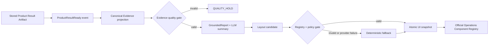

# feat: Week 3-4 evidence report UI automation closure

## Summary

3주차에는 PostgreSQL에 저장된 Product Result Artifact를 하나의 canonical Event Evidence로 투영하고, 같은 snapshot을 정적 GroundedReport와 실제 Operations 화면까지 전달한다. LLM은 이 검증된 Evidence를 요약할 수 있지만, 검증 실패나 provider 장애가 발생하면 deterministic report로 전환한다.

4주차에는 기능을 넓히지 않는다. 3주차 경로를 bounded event-driven workflow로 자동화하고, LLM Component Planner를 Component Registry와 정책 검증기 뒤에 연결한 뒤, Gold 계약 평가·장애 주입·공식 Operations E2E·발표 증거로 완료한다.

완료 주장의 범위는 호범 소유인 `Product Result/Evidence -> Event Evidence -> GroundedReport -> Event UI projection`이다. WorkOrder·Maintenance·Closed-loop 상태 머신과 production SLA/exactly-once 보장은 포함하지 않는다.

## Problem Frame

현재 저장된 Runtime Artifact가 canonical Evidence로 투영되는 경로는 존재하지만, Runtime detail은 이후 Report와 Layout을 자유형 dict로 다시 만든다. 별도의 ReportAgent와 LayoutPlanner는 grounding·fallback·Registry 검증을 제공하지만 fixture/legacy 경로에 머물러 있다. 공식 Operations consumer도 Runtime detail과 legacy Evidence/Report를 병렬 조회한 뒤 legacy Report를 우선해 서로 다른 snapshot을 섞을 수 있다.

또한 현행 Gold 평가는 8개 시나리오에서 통과할 수 있으나 provider가 없으면 Report/Layout 16개가 모두 deterministic fallback이다. 따라서 이 결과만으로 실제 LLM 품질이나 PostgreSQL Runtime-to-UI 연결을 주장할 수 없다.

## Requirements

### 3주차 완료 요구사항

- **R1** 저장된 Product Result Artifact 하나에서 canonical Event Evidence, typed GroundedReport, typed UILayout/ViewModel을 생성한다.
- **R2** Evidence·Report·Layout은 동일한 `organization_id`, `project_id`, `workspace_id`, `event_id`, `product_result_id/artifact_id`, dataset/model/policy/schema version을 유지한다.
- **R3** Runtime의 수제 Report/Layout dict를 공식 projection, ReportAgent, LayoutPlanner 계약으로 교체하거나 경계 adapter로 제한한다.
- **R4** LLM summary에는 검증된 canonical Evidence와 허용된 report context만 전달한다. raw producer payload, `hidden_truth`, `evaluation_truth`는 전달하지 않는다.
- **R5** Report citation/action reference는 현재 Event Evidence source field에 존재해야 하며 status·decision·숫자 원값을 변경할 수 없다.
- **R6** LLM timeout, malformed JSON, schema 오류, unknown citation, 금지 주장, status/decision 변조는 deterministic report로 fail closed한다.
- **R7** 공식 Operations는 Runtime snapshot을 정본으로 소비하고, legacy API는 Runtime 미지원 시에만 명시적 fallback으로 사용한다. 하나의 화면에서 Runtime과 legacy 산출물을 혼합하지 않는다.
- **R8** manager와 engineer의 정적 화면을 실제 Component Registry로 렌더링하고 citation, source, fallback mode를 확인할 수 있어야 한다.

### 4주차 완료 요구사항

- **R9** `ProductResultReady` 계열 이벤트 한 건이 Evidence 검증, Report 생성, Layout 계획, UI snapshot 게시를 순서대로 실행한다.
- **R10** 동일 event+artifact revision의 재전송은 no-op이고, 새 artifact revision은 새 snapshot을 만들며, 늦게 도착한 구버전은 latest를 덮어쓰지 않는다.
- **R11** workflow는 최소한 `RECEIVED`, `VALIDATING`, `EVIDENCE_READY`, `REPORT_READY`, `LAYOUT_READY`, `PUBLISHED`, `QUALITY_HOLD`, `FALLBACK_USED`, `RETRYING`, `DEAD_LETTER` 결과를 감사 가능하게 남긴다.
- **R12** LLM UI Planner는 Registry에 등록된 Component의 선택·순서·강조·접기만 제안한다. JSX/HTML/CSS, 임의 field, status/decision 변경, action 실행은 허용하지 않는다.
- **R13** deterministic policy gate는 role·intent·event 상태에 따른 required/forbidden/first block 규칙과 field binding을 검사한다.
- **R14** Report LLM 실패, Planner 실패, 둘 다 실패를 독립적으로 처리하며, 유효한 deterministic bundle을 게시하거나 `QUALITY_HOLD`로 종료한다.
- **R15** Report 품질은 Gold 8개 x 역할 2개 = 16건, Layout 품질은 Gold 8개 x 역할 2개 x 역할별 intent 3개 = 48건으로 평가한다.
- **R16** official Operations E2E는 manager critical, engineer warning, data-quality hold, LLM/Planner offline의 대표 4개 flow를 검증한다.
- **R17** 평가 결과는 commit, dataset/model/policy/prompt/schema/provider version과 실행 mode를 포함해 JSONL/JSON/Markdown으로 보존한다.
- **R18** deterministic fallback 결과와 실제 LLM 채택 결과를 분리해 보고한다.

## Key Technical Decisions

- **KTD1 — 3주차는 기능 경로, 4주차는 완료 증거:** 3주차 exit gate를 통과하지 못한 항목은 4주차 D1 이전에 먼저 닫는다. 4주차에 새로운 도메인 기능을 추가하지 않는다.
- **KTD2 — Atomic UI snapshot:** Evidence·Report·Layout을 한 snapshot/version 단위로 API와 frontend에 전달한다. 부분 성공 산출물을 조합하지 않는다.
- **KTD3 — Bounded automation:** 이벤트 자동화는 파생 read-model 생성까지만 수행한다. WorkOrder 생성이나 정비 상태 변경은 하지 않는다.
- **KTD4 — At-least-once + idempotency:** 기존 transactional outbox와 delivery log를 사용해 재시도를 허용하고 idempotency로 중복 파생물을 막는다. production exactly-once라고 표현하지 않는다.
- **KTD5 — LLM behind deterministic gates:** LLM은 summary와 Layout 후보만 만든다. 사실·권한·상태·Component 계약은 deterministic code가 최종 결정한다.
- **KTD6 — 계약 평가는 넓게, 브라우저 E2E는 깊게:** 48개 조합은 API/contract evaluator로 실행하고, 브라우저는 대표 4개 flow에 집중한다.
- **KTD7 — 전체 Dashboard가 아닌 Event 영역:** LLM Layout은 Event detail/report 영역의 Component Registry에만 적용한다. 사용자가 저장한 전체 workbench 배치는 덮어쓰지 않는다.

## Target Flow

## Scope Boundaries

### Core

- PostgreSQL Runtime Artifact에서 공식 Operations 화면까지 단일 snapshot 소비 경로
- Evidence quality validation과 GroundedReport/LLM summary grounding
- Event detail/report 영역의 Component Registry 기반 동적 배치
- outbox 기반 파생 snapshot 자동화, idempotency, retry/dead-letter
- Gold 16 Report/48 Layout 평가, 장애 주입, 대표 4개 E2E
- 재현 가능한 결과 파일, 데모 runbook, 발표용 측정치

### Stretch

- 광우의 maintenance overlay가 준비된 경우 post-maintenance snapshot 1건을 추가 E2E로 연결
- 실제 provider 2종 비교 또는 비용/latency 비교

### Out of Scope

- WorkOrder 자동 생성, 승인, Maintenance 상태 머신
- full Runtime Overlay와 fast-forward 재추론
- autonomous investigation multi-agent
- 기간별 Executive Report aggregate 계약
- 모든 48개 조합의 브라우저 실행
- production exactly-once, SLA, 실제 고장 감소율 주장

## Implementation Units

### U1 — Week 3 Exit Gate: Runtime Evidence to Typed Report/UI

**Requirements:** R1-R6, R8

**Files:**

- `systems/backend/ontology_dashboard/predictive_maintenance_runtime/service.py`
- `systems/backend/ontology_dashboard/predictive_maintenance_runtime/models.py`
- `systems/backend/ontology_dashboard/product_result_evidence_projection.py`
- `systems/backend/ontology_dashboard/reports.py`
- `systems/backend/ontology_dashboard/llm.py`
- `systems/backend/ontology_dashboard/planner/layout.py`
- `tests/test_predictive_maintenance_result_replay.py`
- `tests/test_operations.py`

**Work:**

- Runtime projection 이후 수제 Report/Layout 생성을 공식 typed 계약에 연결한다.
- report projection의 `evidence_trace[].field_id`를 citation allowlist로 사용한다.
- deterministic static report와 LLM summary가 같은 canonical Evidence를 사용하게 한다.
- aggregate contract가 없는 전체 설비 count·평균 위험·합산 downtime을 Event Report LLM 입력에서 제외하거나 명시적인 화면 집계로 분리한다.

**Acceptance scenarios:**

- **AE1:** 동일 Artifact를 두 번 투영하면 Report 내용과 citation source가 동일하다.
- **AE2:** unknown citation 또는 status/decision 변조를 반환한 LLM output은 채택되지 않고 deterministic report가 반환된다.
- **AE3:** `hidden_truth`/`evaluation_truth`가 producer payload에 존재해도 Evidence, prompt, API response에 나타나지 않는다.
- **AE4:** PostgreSQL replay에서 저장 Artifact의 event/version이 Report/Layout까지 유지되고 해당 테스트가 skip 없이 통과한다.

### U2 — Atomic Runtime Consumer Cutover

**Requirements:** R2, R7-R8

**Files:**

- `systems/frontend/src/features/operations/api/operationsApi.ts`
- `systems/frontend/src/features/operations/api/operationsAdapters.ts`
- `systems/frontend/src/features/operations/api/operationsAdapters.test.ts`
- `systems/frontend/src/features/operations/report/OperationsExecutiveReportPage.tsx`
- `systems/frontend/src/components.tsx`
- `systems/backend/ontology_dashboard/predictive_maintenance_runtime/service.py`
- `systems/backend/ontology_dashboard/predictive_maintenance_runtime/models.py`

**Work:**

- Runtime response에서 Evidence·Report·Layout과 lineage/version을 함께 반환한다.
- frontend는 Runtime snapshot 전체를 우선하며 legacy fallback을 source가 표시되는 하나의 완전한 bundle로만 허용한다.
- snapshot mismatch에서는 섞어서 렌더링하지 않고 safe error 또는 deterministic fallback 화면을 표시한다.

**Acceptance scenarios:**

- **AE5:** Runtime Report가 성공하면 legacy Report가 이를 덮어쓰지 않는다.
- **AE6:** Evidence와 Report의 artifact/version이 다르면 화면은 혼합 결과를 렌더링하지 않는다.
- **AE7:** Runtime 미지원 시 legacy bundle 전체가 선택되고 UI에 source/fallback mode가 표시된다.

### U3 — Bounded Event-Driven Snapshot Workflow

**Requirements:** R9-R11, R14

**Files:**

- `systems/backend/ontology_dashboard/outbox.py`
- `systems/backend/ontology_dashboard/distributed_handlers.py`
- `systems/backend/ontology_dashboard/predictive_maintenance_runtime/service.py`
- `systems/backend/migrations/postgresql/0030_evidence_report_snapshot_workflow.sql`
- `systems/backend/migrations/sqlite/0030_evidence_report_snapshot_workflow.sql`
- `tests/test_outbox_worker.py`
- `tests/test_evidence_report_layout_workflow.py`

**Work:**

- 기존 transactional outbox의 tenant/project/workspace scope, lease, retry, delivery log를 재사용한다.
- snapshot 식별자는 event, artifact revision, evidence schema, model/policy version으로 구성한다.
- workflow 상태와 실패 분류를 저장하고, latest pointer 갱신 시 구버전 overwrite를 막는다.
- LLM/Planner 실패는 업무 전체 실패가 아니라 `FALLBACK_USED`가 포함된 유효 bundle로 처리한다. Evidence 품질 실패만 `QUALITY_HOLD`한다.

**Acceptance scenarios:**

- **AE8:** 같은 idempotency key를 여러 번 전달해도 snapshot과 delivery side effect가 하나만 생긴다.
- **AE9:** revision 2 게시 후 늦게 도착한 revision 1이 latest를 덮지 않는다.
- **AE10:** worker crash 후 lease 만료·재시도에서도 중복 snapshot 없이 완료한다.
- **AE11:** transient 저장 오류는 `RETRYING`, 재시도 소진은 `DEAD_LETTER`로 감사 가능하다.
- **AE12:** 다른 workspace의 event/artifact를 payload에 넣으면 처리하지 않는다.

### U4 — Governed LLM Summary and Component Planner

**Requirements:** R12-R14

**Files:**

- `systems/backend/ontology_dashboard/llm.py`
- `systems/backend/ontology_dashboard/planner/layout.py`
- `prompts/ui-planner.md`
- `contracts/schemas/ui-block.schema.json`
- `tests/test_operations.py`
- `evaluation/gold_scenarios.yml`

**Work:**

- 역할별 intent를 manager의 `overview`, `summarize-manager`, `recommend-check`와 engineer의 `overview`, `explain-risk`, `detail-engineer`로 고정한다.
- Gold의 required/forbidden/first block을 runtime policy validator에 연결한다.
- critical, approval pending, data-quality hold와 low-confidence 상태의 필수/금지 block 정책을 코드로 강제한다.
- Report와 Planner의 provider 호출·검증·fallback 결과를 독립적으로 기록한다.

**Acceptance scenarios:**

- **AE13:** unregistered Component/field, 필수 block 누락, 잘못된 first block은 거부되고 역할별 deterministic layout으로 전환된다.
- **AE14:** data-quality hold에서는 품질 경고가 첫 block이며 impact/확정 원인 block을 노출하지 않는다.
- **AE15:** Report LLM만 실패, Planner만 실패, 둘 다 실패하는 세 경우 모두 안전한 최종 bundle을 생성한다.
- **AE16:** LLM은 WorkOrder 생성, status 변경, 정지 명령을 호출하거나 제안 결과에 확정 사실로 기록할 수 없다.

### U5 — Gold Evaluator and Failure Injection

**Requirements:** R15, R17-R18

**Files:**

- `scripts/evaluate_gold.py`
- `evaluation/gold_scenarios.yml`
- `evaluation/results/README.md`
- `tests/test_evidence_report_layout_evaluation.py`
- `evaluation/results/<date>-gold-v2/manifest.json`
- `evaluation/results/<date>-gold-v2/case-matrix.jsonl`
- `evaluation/results/<date>-gold-v2/kpi-summary.json`
- `evaluation/results/<date>-gold-v2/failure-injection.jsonl`
- `evaluation/results/<date>-gold-v2/evaluation-report.md`

**Work:**

- 실행 환경을 hermetic하게 고정하고 APP_ENV 누락으로 평가 의미가 달라지지 않게 한다.
- 16개 Report와 48개 Layout case의 개별 판정 및 분모/분자를 저장한다.
- `mock`, `deterministic_fallback`, `live_llm_accepted`, `live_llm_rejected` mode를 분리한다.
- timeout, malformed JSON, unknown citation, 숫자/status/decision 변조, 금지 주장, 미등록 Component/field를 주입한다.

**Metrics:**

- Citation 유효율 = 유효 Evidence field reference 수 / 전체 reference 수
- 수치·상태 일치율 = 원천과 일치한 숫자·enum 수 / 출력된 숫자·enum 수
- Snapshot 일관성 = 동일 lineage/version을 유지한 case 수 / 전체 case 수
- LLM 직접 채택률 = validator를 통과한 LLM output 수 / LLM 시도 수
- 최종 안전 출력률 = 채택 LLM 또는 유효 fallback output 수 / 전체 시도 수
- 필수 Block 재현율 = 노출된 required block 수 / 기대 required block 수
- 금지 Block 위반률 = 노출된 forbidden block 수 / 실행된 forbidden rule 수
- first Block 정확도 = 기대 first block과 일치한 layout 수 / 48
- Bundle 완료율 = 정확히 하나의 유효 bundle을 만든 trigger 수 / 수신 trigger 수
- 중복 생성률 = 중복 delivery가 만든 추가 bundle 수 / 중복 delivery 수

**Hard gates:**

- unknown citation, 숫자/status/decision 변조, hidden/evaluation truth, 금지 운영 주장: 0건
- 미등록 Component/data field 렌더링: 0건
- required block 노출률과 data-quality first block 정확도: 100%
- 장애 주입의 deterministic fallback 또는 `QUALITY_HOLD`: 100%
- 동일 idempotency key의 중복 bundle: 0건
- 구버전의 latest overwrite, cross-workspace access, snapshot version mismatch: 0건

### U6 — Official Operations E2E, CI, Demo Freeze

**Requirements:** R16-R18

**Files:**

- `systems/frontend/e2e/operations-frontend-convergence.spec.ts`
- `systems/frontend/e2e/gold-flow.spec.ts`
- `.github/workflows/backend-contract-ci.yml`
- `.github/workflows/architecture.yml`
- `docs/operations/evidence-report-layout-demo-runbook.md`
- `evaluation/results/<date>-gold-v2/`

**Work:**

- GS-004 manager critical, GS-002 engineer warning, GS-007 data-quality hold, GS-008 LLM/Planner offline을 official Operations에서 검증한다.
- 실제 Component 순서, required/forbidden block, Evidence binding, fallback/source badge를 확인한다.
- 평가 manifest와 승인된 발표 요약을 CI artifact로 구분해 저장한다.
- 1분 데모와 아키텍처/KPI 한 장을 고정한다.

**Acceptance scenarios:**

- **AE17:** PostgreSQL Runtime API에서 받은 하나의 snapshot이 official Operations Component Registry까지 렌더링된다.
- **AE18:** 대표 4개 flow가 브라우저에서 통과하고, LLM offline flow도 raw error/secret 없이 fallback mode를 표시한다.
- **AE19:** 실행 manifest에 commit과 dataset/model/policy/prompt/schema/provider version 및 실행 mode가 기록된다.
- **AE20:** API/fixture 테스트만 통과하고 PostgreSQL-to-browser flow가 없으면 상태를 `Partially Verified`로 유지한다.

## Delivery Schedule

### Week 3 — Single Evidence Path

- **D1-D2:** U1 Runtime typed Report 연결, citation/status/decision/hidden truth 검증
- **D3:** LLM summary와 deterministic fallback 통합
- **D4:** U2 Runtime-first consumer와 typed static UI 연결
- **D5:** PostgreSQL replay, manager/engineer 화면 smoke, 3주차 exit gate 판정

### Week 4 — Automation, Evaluation, Release Evidence

- **D1:** U2 consumer cutover 마감, atomic snapshot/version mismatch 정책
- **D2:** U3 outbox handler, idempotency, revision ordering, retry/dead-letter
- **D3:** U4 Component Planner Runtime 연결, Registry·role/status 정책 검증
- **D4:** U5 16/48 case evaluator, failure injection, KPI 결과 생성
- **D5:** U6 대표 4개 Playwright E2E, CI, 결과·데모·문서 freeze

## Dependencies and Ownership

- **호범:** Evidence projection, GroundedReport, citation/quality policy, Event UI projection 계약, 평가기와 근거 기반 KPI.
- **우수 협업:** provider adapter, Runtime/API wiring, frontend Component Registry 소비, CI/E2E/deploy 환경.
- **광우 handoff:** Recommendation/Decision/WorkOrder/Maintenance 상태. 이 계획은 읽기 전용 상태를 화면 정책에 사용하지만 변경하지 않는다.
- **성민 handoff:** model artifact, dataset/model version, post-maintenance history readiness. 평가 manifest에 버전을 기록한다.

우수의 provider/API/UI 변경 또는 광우의 상태 계약이 늦어져도 호범 범위는 mock/fault-injection과 deterministic fallback으로 검증할 수 있다. 다만 실제 provider와 PostgreSQL-to-browser가 연결되지 않으면 각각 `live LLM verified`, `End-to-End verified`라고 주장하지 않는다.

## Risks and Mitigations

- **Risk:** 4주차에 async workflow까지 추가해 일정이 초과된다.
  **Mitigation:** 기존 outbox/lease/retry/delivery log를 재사용하고 파생 snapshot 하나로 제한한다.
- **Risk:** 기존 legacy/Runtime API를 혼합해 우연히 정상처럼 보인다.
  **Mitigation:** atomic snapshot lineage 비교와 no-mix frontend test를 release gate로 둔다.
- **Risk:** fallback 100% 결과를 LLM 품질로 오해한다.
  **Mitigation:** LLM 직접 채택률과 최종 안전 출력률, live/mock/fallback mode를 분리한다.
- **Risk:** LLM Layout이 사용자의 전체 Dashboard 배치를 덮어쓴다.
  **Mitigation:** Event detail/report 영역과 등록 Component로 권한을 제한한다.
- **Risk:** 품질 지표 평균이 안전 위반을 가린다.
  **Mitigation:** citation 변조, hidden truth, 권한, 미등록 Component, 중복 산출물은 평균이 아닌 Hard Gate로 관리한다.

## Definition of Done

4주차 종료 시 아래가 모두 충족돼야 호범 범위를 완료로 표시한다.

- PostgreSQL stored Runtime Artifact부터 official Operations 화면까지 단일 snapshot 경로가 있다.
- 정적 Report, LLM summary, Layout이 동일 canonical Evidence와 version lineage를 사용한다.
- official Operations가 검증된 Layout을 Component Registry로 실제 렌더링한다.
- 16개 Report/48개 Layout 계약 평가와 장애 주입 결과 파일이 생성된다.
- representative 4개 browser flow가 통과한다.
- Hard Gate 위반은 0건이고 fallback/quality-hold 분기가 모두 검증된다.
- 중복 trigger는 중복 bundle이나 도메인 side effect를 만들지 않는다.
- 결과에는 commit과 모든 관련 version 및 실행 mode가 기록된다.
- WorkOrder/Maintenance/Overlay/production SLA는 완료 주장에 포함하지 않는다.

## Portfolio Evidence After Completion

완료 후에는 다음 수준으로 표현할 수 있다.

> 저장된 예지보전 모델 결과를 canonical Event Evidence로 투영하고, 근거 검증을 통과한 LLM 요약과 역할별 Component Layout을 생성하는 이벤트 기반 파이프라인을 설계·구현했다. 48개 계약 평가와 장애 주입, PostgreSQL-to-browser E2E로 citation·상태 보존·fallback·중복 방지 정책을 검증했다.

단, 실제 provider 실행이나 PostgreSQL-to-browser E2E가 빠진 경우에는 해당 부분을 `mock 검증` 또는 `Partially Verified`로 낮춰 표현한다.
