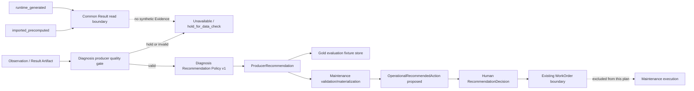

# Recommendation Policy v1 and Gold Seed Plan

## Summary

Diagnosis producer가 Product Result/Evidence에서 운영 추천 후보를 결정론적으로 만들고,
고정 Gold 시나리오는 operational recommendation table 밖의 evaluation/demo fixture로
멱등하게 적재한다. 추천은 실행 명령이 아니며, 사람의 판단·승인 전에는 WorkOrder나
MaintenanceAction을 만들지 않는다.

이 계획은 기존 Closed-loop 상태 머신을 다시 만들지 않고, Diagnosis의 producer
recommendation과 canonical Maintenance의 Operational RecommendedAction 경계를 연결하는
범위만 다룬다. Gold fixture는 운영 상태와 분리한다.

## Problem Frame

저장소에는 ProducerRecommendation, OperationalRecommendedAction, RecommendationDecision,
WorkOrder의 타입·상태·lineage·멱등성 계약이 이미 있다. 그러나 다음 두 연결이 별도
계획으로 고정되어 있지 않다.

- Diagnosis producer가 `status`, `criticality`, `data_quality_hold`를 어떤 우선순위
  규칙으로 추천 후보에 매핑할지
- `evaluation/gold_scenarios.yml`을 이용해 평가 fixture를 미리 쌓되, operational
  recommendation이나 실제 WorkOrder로 오인하지 않도록 어떻게 격리할지
- imported precomputed 결과와 runtime-generated 결과가 같은 Result read boundary를
  사용하면서도 writer 의미와 Evidence 가용성을 섞지 않도록 어떻게 migration할지

현재 Gold 8개는 정상·경고·심각·저신뢰·데이터 품질 보류·LLM 장애를 다루는 내부 회귀
기준이다. 이는 현장 정답이나 비즈니스 효과의 증거가 아니므로, 계획 산출물에는 Gold의
권한·출처·사용 범위를 명시한다.

## Requirements

### Policy and lineage

- R1. 추천 정책은 Diagnosis producer 소유의 `recommendation-policy-v1`로 버전 고정하고,
  `status`와 `data_quality_hold`를 우선 평가한 뒤 명시적으로 전달된
  `equipment.criticality`를 운영 맥락으로 사용한다. 데이터셋에 없는 확률·RPN·검출
  점수를 새로 발명하지 않는다.
- R2. 정책 결과는 기존 `ProducerRecommendation`과
  `OperationalRecommendedAction` 계약을 재사용하며, `source_action_id`,
  `source_product_result_id`, `source_evidence_id`, schema/policy version, 원본 basis를
  보존한다.
- R3. `data_quality_hold`, 필수 identity 누락, unresolved basis가 있으면 실행성 추천을
  만들지 않고 `hold_for_data_check` 또는 unavailable 상태로 fail-closed한다.
- R4. LLM은 추천 결정·status·approval·WorkOrder 상태를 생성하거나 변경하지 않는다.
  LLM은 이후 자연어 요약과 화면 배치 후보에만 제한적으로 사용한다.

### Gold seed and persistence

- R5. Gold fixture는 실행 시 재생성하지 않고 버전과 checksum이 고정된 입력·기대 결과로
  사용한다. 기존 Gold 8개를 `Gold v1` 기준셋으로 유지한다.
- R6. Gold pre-seed는 operational recommendation table이 아닌 evaluation/demo fixture
  store에만 `proposed` 결과로 저장한다. Gold fixture를 operational recommendation으로
  자동 승격하지 않으며, 별도 운영 승격 계약 없이는 Decision·WorkOrder 경로에 연결하지
  않는다.
- R7. 동일 `source_product_result_id + source_action_id` 재처리는 no-op 또는 동일
  결과 replay가 되어야 한다. `source_policy_version`은 provenance이며 materialization
  key에 포함하지 않는다. 새 artifact revision은 새 recommendation lineage를 만든다.
- R8. Gold seed 경로에서는 operational RecommendationDecision, WorkOrder,
  MaintenanceAction, MaintenanceEvent를 생성하지 않는다. 이 조건은 문구가 아니라
  fixture store와 operational repository의 저장 경계로 보장한다.

### Evaluation and claims

- R9. Gold runner는 상태·결정·근거·정책 버전·추천 상태·중복 여부·WorkOrder 부작용을
  별도로 기록한다. 단순 `8/8` pass rate만 보고하지 않는다.
- R10. 기존 8개 외에 정책 경계용 3~4개를 추가하거나 parameterized contract test로
  검증한다: critical+중간 criticality, data-quality-hold+high criticality,
  criticality 누락, 동일 이벤트 replay/new artifact revision.
- R11. 입력 변형(event/asset/evidence ID 변경, quality hold 삽입, unknown basis,
  policy version mismatch)은 reject/hold되어야 하며 실행성 추천으로 통과하면 안 된다.
- R12. 결과 문서와 발표에서는 `engineering acceptance set` 또는
  `synthetic evaluation set`으로 표현한다. 현장 정확도, 정비 시간 절감, 고장률 개선은
  실제 정비 이력·도메인 검토 없이는 주장하지 않는다.

### Migration boundaries

- R13. 신규 구현은 `systems/backend/app/diagnosis`, `systems/backend/app/maintenance`,
  `systems/backend/app/infra/db` canonical 경로에만 둔다. 제거 대상
  `systems/backend/ontology_dashboard`에는 새 기능·새 파일을 추가하지 않는다.
- R14. `materialization_strategy=runtime_generated|imported_precomputed`를 내부 writer
  provenance로 보존한다. 한 Dataset Version에서 두 writer를 동시에 사용하지 않고,
  runtime 실패를 imported 결과로 자동 fallback하지 않는다.
- R15. imported Result Artifact에 Evidence detail이 없으면 Result·추천·schema는 보존하고
  detail만 unavailable로 표시한다. consumer가 synthetic Evidence나 추천 근거를 재생성하지
  않는다.

## Key Technical Decisions

- KTD1. **Producer ownership:** 추천 정책 evaluator는
  `systems/backend/app/diagnosis`가 소유한다. Maintenance는 ProducerRecommendation의
  의미를 재계산하지 않고 validation/materialization만 수행한다. Operations가 독자 추천을
  만들 경우 producer projection과 다른 `origin`·policy/version을 갖는 별도 계약으로
  분리한다.
- KTD2. **정책 순서 고정:** `data_quality_hold/identity failure`를 가장 먼저 차단하고,
  그 다음 `critical`/`warning`/`attention`/`normal`을 처리한다. criticality는 Diagnosis가
  equipment public port 또는 명시적 projection으로 받은 경우에만 사용하며, 별도
  Maintenance DB를 직접 조회하지 않는다.
- KTD3. **Canonical migration path:** 구현 target은 `app/diagnosis`·`app/maintenance`·
  `app/infra/db`다. 현재 `ontology_dashboard/closed_loop` 구현은 #92 convergence가
  정한 canonical target으로 수렴할 때까지 migration input으로만 취급한다.
- KTD4. **추천과 실행 분리:** `request_inspection`과 `review_shutdown`은 사람이 검토할
  후보이며 자동 shutdown이나 maintenance 승인이 아니다. 기존 Domain 계약의
  `RecommendationDecision`과 WorkOrder 승인 경계를 그대로 따른다.
- KTD5. **Gold 고정, seed는 provenance:** 정적 Gold fixture에는 실행 seed를 요구하지
  않는다. 합성 데이터 생성에 seed가 사용된 경우에는 생성 metadata와 checksum에만
  기록하고, Gold 기대 결과를 현재 모델 출력으로 재생성하지 않는다.
- KTD6. **Gold fixture 격리:** Gold pre-seed는 local/test/demo evaluation fixture store에만
  허용한다. operational recommendation table에 `gold_fixture`나
  `do_not_operationalize` 문자열만 추가해 안전을 보장하지 않는다. 운영 테이블에 Gold를
  넣는 선택은 별도 schema·authorization·promotion 계약으로 후속 결정한다.
- KTD7. **결정론적 ID와 policy re-evaluation:** materialization key는 현재 계약인
  `source_product_result_id + source_action_id`를 유지하고, policy version은 provenance로
  기록한다. 같은 source를 policy v2로 다시 평가할 때 operational recommendation을
  새로 만들지 않고 별도 evaluation artifact로 저장한다. 새 Product Result revision은
  새 source ID를 가지므로 새 lineage를 허용한다.
- KTD8. **Writer migration:** imported precomputed와 runtime-generated writer를 내부
  strategy로 구분하되 public API/UI mode로 노출하지 않는다. Evidence 부재는 detail
  unavailable이며 runtime 실패의 imported fallback 사유가 아니다.

## High-Level Technical Design

정책 판단은 Diagnosis가 명시적으로 받은 구조화된 입력만 읽는다. Gold seed는 `F`의
evaluation fixture 경로를 검증하고, runtime producer 경로만 `G` 이후 Maintenance
materialization으로 연결한다. `I` 이후의 승인·작업·정비 상태는 기존 Closed-loop 계획과
담당자의 구현 범위로 남긴다.

## Scope Boundaries

### In scope

- Recommendation Policy v1 규칙·버전·basis 계약
- Product Result/Evidence에서 ProducerRecommendation으로의 결정론적 매핑
- Gold v1 평가 확장과 정책 경계 테스트
- Gold evaluation/demo fixture pre-seed, provenance, 멱등성, replay 검증
- runtime/imported writer strategy와 Evidence unavailable migration gate
- 발표용 평가 artifact와 제한된 주장 문구

### Deferred to Follow-Up Work

- 실제 PostgreSQL Runtime Artifact에서 자동 consumer를 거쳐 recommendation을
  materialize하는 production E2E
- RecommendationDecision UI와 WorkOrder 승인 흐름의 확장
- 정비 완료 이후 Runtime Overlay와 treatment-effect 평가
- 비용·downtime·작업시간을 포함한 RPN 또는 기대비용 최적화
- 도메인 전문가의 현장 라벨 검토와 business impact 실험

### Outside this product's identity

- 자동 설비 정지·제어
- 자동 정비 실행 또는 승인 없는 WorkOrder 생성
- Gold 통과율을 근거로 한 현장 고장률·비용 절감 보증

## Implementation Units

### U1. Recommendation policy contract and deterministic evaluator

- **Goal:** Diagnosis producer가 명시적으로 받은 evidence와 equipment context를 사용해
  정책 버전과 우선순위 규칙을 결정론적으로 평가하고 ProducerRecommendation을 생성한다.
- **Requirements:** R1, R2, R3, R4, KTD1, KTD2, KTD3
- **Dependencies:** 없음
- **Files:**
  - `systems/backend/app/diagnosis/recommendation_policy.json`
  - `systems/backend/app/diagnosis/recommendation_policy.py`
  - `systems/backend/app/diagnosis/diagnosis_schema.py`
  - `systems/backend/app/diagnosis/evidence_enrichment.py`
  - `tests/test_recommendation_policy.py`
  - `tests/test_product_result_evidence_enrichment.py`
- **Approach:** 정책 파일은 version, input fields, ordered rules, output action kind,
  approval requirement, basis field IDs를 선언한다. evaluator는 evidence validation을
  통과한 projection만 받고, existing `ProducerRecommendation`으로 반환한다. 기존
  `_ACTION_BY_STATUS`와 중복되는 의미가 발견되면 새 규칙을 병렬로 두지 않고 adapter로
  통합한다.
- **Patterns to follow:** `systems/backend/app/diagnosis/threshold_policy.json`,
  `systems/backend/app/diagnosis/evidence.py`,
  `systems/backend/app/diagnosis/evidence_enrichment.py`.
- **Test scenarios:**
  - normal/medium은 `continue_monitoring` 후보와 monitor basis를 반환한다.
  - warning/high와 warning/medium은 inspection 후보를 반환하되 approval requirement를
    보존한다.
  - critical/high는 shutdown review 후보를 반환하고 자동 shutdown 명령을 만들지 않는다.
  - data-quality-hold/high는 실행성 추천이 아니라 data check hold로 끝난다.
  - criticality가 Diagnosis public input/projection에 없으면 Maintenance DB를 조회하지 않고
    unavailable/reject로 끝난다.
  - criticality 또는 source basis가 누락되면 unavailable/reject로 끝난다.
  - LLM/provider가 비활성화되어도 policy output은 동일하다.
- **Verification:** 같은 evidence snapshot과 policy version에서 동일한 action ID,
  kind, basis, approval 값이 반복해서 나온다.

### U2. Gold v1 evaluation and boundary coverage

- **Goal:** 기존 Gold 8개를 추천 정책의 회귀 기준으로 확장하고 경계 케이스를 보강한다.
- **Requirements:** R5, R9, R10, R11, R12, KTD4
- **Dependencies:** U1
- **Files:**
  - `evaluation/gold_scenarios.yml`
  - `evaluation/README.md`
  - `scripts/evaluate_gold.py`
  - `tests/test_recommendation_gold.py`
  - `tests/test_evidence_report_layout_workflow.py`
- **Approach:** Gold v1 fixture와 expected block/decision을 수정 없이 유지한다. 추천
  policy 결과, source lineage, quality hold, forbidden side effect를 별도 결과 필드로
  추가한다. 경계 테스트는 새 fixture로 만들거나 parameterized contract fixture로
  두되, 기존 Gold expected value를 모델 실행 결과로 덮어쓰지 않는다.
- **Patterns to follow:** `evaluation/gold_scenarios.yml`, `evaluation/README.md`,
  `scripts/evaluate_gold.py`, `tests/test_closed_loop_domain_contract.py`.
- **Test scenarios:**
  - GS-001~GS-008의 expected decision과 policy output이 일치한다.
  - Gold runner가 각 추천의 source product/evidence/action ID를 확인한다.
  - critical+medium, data-quality-hold+high, missing-criticality, replay/revision 경계를
    각각 검증한다.
  - event/asset/evidence ID 변형과 unknown basis는 reject/hold된다.
  - Gold 평가 중 WorkOrder·MaintenanceAction·MaintenanceEvent 생성 수가 0이다.
- **Verification:** Gold v1 pass artifact에 scenario count, policy version, seed source,
  rejected mutation count, side-effect count가 기록된다.

### U3. Gold evaluation fixture seed and runtime materialization boundary

- **Goal:** Gold 입력을 operational recommendation table 밖에 미리 쌓고, runtime producer
  경로에서만 canonical Maintenance materialization 계약을 검증한다.
- **Requirements:** R5, R6, R7, R8, R14, R15, KTD5, KTD6, KTD7, KTD8
- **Dependencies:** U1, U2
- **Files:**
  - `scripts/seed_gold_recommendations.py`
  - `evaluation/results/recommendation-policy-v1.json`
  - `systems/backend/app/maintenance/maintenance_schema.py`
  - `systems/backend/app/maintenance/maintenance_domain.py`
  - `systems/backend/app/infra/db/maintenance_repository.py`
  - `tests/test_gold_recommendation_seed.py`
  - `tests/test_maintenance_recommendation_materialization.py`
- **Approach:** seed 입력은 Gold scenario ID와 고정 fixture revision을 사용해 evaluation
  result/fixture store에만 기록한다. operational repository를 호출하지 않으며, runtime
  ProducerRecommendation만 canonical Maintenance validation/materialization 경계를
  통과한다. materialization key는 source result/action을 유지하고 policy version은
  provenance로만 남긴다. 새 result revision은 새 lineage로 저장한다.
- **Patterns to follow:** `systems/backend/app/diagnosis` public producer contract,
  `systems/backend/app/maintenance` canonical target, `docs/backend-migration-map.md`,
  demo seed의 production guard 패턴.
- **Test scenarios:**
  - 빈 evaluation store에 Gold seed를 실행하면 expected count의 fixture recommendation만
    저장되고 operational recommendation row는 0개다.
  - 동일 seed를 두 번 실행해도 fixture row가 중복되지 않는다.
  - 동일 source를 policy v2로 재평가해도 operational recommendation은 새로 만들지 않고
    별도 evaluation artifact로 저장된다.
  - 동일 event의 새 Product Result revision은 기존 추천을 덮지 않고 새 source lineage를
    만든다.
  - runtime failure가 imported_precomputed 결과로 자동 fallback하지 않는다.
  - imported Result Artifact에 Evidence가 없으면 Result와 추천은 보존하고 detail만
    unavailable로 반환한다.
  - 다른 workspace scope의 Gold source는 저장되지 않거나 권한 오류가 난다.
- **Verification:** seed 결과 manifest와 fixture count가 일치하고, repeat run delta가 0이며,
  operational recommendation/Decision/WorkOrder side effect가 0이다. canonical target은
  `app/maintenance`와 `app/infra/db`에만 존재한다.

### U4. Evaluation artifact, documentation, and handoff boundary

- **Goal:** Gold 결과를 현장 효과로 과장하지 않고 발표·리뷰에서 재현 가능한 artifact로
  남긴다.
- **Requirements:** R9, R12, R13, R14, R15, KTD3, KTD4, KTD5, KTD8
- **Dependencies:** U2, U3
- **Files:**
  - `evaluation/results/README.md`
  - `evaluation/results/recommendation-policy-v1.json`
  - `docs/architecture.md`
  - `docs/backend-migration-map.md`
  - `docs/closed-loop-implementation-plan.md`
  - `docs/closed-loop-domain-contract.md`
  - `docs/operations/pdm-evidence-report-ui-integration-plan.md`
- **Approach:** 결과 artifact에 Gold version, fixture checksum, policy/schema/model
  version, evaluator version, writer strategy, run timestamp, scenario count, pass/fail,
  mutation rejection, operational side-effect count, known limitations를 기록한다. 기존
  Closed-loop 문서에는 Diagnosis ownership, canonical Maintenance target, fixture 격리,
  imported/runtime writer 경계만 연결하고 상태 머신 설명을 복제하지 않는다.
- **Patterns to follow:** `evaluation/results/README.md`, `docs/closed-loop-*`,
  `docs/operations/report-specification.md`의 claim/limitation 원칙.
- **Test scenarios:**
  - 결과 JSON이 schema와 required provenance를 만족한다.
  - Gold 8/8 통과와 field/business validation 미실시가 동시에 표현된다.
  - policy version 또는 fixture checksum이 바뀌면 결과가 다른 run으로 분리된다.
  - `runtime_generated`와 `imported_precomputed`가 한 Dataset Version에서 동시에 writer로
    선택되지 않는다.
- **Verification:** reviewer가 결과 artifact만 보고 Gold acceptance와 현장 효과 주장을
  구분할 수 있다.

## Acceptance Examples

- AE1. **정상 설비**
  - **Given:** GS-001, valid evidence, medium criticality
  - **When:** policy v1 evaluates the snapshot
  - **Then:** `continue_monitoring` fixture recommendation이 evaluation store에 생성되고,
    operational recommendation row와 WorkOrder는 모두 0개다.

- AE2. **데이터 품질 보류**
  - **Given:** GS-007, invalid sensor data, any criticality
  - **When:** seed 또는 policy evaluation을 수행한다.
  - **Then:** `hold_for_data_check` 또는 unavailable만 허용되고 inspection/shutdown
    WorkOrder는 생성되지 않는다.

- AE3. **재처리 멱등성**
  - **Given:** 동일 event/product-result/action을 이미 seed했다.
  - **When:** 같은 Gold seed를 다시 실행한다.
  - **Then:** 기존 fixture recommendation을 replay하고 fixture delta와 operational side effect를
    모두 만들지 않는다.

- AE4. **새 결과 revision**
  - **Given:** 같은 asset/event에 새 product result revision이 도착했다.
  - **When:** policy v1과 seed를 재실행한다.
  - **Then:** 구 revision을 덮지 않고 새 source lineage의 fixture recommendation을 만든다.

- AE5. **Imported detail unavailable**
  - **Given:** `imported_precomputed` Result Artifact에 Evidence detail이 없다.
  - **When:** 공통 Result read boundary가 결과를 조회한다.
  - **Then:** Result·recommendation·schema는 보존하고 detail만 unavailable로 반환하며,
    runtime-generated Evidence나 추천을 합성하지 않는다.

## System-Wide Impact

- **호범 / Diagnosis:** Product Result/Evidence에서 판단 후보와 basis를 제공하고
  `recommendation-policy-v1`을 소유한다. risk, probability, failure type을 Maintenance가
  재계산하지 않는다.
- **광우 / Maintenance/Closed-loop:** canonical `app/maintenance` 경계에서
  ProducerRecommendation을 OperationalRecommendedAction으로 validation/materialization하고,
  이후 사람의 Decision·WorkOrder 상태를 소유한다. 기존 `ontology_dashboard/closed_loop`는
  #92 convergence 전까지 migration input으로만 읽는다.
- **우수 / Product API/UI:** 추천을 read-only proposed 상태로 표시하고 Backend의
  `available_actions`를 소비한다. Frontend가 추천 규칙이나 ID를 합성하지 않는다.
- **Evaluation:** Gold runner와 seed manifest는 개발·CI·demo fixture store에 한정하며
  operational recommendation repository를 호출하지 않는다.
  PostgreSQL Runtime consumer 연결은 별도 E2E로 검증될 때까지 미입증으로 표시한다.

## Risks and Dependencies

| Risk / dependency | Mitigation |
| --- | --- |
| Gold expected action이 현재 fixture와 불일치 | U2에서 fixture expected와 policy output을 분리 비교하고 변경 시 Gold version을 올린다. |
| criticality를 실제 확률처럼 해석 | policy 문서에서 criticality는 운영 우선순위 맥락으로만 명시한다. |
| Gold pre-seed가 실제 업무로 오인 | Gold는 evaluation/demo fixture store에만 저장하고 operational repository를 호출하지 않는다. 운영 승격은 별도 schema·authorization·promotion 계약 없이는 불가하다. |
| source policy/evidence ID 누락 | 기존 Domain 계약처럼 unknown 기본값을 만들지 않고 fail-fast한다. |
| seed replay 중 중복 audit/outbox | source lineage 기반 idempotency와 repeat-run count 테스트를 둔다. |
| policy v2 재평가가 operational row를 중복 생성 | policy version은 provenance로만 기록하고 동일 source key는 replay한다. v2 결과는 별도 evaluation artifact로 저장한다. |
| runtime/imported 이중 writer 또는 잘못된 fallback | Dataset Version별 writer를 하나로 선택하고 strategy를 provenance에 기록한다. runtime 실패를 imported로 자동 전환하지 않는다. |
| #92 전환 중 legacy 경로에 새 코드 추가 | 계획과 구현 파일을 `app/diagnosis`, `app/maintenance`, `app/infra/db`로 고정하고 legacy package는 migration input으로만 사용한다. |
| 8개 Gold를 현장 대표성으로 과장 | acceptance artifact에 synthetic/internal authority와 external validation 미실시를 기록한다. |

## Sources and Research

### Repository sources

- `docs/closed-loop-implementation-plan.md`: Producer recommendation materialization,
  담당 경계, PR 순서, 자동 실행 제외 범위
- `docs/closed-loop-domain-contract.md`: 추천·Decision·WorkOrder 경계, 상태 전이,
  `source_product_result_id + source_action_id` 멱등성 키
- `docs/closed-loop-product-consumption-contract.md`: 역할별 추천 소비,
  `available_actions`, Backend 권한 검증
- `docs/operations/pdm-evidence-report-ui-integration-plan.md`: producer action/basis grounding,
  recommendation과 WorkOrder 분리, runtime/imported writer 선택과 Evidence unavailable 경계
- `docs/architecture.md`: `systems/backend/ontology_dashboard` legacy migration source 및
  신규 기능 추가 금지 원칙
- `docs/backend-migration-map.md`: `closed_loop/*`를 `app/maintenance`로 이동하는 canonical
  target map
- `systems/backend/app/diagnosis/evidence_enrichment.py`: 기존 Diagnosis producer의
  status 기반 action 매핑과 통합 대상
- `evaluation/gold_scenarios.yml`: Gold v1 8개 시나리오, 안전·fallback·역할별 기대값
- `scripts/evaluate_gold.py`: 현재 Gold runner가 검증하는 상태·결정·신뢰도·보고서·layout 범위
- `tests/test_closed_loop_domain_contract.py` and `tests/test_closed_loop_persistence.py`:
  typed recommendation과 persistence/idempotency의 기존 패턴

### External references

- [NIST AI RMF Core — Measure 2](https://airc.nist.gov/airmf-resources/airmf/5-sec-core/)
  는 test set, metric, 도구·조건의 문서화, 배포 조건과 유사한 환경에서의 검증, 일반화
  한계 공개를 요구한다. 이 계획의 Gold manifest와 `not for` 주장 경계의 근거다.
- [NIST AI TEVV](https://www.nist.gov/ai-test-evaluation-validation-and-verification-tevv)
  는 AI 제품의 신뢰성을 위해 반복 가능한 측정·평가·검증·확인 체계를 사용하도록 안내한다.
  Gold runner를 단발성 demo가 아닌 repeatable evaluation artifact로 두는 근거다.
- [Google ML Test Score](https://research.google/pubs/whats-your-ml-test-score-a-rubric-for-ml-production-systems/)
  는 모델 정확도 외에 데이터·검증·모니터링·운영 준비 테스트를 함께 평가한다. 추천
  policy, data-quality hold, fallback, side-effect zero를 함께 보는 근거다.
- [Testing and Validating Machine Learning Classifiers by Metamorphic Testing](https://pmc.ncbi.nlm.nih.gov/articles/PMC3082144/)
  는 명확한 test oracle이 부족한 ML 시스템에서 입력-출력 관계를 불변 조건으로 검사하는
  접근을 제시한다. unknown citation, identity 변경, quality-hold 변형 테스트의 근거다.
- [Datasheets for Datasets](https://arxiv.org/abs/1803.09010)
  는 데이터셋의 목적·구성·수집·권장 사용을 문서화하도록 제안한다. Gold를 현장 정답이
  아닌 내부 engineering acceptance set으로 표시하는 근거다.
- [Model Cards for Model Reporting](https://arxiv.org/abs/1810.03993)
  는 평가 조건·의도된 사용·성능 특성·제한을 함께 공개하도록 제안한다. Gold 결과와
  실제 field/business validation을 분리하는 근거다.

## Success Metrics

- Gold v1 8개 + 경계 3~4개에서 정책 결과·근거 lineage 불일치 0건
- invalid/unknown basis·cross-scope 입력의 실행성 추천 통과 0건
- data-quality-hold에서 inspection/shutdown WorkOrder 생성 0건
- 동일 seed replay의 신규 recommendation·Decision·WorkOrder side effect 0건
- 새 artifact revision이 구 revision을 덮어쓴 사례 0건
- Gold fixture store의 fixture count가 manifest와 일치하고 repeat seed delta가 0건
- Gold seed가 operational recommendation/Decision/WorkOrder row를 0건 생성
- 동일 source의 policy v2 재평가가 operational recommendation을 추가하지 않음
- Dataset Version당 writer가 정확히 1개이며 runtime 실패 시 imported fallback이 0건
- 결과 artifact에 scenario count, policy/schema version, checksum, evaluator version,
  limitation이 기록됨
