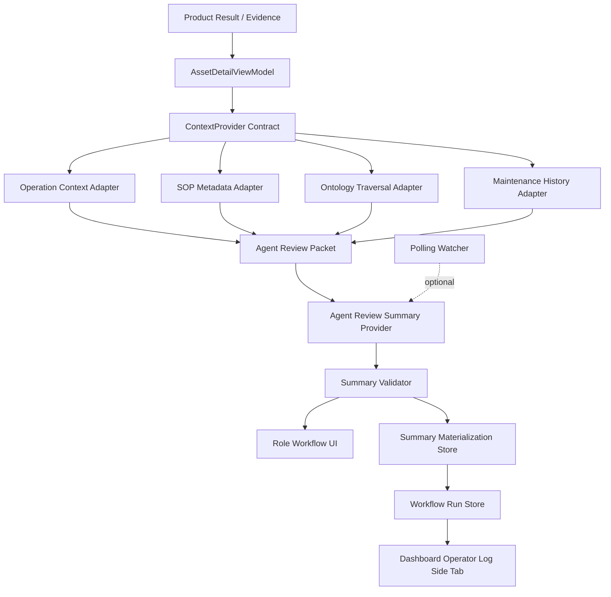

# AI Context Orchestration and Adapter Pipeline Plan

## Problem Frame

PR #130 and the follow-up AI summary slice establish a read-only Agent Review Packet and an LLM summary contract. The next question is not whether the LLM can write a paragraph. It can. The product question is whether the service can keep adding operating domains without making the AI path unstable.

This plan builds on `docs/plans/ai-workflow/2026-08-29-002-product-result-evidence-materialization-plan.md`. That materialization plan defines the trusted Product Result/Evidence boundary before UI, Report, Closed-loop, or AI consumers read prediction outputs. This orchestration plan starts after that boundary and focuses on how AI consumes trusted evidence with adapter-supplied context.

The target architecture is an evidence pipeline where domain adapters supply bounded, cited context; the packet normalizes that context; the LLM produces role-specific summaries; and the validator prevents Closed-loop authority leaks. This keeps the service extensible while preserving the existing ownership split:

```text
Product Result / Evidence
-> Domain Context Adapters
-> Agent Review Packet
-> AI Summary Contract
-> Human Workflow Surface
-> Closed-loop owner decision and mutation APIs
```

## Scope

This plan covers the next architecture slice for AI workflow, SOP/ontology exploration, watcher materialization, and evidence-based evaluation. It does not implement full automation or decide that LangGraph, GraphRAG, or vector RAG must be introduced now.

Current implementation baseline:

- `contracts/schemas/agent-review-packet.schema.json` defines the read-only packet.
- `contracts/schemas/agent-review-summary.schema.json` defines the LLM/deterministic output.
- `systems/backend/app/operations/domain_context_adapters.py` owns the current manufacturing fixture adapter for operation context, SOP guidance, inspection locations, and SOP retrieval.
- `systems/backend/app/operations/agent_review_packet.py` composes packet context from ViewModel and adapter-supplied SOP retrieval.
- `systems/backend/app/operations/agent_review_summary.py` composes deterministic fallback and validates summary output.
- `systems/backend/app/operations/agent_review_summary_provider.py` wraps the LLM provider.
- `systems/backend/app/operations/agent_review_summary_workflow.py` exposes the current lightweight workflow result for watcher execution, including engine identity, bounded retry attempts, terminal status, and read-only consumer readiness.
- `systems/frontend/src/features/operations/overview/OperationsWorkflowOverviewPage.tsx` consumes the summary inline.
- `tests/fixtures/agent_review_packets/` and summary tests provide the first gold traces.

## Requirements

- R1. The AI path must remain read-only. It may summarize, cite, and prepare review language, but must not create WorkOrder, MaintenanceAction, MaintenanceEvent, Replay, or auto approval state.
- R2. Domain context must enter the AI path through adapter-owned contracts, not hidden DB reads inside prompts.
- R3. Role summaries should stay focused on the two Operations roles currently represented in the product surface: `field_operator` and `process_manager`.
- R4. Missing context should be represented as `data_footnotes` or `evidence_gaps`, not as loud main-copy warnings that drown out usable evidence.
- R5. Polling watcher adoption must start at a lightweight materialization level before event/outbox promotion is added.
- R6. SOP RAG and GraphRAG must be treated as expansion paths because the current SOP source is a controlled, structured fixture.
- R7. KG/RDB comparison must control query intent, data scope, and expected answer shape; raw query syntax cannot be the controlled variable because graph and relational stores express traversal differently.
- R8. LLM validation must keep groundedness, boundary compliance, source refs, and role summary shape as release gates.
- R9. Dashboard operators need a side-tab runtime log panel that shows summary generation runs, watcher/manual trigger source, attempt status, and failure reasons without exposing mutation controls.

## Key Technical Decisions

- KTD-1. **Adapter pipeline first, orchestration framework later.** Introduce a `ContextProvider` style contract before LangGraph. The current adapter already exposes multiple context facets: operation context, inspection location, SOP retrieval, spare-part context, and similar-event context. LangGraph becomes useful when those facets turn into independently authorized runtime tools with separate failure/retry boundaries, ordered tool calls, human pauses, or long-running state that is awkward in a service method.
- KTD-2. **Polling watcher starts as materialization, not promotion.** The first watcher should detect new Product Result artifacts and precompute `AgentReviewSummary` rows or files. It should not promote Closed-loop state or trigger approval logic.
- KTD-3. **Event/outbox promotion is deferred.** Outbox is warranted when state transitions must be durable, idempotent, retried, and audited across service boundaries. The current AI summary path is read-only and separates stored-summary reads from generation: `GET /agent-review-summary` returns a stored summary or `pending`, while `POST /agent-review-summary` and watcher execution perform materialization. Cached reads may expose the stored `workflow_run_id` metadata for observability, but they must not start a new run.
- KTD-4. **Ontology remains the backbone.** Ontology should normalize relationships among asset, component, location, failure mode, factor, SOP procedure, and operating context. The LLM should consume these normalized relationships through packet fields, not discover them ad hoc.
- KTD-5. **KG Level 0 is a test footprint.** Do not add a production graph store yet. Add tests or evaluation traces that prove ontology traversal can answer multi-relationship questions better than flat packet fields when such questions appear.
- KTD-6. **RAG is not needed for structured demo SOP.** Current SOP is already structured, versioned, and maturity-gated. RAG becomes valuable when site SOPs arrive as unstructured PDFs, mixed versions, or cross-document procedure sets.
- KTD-7. **Role language is product contract.** Asset IDs, factor keys, and missing-data labels must be mapped into field/operator language before or during summary generation. Technical IDs can remain in `source_refs`.
- KTD-8. **SOP updates are review candidates, not automatic writes.** SOP is a versioned knowledge artifact that can be revised from inspection results, maintenance outcomes, similar-event history, and post-maintenance observations. AI may summarize drift and draft a revision candidate, but it must not overwrite approved SOP content or silently change Closed-loop decision rules.
- KTD-9. **Runtime logs are an operator surface, not a control surface.** The dashboard operator view may show Agent Review Summary run status, trigger source, retry attempts, completion time, and error messages. It must not expose approval, WorkOrder mutation, replay, or SOP-publish actions from the AI log panel.
- KTD-10. **Domain sections before physical ViewModel split.** Keep the public AI input as one `AgentReviewPacket`, but make its domain boundaries explicit through `domain_sections` lineage: risk, operation, maintenance history, inspection, SOP, ontology, and Closed-loop boundary. Do not create separate public ViewModels for each domain until a domain has independent storage, authorization, freshness, retry, or mutation-guard requirements. This preserves one snapshot for UI/Report/AI summaries while still making future adapter/tool decomposition testable.

## Architecture



The important boundary is that adapters gather domain facts, while the packet decides what the LLM is allowed to see. The LLM provider should not have its own domain query power until tool-call evaluation and authorization exist.

## Implementation Units

### U1. Context Provider Contract

- **Status:** Implemented on the PR 140 child branch. `AgentReviewContext` now carries read-only operation context, evidence gaps, source refs, and limitations into Agent Review Packet composition. `AgentReviewPacket.domain_sections` records the current domain-section lineage without splitting the public ViewModel/API shape.
- **Goal:** Define the stable abstraction that lets new domain adapters contribute context to the Agent Review Packet.
- **Files:**
  - `contracts/schemas/agent-review-packet.schema.json`
  - `systems/backend/app/operations/agent_review_packet.py`
  - `systems/backend/app/operations/context_providers.py`
  - `tests/test_agent_review_packet_golden.py`
- **Approach:** Create a small contract around context sections such as `operation_context_summary`, `sop_guidance`, `ontology_context`, `maintenance_history_summary`, and `data_footnotes`. Keep each section source-ref based and read-only.
- **Test Scenarios:**
  - A provider can add context without changing LLM summary schema.
  - A provider that has no evidence returns a typed gap instead of prose.
  - Duplicate source refs are deduplicated in packet output.
  - Provider output cannot add Closed-loop mutation fields.
  - Packet output exposes each assembled domain section with owner, source, packet paths, and `mutation_allowed=false`.
- **Verification:** Golden packets still validate, and a new adapter fixture can be added with only schema/test updates for its section.

### U2. Domain Adapter Registry

- **Status:** Implemented. `DomainReviewContextAdapter` and `ManufacturingFixtureReviewContextAdapter` now own operation context, SOP guidance, inspection location references, SOP retrieval, spare-part candidates, similar-event context, and ontology traversal before `AssetDetailViewModel` and `AgentReviewPacket` consume them. The fixture implementation is internally split into operation, SOP, location, and ontology context adapters while preserving the public packet contract.
- **Goal:** Make domain additions explicit and replaceable rather than hard-coded inside one packet composer.
- **Files:**
  - `systems/backend/app/operations/domain_context_adapters.py`
  - `systems/backend/app/operations/context_providers.py`
  - `systems/backend/app/dependencies.py`
  - `tests/test_operations.py`
- **Approach:** Register adapters from the composition root. The current manufacturing adapter is fixture-backed, read-only, and replaceable; external domains should implement the same adapter surface before adding dynamic plugin loading.
- **Test Scenarios:**
  - Default registry returns operation context for manufacturing demo.
  - Unknown adapter codes fail closed during service construction or packet generation.
  - Adapter exceptions are captured as evidence gaps rather than uncaught UI failures where reasonable.
- **Verification:** `agent_review_packet` behavior remains compatible for GS-002/GS-004/GS-007, a stub adapter test proves ViewModel and packet consumers read adapter-provided operation/SOP/location context, and a responsibility-split test confirms the fixture adapter delegates to separate read-only context roles.

### U3. Polling Watcher Materialization

- **Status:** Implemented. `AgentReviewSummaryWorkflow` wraps the materialization service, each materialization attempt records an `agent_review_workflow_runs` row, summaries store the generating `workflow_run_id`, the watcher emits stage status and an explicit `operating_mode`, `GET /agent-review-summary` is stored-summary lookup only, UI manual regeneration calls the explicit `POST` trigger, and `run_local_live.sh` can start the watcher with bounded polling, bounded retry attempts, optional max iterations, stale-policy reporting, and optional Postgres shutdown for one-shot live checks.
- **Goal:** Decide whether AI summaries should be prepared before the user opens the UI.
- **Files:**
  - `systems/backend/app/operations/agent_review_summary.py`
  - `systems/backend/app/operations/agent_review_summary_workflow.py`
  - `systems/backend/app/operations/service.py`
  - `systems/backend/app/infra/db/migrations.py`
  - `scripts/watch_agent_review_summaries.py`
  - `tests/test_operations.py`
  - `docs/plans/ai-workflow/2026-08-29-001-ai-context-orchestration-adapter-plan.md`
- **Approach:** Start with a Level 0 watcher contract: discover new or changed Product Result artifacts, compute packet checksum, compute summary, validate it, store status, and emit read-only workflow stages. The simple workflow boundary now reports `engine`, `max_attempts`, `attempt_count`, `terminal_status`, retry policy, and per-attempt errors. Do not mutate Closed-loop. Do not introduce event/outbox promotion in this unit.
- **Test Scenarios:**
  - Same artifact checksum is not summarized twice.
  - Provider failure records fallback status and validation errors.
  - New artifact checksum triggers a new summary materialization.
  - Materialized summary is read by UI when fresh; cache miss returns `pending` without LLM or fallback generation.
  - `POST /agent-review-summary` and watcher execution remain explicit materialization triggers; side-view open/tab changes stay cache-only.
  - Each explicit materialization trigger records a workflow run with trigger, engine, status, source/context checksum, and summary key.
  - Summary rows point back to the workflow run that generated them; cached `GET` reads expose that run reference and stored run metadata without starting a new run.
  - Transient materialization service failure retries within the workflow boundary and reports attempt history.
  - Terminal materialization failure blocks `consumer_ready` without creating Closed-loop actions.
  - CLI and workflow output report mode, target scope, stale detection, duplicate summary policy, run-record policy, max attempts, interval, and max iterations.
- **Verification:** Watcher can be run repeatedly without changing domain state and without duplicate summaries. Tests verify explicit materialization creates a workflow run, cached `GET` does not start a run, summary rows retain the generating `workflow_run_id`, cached reads expose the stored run metadata, watcher items report workflow status, and CLI output carries the operating-mode contract. Live smoke verified `gpt-4o-mini` summaries were reused from stored materialization rows.

### U4. SOP / Ontology Exploration Adapter

- **Goal:** Add a controlled exploration path that combines SOP and ontology relationships before considering RAG or KG infrastructure.
- **Files:**
  - `systems/backend/app/operations/sop_retrieval.py`
  - `systems/backend/app/ontology/ontology_service.py`
  - `systems/backend/app/operations/context_providers.py`
  - `tests/test_agent_review_packet_golden.py`
  - `tests/test_agent_review_packet_eval_set.py`
- **Approach:** Implement ontology-backed lookup as an adapter behind packet composition. It should answer relationship questions such as component-to-location, factor-to-component, failure-mode-to-SOP, and SOP maturity gate.
- **Test Scenarios:**
  - GS-004 explains that three factor refs map to one `drive_power` inspection target.
  - A retired or draft SOP is not surfaced as user-facing guidance.
  - A missing SOP match produces a narrow gap or low-emphasis footnote, not an invented procedure.
  - Ontology lookup source refs are preserved in summary output.
- **Verification:** Existing packet/summary evals pass, and at least one test asserts ontology relationship traversal output.

### U5. KG Level 0 Comparison Trace

- **Status:** Implemented and executed as a Level 0 contract trace, not as a production KG store benchmark.
- **Goal:** Leave an evidence trail for whether KG is justified, without adding graph infrastructure prematurely.
- **Files:**
  - `tests/eval/agent_context_questions.jsonl`
  - `tests/eval/agent_context_question_backlog.jsonl`
  - `tests/eval/test_agent_context_retrieval_eval.py`
  - `tests/eval/results/agent_context_retrieval_eval_2026-08-30.json`
  - `docs/plans/ai-workflow/2026-08-29-001-ai-context-orchestration-adapter-plan.md`
- **Approach:** Define functional questions and expected answer facets. Compare the current normalized packet/RDB-style lookup against an ontology traversal adapter. Control variables by keeping the same question set, same fixture scope, same answer schema, and same pass/fail rubric.
- **Test Scenarios:**
  - Single-hop: asset -> component -> field location.
  - Two-hop: factor -> component -> SOP procedure.
  - Extension hop: component -> demo spare-part candidate -> availability status.
  - Extension hop: current event factors -> similar historical event -> prior action/outcome.
  - Boundary: SOP exists but maturity gate blocks user guidance.
  - Missing context: validated Product Evidence gaps remain gaps even when a demo adapter supplies auxiliary history context.
- **Verification:** `tests/eval/test_agent_context_retrieval_eval.py` was executed on 2026-08-30 and passed 6/6 checks. The result artifact records that packet answers and `ontology_context` traversal satisfy the same answer facets for GS-002, GS-004, and GS-007, now including `spare_part_ids` and `similar_event_ids`. This is intentionally not a Cypher/SPARQL-vs-SQL performance benchmark; production KG remains a later decision.
- **Current Data Boundary:** `spare_parts`, `similar_events`, `inspection_locations`, `operation_context`, and structured SOP retrieval are fixture-backed demo adapter context with `assumption_level`, not validated Product Evidence or operational source-of-truth records. They can support read-only AI explanation and KG/RDB comparison design, but must not be used as Closed-loop approval or mutation facts until an explicit current-domain promotion contract exists.
- **Demo Coverage Boundary:** The CNC demo spare-part fixture covers the same component IDs as the CNC inspection-location fixture (`tooling`, `drive_power`, `thermal_path`, `rotating_assembly`). A separate compressor fixture covers representative compressor components (`vibration_path`, `air_supply`, `electrical_supply`, `rotating_assembly`) through a direct adapter contract test. The current `MPT-001` Operations fixture still uses the compatibility input-event shape, so compressor service-level packet coverage is deferred until the compressor input-event contract is split from the CNC sensor envelope.
- **External Reference Basis:** The fixture is standard-aligned, not standards-complete. ISO 14224 frames reliability and maintenance data around equipment, failure, maintenance action, resources used, and downtime categories. MIMOSA OSA-EAI frames exchange of asset registry, condition, maintenance, and reliability information across enterprise systems, including logistics and parts-supplier contexts. ISA-95/IEC 62264 frames enterprise-control integration and the production/logistics boundary. These references support why spare-part candidates and similar-event history are valid read-only decision context, but they do not prove that the current demo fixture is an ISO/MIMOSA/ISA compliant data model.
- **Approved Wording:** Use "standard-aligned demo adapter fixture" or "demo adapter assumption aligned with maintenance/resource/logistics context." Do not use "industry-standard spare-part master," "standards-compliant asset catalog," or "all CNC/compressor parts are covered." For Korean product/docs wording, prefer "표준 정비 데이터 범주와 정렬된 데모 어댑터 근거" and avoid "업계 표준 부품 마스터를 구현했다."
- **Question Backlog:** `agent_context_question_backlog.jsonl` separates current coverage from future KG pressure. Current Level 0 covers component/location/spare/similar-event explanation and read-only boundaries. Level 1 candidates require new source contracts for CMMS work-order history, ERP/WMS inventory lots and supplier lead time, MES/APS schedule impact, structured SOP steps/tools/safety constraints, and multi-asset topology.
- **RDB/KG Comparison Order:** Do not run a speed benchmark yet. With the current fixture size, RDB-style packet projection should trivially win and would not be useful evidence. First expand the question set and source contracts, then compare the same questions under the same answer schema across packet/RDB projection and graph traversal.
- **Domain Loading Decision:** Do not add loading/ingestion logic for newly expanded demo domains until their source contracts exist. Maintenance history is the first promoted non-SOP domain: canonical Closed-loop work-order/activity storage is read back through `MaintenanceHistoryContextProvider` into `AgentReviewPacket`. Inventory, work schedule, MES actuals, and richer SOP step/tool/safety sources remain deferred; pretending their fixture hints are source-of-truth would blur the Product Evidence/Closed-loop trust boundary.
- **Domain Section Decision:** The packet is domain-sectioned before it is physically split. `domain_sections` is the near-term contract for testing ownership and source boundaries. Physical split into separate domain ViewModels or APIs is deferred until a domain needs independent storage/freshness/retry semantics, or until tool trajectory eval proves that runtime tool selection needs domain-specific contracts outside one packet.
- **RDB Migration Timing:** Do not move the spare-part, similar-event, inspection-location, operation-context, or structured SOP demo fixtures into RDB yet. JSON fixture plus adapter is the right current shape because the goal is AI/KG workflow evidence, not operational storage. Move them into an RDB read model when at least one of these becomes true: UI, AI summary, Report, and Closed-loop need to share the same auxiliary context; snapshot consistency must prove that UI and Closed-loop consumed the same context version; watcher diff triggers need `source_updated_at`, `snapshot_hash`, or `materialized_at`; local/live demo needs stored summaries that survive side-view reopens; or a real RDB-vs-KG query comparison requires a relational baseline table. Until then, keep RDB as the current production-style packet baseline and keep demo fixtures as adapter-owned source context.
- **Fixture-to-DB Promotion Evidence Required:** Before moving a fixture domain into DB, add one contract test that proves the domain has a local update trigger and one API/read-model test that proves `source_updated_at` or equivalent version metadata reaches the packet. Static reference domains may remain fixture-backed if their only change path is repository deploy. Dynamic domains should move first in this order: Agent Review Summary store, similar-event history from completed local outcomes, SOP revision candidates, operation-context versions, spare-part candidate versions, and inspection-location reference versions.
- **Current-Domain Update Paths:** Limit near-term update logic to domains already present in this repository: Product Result/Evidence snapshots, Agent Review Summary materialization, Closed-loop recommendations/decisions/work orders/inspection results/maintenance actions/equipment state, structured SOP fixture metadata, inspection-location references, operation-context fixtures, spare-part candidate fixtures, and similar-event fixtures. Do not introduce external CMMS/ERP/MES/SOP repository ingestion as part of this slice.
- **Current-Domain Promotion Criteria:** A current domain can move from fixture-only context to a DB read model only when it has an update trigger already represented in local data. Valid local triggers are: a new Product Result/Evidence snapshot, a changed packet `snapshot_hash`, a Closed-loop inspection result, a completed maintenance event, an equipment-state patch, a similar-event fixture addition, an operation-context fixture version change, a spare-part fixture version change, or an SOP fixture version/hash change.
- **Current-Domain Update Candidates:** The near-term DB-backed update candidates are: persisted AI summary refresh/reuse on packet hash changes; similar-event history appended from completed inspection/maintenance outcomes; SOP revision candidates derived from local inspection results, maintenance events, equipment-state patches, and similar events; spare-part candidate context versioning from fixture updates; operation-context snapshot versioning from fixture updates; and inspection-location reference versioning from fixture updates. These are update candidates for read models or review candidates, not proof of live enterprise integrations.
- **SOP Update Trigger Path:** SOP update pressure should come from local operational evidence, not from a user-facing summary alone. Candidate inputs are Closed-loop inspection results, completed maintenance events, equipment-state patches, similar-event outcomes, repeated missing measurements, and post-maintenance observations already represented by Product Result/Evidence or local fixtures. A future `SOP Review Aggregator` can group these by `sop_id`, component, failure mode, factor key, and time window, then produce a `SOP Revision Candidate` with source refs, observed drift, suggested checklist/threshold changes, confidence, and explicit limitations. The approved SOP version remains a human-owned publish step.
- **SOP Mutation Boundary:** AI workflow may create a read-only SOP revision candidate or review packet. It must not update SOP `maturity`, `effective_from`, `document_hash`, sensor thresholds, checklist text, or Closed-loop approval criteria directly. Existing inspection results must not be retroactively reclassified under a newer SOP version unless a separate migration/audit workflow is explicitly run.
- **RDB Baseline:** `agent_context_rdb_baseline.json` records the current default as `keep_rdb_packet_projection`. It names where RDB/ViewModel projection is sufficient today and where pressure starts: inventory lot/supplier lead time, Closed-loop work-order dedup history, SOP step/tool/safety relationships, and cross-asset topology. The baseline explicitly forbids claiming KG speed or production necessity from the current Operations fixture.
- **KG Level 1 Experiment:** `systems/backend/app/operations/agent_context_graph.py` builds an in-memory graph from the existing read-only packet. It does not add a graph database or runtime dependency. The experiment verifies graph-shaped paths for `PredictionSnapshot -> Factor -> Component -> InspectionLocation/SOP/SparePart/SimilarEvent -> Outcome`, using the same expected answer facets as the packet baseline.

### U6. RAG Decision Gate

- **Status:** Implemented as a lightweight evaluation gate. Runtime RAG remains deferred.
- **Goal:** Capture when RAG becomes worth implementing.
- **Files:**
  - `docs/plans/ai-workflow/2026-08-29-001-ai-context-orchestration-adapter-plan.md`
  - `tests/eval/agent_context_questions.jsonl`
  - `tests/eval/rag_decision_gate.json`
  - `tests/eval/test_agent_context_retrieval_eval.py`
- **Approach:** Keep RAG out of the runtime until there is unstructured SOP content or multi-document retrieval pressure. For now, represent RAG as an adapter-compatible future source.
- **Decision Gate:**
  - Site SOPs arrive as PDFs or free-form docs.
  - Multiple SOP versions overlap for the same component/failure mode.
  - Users need paragraph-level citations from procedures.
  - Structured metadata cannot answer expected SOP questions without manual expansion.
- **Verification:** `rag_decision_gate.json` asserts that the current structured fixture SOP path uses `local_sop_metadata_retriever`, defers vector DB, LlamaIndex runtime retrieval, and GraphRAG runtime storage, and names the pre-adoption evidence required before those dependencies can enter runtime.

### U7. LangGraph Decision Gate

- **Status:** Implemented as a lightweight evaluation gate. Production LangGraph runtime remains deferred behind the workflow boundary.
- **Goal:** Prepare for LangGraph without adding it before orchestration complexity is verified in code.
- **Files:**
  - `systems/backend/app/operations/agent_review_summary_workflow.py`
  - `systems/backend/app/operations/agent_review_summary_provider.py`
  - `systems/backend/app/operations/domain_context_adapters.py`
  - `tests/test_operations.py`
  - `tests/eval/agent_workflow_eval_gate.json`
  - `tests/eval/langgraph_decision_gate.json`
  - `tests/eval/test_agent_context_retrieval_eval.py`
- **Approach:** Keep `AgentReviewSummaryWorkflow` as the public workflow boundary. The current implementation is a simple in-process orchestrator. If LangGraph is introduced, add it behind this boundary rather than changing watcher, UI, or Report consumers.
- **Decision Gate:**
  - The agent must call three or more independent runtime domain tools. Current fixture-backed context facets do not count as independent tools because they are resolved inside one local adapter without separate auth, network failure, retry, or trajectory-eval boundaries.
  - The flow needs durable pause/resume for human review.
  - Retry strategy differs per step and must be observable.
  - Tool trajectory evaluation becomes part of release gates.
  - The service method starts carrying graph-like branching state.
- **Verification:** `langgraph_decision_gate.json` keeps `simple` as the production engine, records `AI_WORKFLOW_ENGINE=langgraph` as an experiment behind `AgentReviewSummaryWorkflow`, and forbids executable Closed-loop commands, mutable WorkOrder state, and approval tools in graph state. `agent_workflow_eval_gate.json` adds the release-facing workflow eval contract: output contract, groundedness, workflow stages, summary reuse, fallback/retry, and Closed-loop boundary must pass before changing the orchestration engine. Tool trajectory remains the first measurable reason to replace the simple engine: different gold scenarios should select different read-only domain tools.

### U8. Read-Only Tool Trajectory Experiment

- **Status:** Implemented as an eval-only experiment. It is not wired into the production watcher or UI path.
- **Goal:** Create code-level evidence for when LangGraph/tool orchestration is useful: not because the summary always needs every domain, but because different situations route to different read-only context tools.
- **Files:**
  - `systems/backend/app/operations/agent_context_tool_pipeline.py`
  - `tests/eval/agent_tool_trajectory_gold.jsonl`
  - `tests/eval/test_agent_tool_pipeline_eval.py`
  - `tests/eval/langgraph_decision_gate.json`
  - `docs/plans/ai-workflow/2026-08-29-001-ai-context-orchestration-adapter-plan.md`
- **Approach:** Add a `SituationQuestionRouter` that reads the trusted Agent Review Packet and chooses only the tools needed for the current situation. Each selected tool returns a bounded slice from the packet: model evidence, maintenance history, operation context, inspection location, structured procedure guidance, ontology neighbors, spare-part candidates, similar-event history, or data-quality hold context. The pipeline records `called_tools`, per-call hashes, source references, read-only flags, retry policy, attempt logs, and forbidden Closed-loop tool names.
- **Retry Boundary:** Retry is owned by the tool pipeline contract, not by LangGraph implicitly. Packet-internal required tools such as model evidence and data-quality hold use `max_attempts=1` and fail the pipeline when invalid. Adapter-like context tools such as operation context, maintenance history, SOP guidance, ontology neighbors, spare-part candidates, and similar-event history use bounded retry and may continue as a gap when the configured fallback behavior allows it. Every call records `attempt_count`, per-attempt error type, retryability, and final `status`.
- **LangGraph Shape:** `run_langgraph_tool_pipeline` executes the same selection, tool execution, and boundary validation steps through LangGraph when the dependency is available. If the dependency is missing, the function falls back to the simple engine and reports `requested_engine=langgraph` plus a fallback reason. This keeps the production path stable while preserving a runnable experiment on environments that have LangGraph.
- **Trajectory Expectations:**
  - Critical CNC drive-power case: model evidence, maintenance history, production impact, field location, ontology neighbors, spare-part candidate, and similar-event history.
  - Warning tooling case: model evidence, maintenance history, field location, structured procedure guidance, ontology neighbors, spare-part candidate, and similar-event history.
  - Data-quality hold case: only data-quality context; no SOP, location, spare-part, similar-event, or Closed-loop mutation tools.
- **Verification:** The trajectory gold set checks expected and forbidden tools per scenario. The pipeline tests verify read-only execution, source-ref subset boundaries, distinct situation-specific tool plans, data-quality fanout suppression, retry success after transient failure, partial completion when an optional context tool exhausts retry, hard failure when a required tool has a non-retryable error, and parity between the simple and experimental LangGraph path. The 2026-08-31 evidence artifact is `tests/eval/results/agent_tool_trajectory_eval_2026-08-31.json`.

### U9. System Admin Runtime Log Side Tab

- **Status:** Implemented as a read-only Operations `System Admin` side tab. This is a UI/observability slice, not an automation or mutation slice.
- **Goal:** Let a system administrator understand whether AI summaries are current, reused, manually regenerated, watcher-generated, partially completed, or failed across the project.
- **Files:**
  - `systems/backend/app/operations/router.py`
  - `systems/backend/app/operations/service.py`
  - `systems/backend/app/infra/db/operations_audit_repository.py`
  - `systems/frontend/src/features/operations/system/OperationsSystemAdminPage.tsx`
  - `systems/frontend/src/features/operations/shell/OperationsShell.tsx`
  - `systems/frontend/src/features/operations/context/OperationsSelectionContext.tsx`
  - `systems/frontend/src/features/operations/overview/OperationsWorkflowOverviewPage.tsx`
  - `systems/frontend/src/features/operations/operations.css`
  - `tests/test_operations.py`
  - `systems/frontend/e2e/operations-frontend-convergence.spec.ts`
- **Approach:** Keep `운영 로그` out of the asset side-view. Add a project-level `System Admin` side tab that reads stored `agent_review_workflow_runs` metadata through a project-scoped read API and renders every run as a terminal-like log line with trigger, status, updated time, engine, asset/event hints, and stage. `상세 보기` opens a read-only dialog with run stage, summary key, source/context hashes, timing, and validation errors. It is read-only.
- **UI Behavior:**
  - `watcher · 완료`: summary was prepared before side-view interaction.
  - `수동 갱신 · 완료`: operator clicked the explicit regeneration control.
  - `부분 완료`: fallback summary was stored after LLM/provider/validation failure.
  - `실패`: no consumer-ready summary was produced; show error type/message only in details.
  - Status filters let the administrator scan all runs, completed runs, partial fallback runs, failed runs, or active runs.
  - Clicking a terminal row opens a small detail panel with trace stage, checksums, validation errors, and failure reason when present.
  - No `승인`, `작업요청 생성`, `되돌리기`, `재시도 실행`, or Closed-loop mutation buttons in this tab.
- **Test Scenarios:**
  - Cached side-view open does not create a new run.
  - Manual regeneration creates a `ui_manual_regeneration` run and the `System Admin` tab shows it.
  - Watcher materialization creates `polling_watcher` runs and the `System Admin` tab shows trigger source.
  - Failed or fallback runs render status and reason without exposing mutation controls.
  - Operator log rows link back to existing summary/run ids without raw prompt or hidden domain DB reads.
- **Verification:** Backend tests prove the read-only workflow-run listing returns runs without triggering a new summary and remains behind the administrator audit permission. Frontend type checking passed. Existing packet/eval tests passed. Browser e2e verifies stored summary reuse, permitted manager manual regeneration, engineer read-only summary access, System Admin terminal rendering, read-only detail disclosure, and absence of Closed-loop mutation controls in the AI runtime log. Docker-backed PostgreSQL replay/integration tests apply migrations against a local PostgreSQL service and verify the persistence path beyond SQLite.

#### LangGraph Implementation Plan

The recommended implementation is not to replace the whole AI path at once. The first LangGraph slice should be a parallel implementation behind the existing workflow boundary:

```text
AgentReviewSummaryWorkflow
  -> SimpleAgentReviewSummaryWorkflow      # current default
  -> LangGraphAgentReviewSummaryWorkflow   # optional engine behind a flag
```

Initial flag:

```text
AI_WORKFLOW_ENGINE=simple    # default
AI_WORKFLOW_ENGINE=langgraph # optional validation path
```

The LangGraph state should contain only read-side data:

```text
project_id
asset_id
dataset_version_id
history_window
snapshot_basis
domain_context
agent_review_packet
summary_candidate
validated_summary
materialization_trace
validation_errors
fallback_reason
```

It must not contain executable Closed-loop commands, mutable WorkOrder state, or approval action tools. Closed-loop data may appear only through `closed_loop_boundary` as read-only context.

Minimum graph nodes:

```text
snapshot_scan
packet_build
context_enrichment
llm_generate
validate_summary
persist_summary
consumer_ready
```

Node-level retry policy:

- `snapshot_scan`: retry for transient DB/read failures; fail fast on missing project/asset.
- `context_enrichment`: adapter failure becomes a typed evidence gap where possible; no mutation retry.
- `llm_generate`: retry with bounded backoff; fallback to deterministic summary after retry exhaustion.
- `validate_summary`: no blind retry for invalid prose; route to deterministic fallback.
- `persist_summary`: retry idempotently with `summary_key`; duplicate key means reuse.
- `consumer_ready`: no domain mutation; report stored materialization status only.

Adoption should happen only after the adapter surface has at least two real sources or one source with independent failure modes, for example SOP document retrieval plus maintenance history or inventory context. Until then the current `SimpleAgentReviewSummaryWorkflow` is the production path.

## Data and Contract Shape

The stable AI-facing contract should stay close to this shape:

```text
AgentReviewPacket
  asset_id
  asset_label
  risk_summary
  model_expression_context
  inspection_targets
  sop_guidance
  operation_context_summary
  ontology_context
  maintenance_history_summary
  evidence_gaps
  source_refs
  closed_loop_boundary

AgentReviewSummary
  title
  summary
  role_summaries[field_operator, process_manager]
  inspection_focus
  data_footnotes
  source_refs
  boundary_note
  validation trace
```

New domains should add adapter output into packet sections, not new prompt-only context. If a field is not mature enough for user display, it should remain in source refs, trace, or footnotes.

### Model and Closed-loop Absorption Check

The packet must preserve all displayable expressions that Backend can trust after Product Result materialization. It should not reduce the model artifact to only `score`, `threshold`, and status when richer model-side explanation is available.

Current state:

- Fixture-built Product Result artifacts preserve `top_factors`, `ranked_factor_evidence`, observation/history windows, sensor evidence, component hypotheses, recommended actions, source fields, evidence gaps, and provenance.
- Generator batch promotion now accepts the optional `results[].explanation` contract from `prediction-result-batch.schema.json`, including `top_factors[]`, `confidence_label`, `explanation_method`, `feature_snapshot_ref`, `sensor_window_ref`, `display_labels`, and checksum-backed factor `source_ref` values.
- Backend materialization absorbs trusted Generator explanation into Product Result `top_factors`, `ranked_factor_evidence`, and `evidence_payload.source_fields` after batch validation. The Backend still owns `status_grade`, policy mapping, and `recommended_action`.
- If Generator explanation is absent, promotion falls back to generic but explicit factors such as `generator_failure_score`, `model_selected_threshold`, `asset_criticality_adjustment`, and `generator_model_artifact_manifest`; this is a safe minimum path, not a synthesized normal explanation.
- Agent Review Packet exposes trusted model expressions through `model_expression_context`, while keeping untrusted raw Generator payloads out of the LLM prompt.

Remaining contract gate before 120-run evaluation:

- Ensure the 8-case Agent Review Packet gold set includes at least one Generator batch explanation case so `model_expression_context.top_factors[].source_ref` and display labels are covered by the LLM eval input set.
- Keep absent expression data as a visible evidence gap or safe generic fallback; do not silently turn it into normal field evidence.
- If future Generator payloads include expression blocks that fail source/checksum validation, record them as unpromoted expression diagnostics before they are eligible for trusted packet exposure.

Closed-loop history should be handled the same way: use existing work-order, inspection-result, maintenance-action, maintenance-event, equipment-state, and activity tables as source records, then project a read-only `maintenance_history_summary` for AI. Do not let AI create or mutate those records.

### Role Summary Completeness Rule

Role-specific AI summaries must not omit high-signal facts already present in the trusted packet. If a role has a relevant field, the first or second sentence should use it directly.

Minimum role mapping:

- `field_operator`: inspection target, field-facing component name, current symptom/factor names, existing work request state, and preparation-only part candidates.
- `process_manager`: production impact, queue/order impact, approval priority, work request state, and whether the same evidence should feed procedure update candidates.

Example when `operation_context_summary.estimated_impact_count=51`, model expressions, and Closed-loop history are available:

```text
공정 관리자용:
4구역 · 2셀 · CNC 가공기 3 위험 감지 건은 점검이 지연될 경우 약 51건의 생산 영향이 예상됩니다. 모델은 구동 토크, 과부하 누적 지표, 모터 출력 변화를 근거로 동력 전달 계통 위험을 높게 봤고, 작업 처리 흐름에는 점검 요청이 이미 접수되어 있습니다. 최근 유사 이력은 8월 12일 1건이라 반복 고장으로 단정하진 않지만, 현재 요청을 우선 승인 검토하고 점검 결과를 다음 표준 점검 절차 갱신 후보에 연결할 수 있습니다.

- 모델 근거: 구동 토크, 과부하 누적 지표, 모터 출력
- 생산 맥락: 점검 지연 시 약 51건 영향
- 작업 처리 흐름: 점검 요청 접수됨
- 유사 이력: 8월 12일 1건
- 조치 경계: AI는 승인이나 작업 생성을 수행하지 않음
```

If production impact is missing from the packet, the process-manager summary may mention the absence only in bullets, not by repeatedly weakening the main prose.

## Polling Watcher Trade-Off

Polling watcher is useful when summaries need to be ready before UI interaction and when LLM latency should not be paid by the user. It also creates an audit trail for provider failures, fallbacks, and stale summaries.

The cost is additional state: checksum, freshness, retry policy, duplicate suppression, and materialization status. That is still much smaller than event/outbox promotion, which introduces durable delivery semantics and cross-service mutation responsibility.

Recommended sequence:

1. Stored-summary read is the canonical UI/Report behavior.
2. Explicit materialization happens through watcher runs or a user-visible manual regeneration control.
3. Each materialization trigger records workflow runtime status and links the summary to the generating run.
4. Add event/outbox only if other services must react durably to summary lifecycle events.

## Next Execution Order

The next implementation order is:

1. **Watcher operating mode.** Stabilize polling interval, target scope, limit behavior, stale detection, retry count, fallback/failure status, and local start/stop expectations. This turns the current runnable watcher into a predictable local/runtime service contract.
2. **Adapter responsibility split.** Refactor the current manufacturing fixture adapter into clearer domain adapter seams such as operation context, standard procedure metadata, maintenance/similar-event history, inspection-location reference, spare-part candidate context, and ontology traversal. Keep the packet schema stable while making replacement points explicit.
3. **LangGraph experiment behind the existing boundary.** Keep `AgentReviewSummaryWorkflow` as the public boundary and `simple` as production default. Add or extend the optional LangGraph path only when it executes the same read-only tool trajectory contract and preserves existing retry/boundary traces.
4. **Final demo scenario.** Lock the field-operator and process-manager walkthrough: watcher prepares a summary, side-view reuses it, manual regeneration creates a visible run, the System Admin side tab shows project-level run history, and Closed-loop mutation remains outside the AI panel.

The System Admin runtime log side tab from U9 should be implemented as part of the watcher operating-mode and final-demo slices. It is valuable because it makes the runtime visible, but it should not reorder the core architecture work or become a control panel.

## RDB vs KG Test Framing

The comparison should not force the same SQL/graph query syntax. That would be a false control variable. The controlled variable should be the same user question, same fixture scope, same expected answer schema, and same acceptance rubric.

Example controlled question:

```text
For EVT-GS-004, explain why three top factors map to one field inspection target,
which location should be checked, and whether SOP guidance is available.
```

RDB-style lookup may answer this through joins or precomposed ViewModel fields. Ontology/KG traversal may answer it through factor -> component -> location -> SOP relationships. The fair comparison is whether the final grounded answer is correct, cited, maintainable, and cheaper to extend.

## Evaluation

Minimum release gates:

- Groundedness: no packet/source-ref unsupported fact.
- Boundary compliance: no Closed-loop mutation, approval, replay, or repair completion claim.
- Role shape: exactly `field_operator` and `process_manager` summaries for Operations workflow.
- Data gap handling: missing data appears as `evidence_gaps` or `data_footnotes`.
- Source refs: every nested summary source ref must exist in packet `source_refs`.
- Workflow observability: `engine`, `attempt_count`, retry policy, and terminal status are emitted for watcher/materialization runs.
- Summary reuse: opening the side view must be able to reuse a stored summary for the same packet snapshot instead of forcing a new LLM call.
- Runtime trigger boundary: UI side-view reads are cache-only; watcher and manual regeneration are the only generation triggers.
- Domain context absorption: role summaries must actually use available operation impact, maintenance history, spare-part candidate, similar-event date, field location, and standard procedure context when those fields are present.
- Snapshot consistency: UI summary and Closed-loop recommendation input must be derived from the same trusted packet snapshot when both consumers are active.

External eval alignment:

- OpenAI contextual eval framing maps to this service as workflow-specific definition of "good": role-specific, grounded, bounded, and reusable summaries.
- LangSmith agent-eval framing maps final-response checks to the current simple workflow. Tool trajectory checks now exist as an eval-only experiment and become release gates only if the production workflow adopts independent runtime tools.
- Azure agent/RAG evaluators map to task completion, tool-call correctness, groundedness, retrieval relevance, and response completeness; only the groundedness and completion-adjacent checks are current Operations gates.
- RAGAS-style context precision/recall remains deferred until SOP content becomes runtime retrieval context rather than structured adapter metadata.

Useful but deferred metrics:

- Retrieval context precision/recall for SOP RAG.
- Tool trajectory accuracy for LangGraph-style agents beyond the current eval-only experiment.
- Natural-language validation evidence for Korean repair/approval/priority/production-loss claims is recorded in `tests/eval/results/agent_summary_validation_eval_2026-08-31.json`.
- Human edit distance and accept-with-edit ratio.
- Summary freshness and stale materialization rate.
- Cost and latency per materialized summary.

## Adoption Gates for LangGraph and RAG Runtime

LangGraph, GraphRAG, Vector DB, and LlamaIndex are not rejected technologies in this workflow. They remain open adoption gates: if their trigger conditions are met, the system can promote them behind the existing packet, workflow, and validation boundaries without changing the AI authority model.

The current production default stays conservative: structured adapter context enters the `AgentReviewPacket`, `AgentReviewSummaryWorkflow` runs as the simple engine, and the validator rejects unsupported or authority-leaking output. This is enough while domain context is resolved inside one service boundary and SOP/ontology context is structured metadata rather than live unstructured retrieval.

LangGraph becomes a production candidate when the workflow needs graph-owned orchestration, not merely because multiple context facets exist. Adoption is justified when independently authorized runtime tools need ordered calls, node-specific retry/resume state, durable human pause/resume, or branching graph state that no longer fits a service method. The current experiment proves the candidate path can preserve the same read-only tool trajectory as the simple engine; it does not yet prove that switching the production watcher/runtime would reduce complexity or risk.

GraphRAG, Vector DB, or LlamaIndex become production candidates when SOP and ontology evidence stop being reliably represented by structured adapter metadata. Adoption is justified when site SOPs arrive as free-form PDFs or overlapping versions, retrieval context precision/recall becomes a release gate, retrieved chunks carry source checksum and freshness metadata, and every retrieval result is bound back to the packet snapshot consumed by UI, Report, AI, and Closed-loop. Until those metrics exist, runtime RAG would add moving evidence without proving better groundedness.

Current limitations:

- The LangGraph gate currently measures tool trajectory parity and boundary behavior, not final Korean summary quality or production watcher reliability.
- The RAG-family gate currently records adoption criteria, but does not yet measure retrieval precision, retrieval recall, source freshness, or chunk-level citation coverage.
- The 120-run LLM evaluation should report that the runtime source is structured adapter context unless a separate retrieval eval passes first.
- PR #154 cost-basis must be merged into `main` and rechecked before final 120-run claims that compare AI summary evidence and Closed-loop recommendation input on the same trusted snapshot.

## Scope Boundaries

Conditionally deferred until adoption gates pass:

- Production GraphRAG store.
- Vector DB or LlamaIndex runtime retrieval.
- LangGraph orchestration runtime as the production watcher engine.
- Event/outbox promotion for summary lifecycle.
- Auto approval of low-importance notifications.
- Closed-loop state mutation from AI summaries.

Outside this feature identity:

- Claiming real downtime reduction without MES and post-maintenance observations.
- Treating SOP fixture guidance as approved site SOP.
- Allowing LLM direct access to arbitrary domain databases.
- Replacing Product Result/Evidence computation with LLM reasoning.

## Field Language Contract

Internal IDs and workflow terms can remain in `source_refs`, audit payloads, and developer diagnostics, but user-facing AI summaries and decision-change rows should map them into field language.

| Internal term | Field-facing term | Display guidance |
| --- | --- | --- |
| `event_id`, `EVT-*` | 위험 감지 건 | Prefer equipment display name plus risk state; keep the raw event ID in detail metadata. |
| `asset_id`, `equipment_id`, `CNC-*` | 설비 | Prefer `equipment.display_name`, for example `4구역 · 2셀 · CNC 가공기 3`. |
| `SOP` | 표준 점검 절차 / 정비 매뉴얼 | Use `표준 점검 절차` for inspection guidance and `정비 매뉴얼` when referring to the broader document artifact. |
| `sop_retrieval` | 관련 표준 점검 절차 조회 | Explain which manual matched the asset, symptom, component, and risk state. |
| `sop_guidance` | 표준 절차 기반 확인 항목 | Use for checklist, inspection method, and replacement-timing review copy. |
| `sensor_judgment.criteria` | 센서 판정 기준 | Use when explaining threshold/checklist review, not as an automatic approval rule. |
| `inspection_location` | 현장 확인 위치 | Tell the operator where to inspect, not which internal contract supplied it. |
| `Closed-loop` | 작업 처리 흐름 | Use for approval, work request, maintenance action, completion, and replay ownership. |
| `recommendation` | 조치 후보 | Keep separate from approval or command execution. |
| `decision` | 관리자 판단 | Use for accept/reject/defer review decisions. |
| `work_order` | 작업 요청 | Use for requested/approved/in-progress/completed work. |
| `maintenance_action` | 정비 작업 | Use only after approval creates a planned/in-progress/completed action. |
| `maintenance_event` | 정비 완료 이력 | Use after completion is recorded. |
| `equipment_state` | 정비 후 설비 상태 | Use for state values updated by approved maintenance completion. |
| `snapshot_hash` | 근거 버전 | Use in detail metadata, one-line change logs, or rollback rows, not prose-heavy main copy. |
| `source_ref` | 근거 출처 | Use in expandable evidence detail, not headline copy. |
| `materialization` | AI 요약 저장/재사용 | Use when explaining why the side view did not call the LLM again. |
| `similar_event` | 유사 이력 | Use for past similar symptom/action/outcome context. |
| `spare_part_candidate` | 참고 부품 후보 | Do not imply inventory availability or purchase lead time. |
| `operation_context` | 생산 맥락 | Use for shift, line load, planned loss, or production-impact wording. |

Decision-change rows should be terse operational logs, not paragraphs. Keep each row to one field-facing change phrase plus only the actions `상세 보기` and, when rollback is supported for that row, `되돌리기`.

```text
- 표준 점검 절차 기준 버전 갱신, AI 요약 재생성  [상세 보기] [되돌리기]
- 유사 이력 1건 추가, 위험 판단 변경 없음  [상세 보기]
- 현장 확인 위치 설명 갱신, 작업 요청 영향 없음  [상세 보기] [되돌리기]
- 생산 맥락 기준 시간창 갱신, 관리자 요약 재계산  [상세 보기] [되돌리기]
- 정비 매뉴얼 개정 후보 생성, 승인 전 미적용  [상세 보기]
```

Summary copy should carry the useful operational answer. Limitations and non-authoritative claims should move below the summary as short bullets, not as repeated sentence endings inside the main copy:

```text
4구역 · 2셀 · CNC 가공기 3은 동력 전달 계통 확인이 우선입니다.
모터 출력, 과부하 누적, 구동 토크가 함께 높아졌고, 같은 계통의 유사 이력이 추가로 확인됐습니다.

- 참고 부품 후보는 점검 준비용입니다.
- 실제 재고나 입고 가능 여부는 이 화면에서 판단하지 않습니다.
- 작업 요청과 관리자 판단은 작업 처리 흐름에서 별도로 기록됩니다.
```

## Sequencing

1. U1 Context Provider Contract.
2. U2 Domain Adapter Registry.
3. U4 SOP / Ontology Exploration Adapter.
4. U5 KG Level 0 Comparison Trace.
5. U3 Polling Watcher Materialization.
6. U6 RAG Decision Gate.
7. U7 LangGraph Decision Gate.

The reason U3 comes after the adapter and ontology work is simple: materializing summaries is only valuable once the context being materialized is stable. Otherwise the watcher just makes unstable payloads faster.

## Open Questions

- Should `ontology_context` be added to the packet as a first-class schema section, or should ontology remain a hidden implementation detail behind `inspection_targets` and `sop_guidance` for one more slice?
- Should materialized summaries be persisted in SQLite/PostgreSQL now, or should a file/checksum trace be enough for Operations review?
- Should role-specific copy be generated by LLM, deterministic templates, or a hybrid where LLM may only rewrite the quote text?
- What is the first non-SOP domain adapter after operation context: inventory, work schedule, MES production actuals, or maintenance history?
