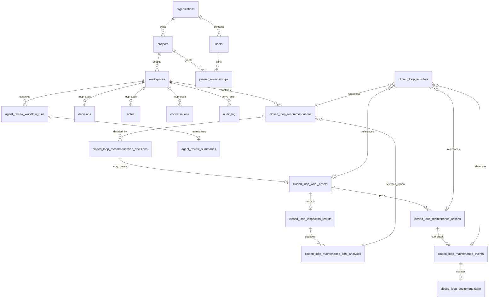

# Workflow and Closed-loop DB Diagram

Current source of truth: SQL migrations under
`systems/backend/migrations/sqlite` and `systems/backend/migrations/postgresql`.

This diagram is scoped to the workflow screen and the Closed-loop state it can
surface or trigger: Identity/Project scope, MVP activity/audit rows, read-only
Agent Review materialization, and Closed-loop Maintenance through inspection,
cost support, recommendation acceptance, work orders, maintenance actions,
maintenance events, and equipment-state updates.

Product Result/Evidence artifacts are referenced by lineage IDs in Closed-loop
tables; they are not modeled here as direct relational parents.

Included:

- Workflow access and scope: organization, project, workspace, user, project
  membership, project membership roles.
- Workflow activity surfaces: decisions, notes, conversations, audit log.
- Agent Review runtime: workflow runs and stored summaries.
- Closed-loop domain: recommendations, recommendation decisions, work orders,
  inspection results, cost analyses, maintenance actions, maintenance events,
  equipment state, and idempotency records.

Excluded:

- Dashboard template/editor tables.
- Dataset ingestion/materialization internals.
- Ontology object/link projection internals.
- Predictive-maintenance runtime result tables, except where Closed-loop stores
  Product Result/Evidence lineage IDs.

## High-Level Runtime Flow

## Detailed Mermaid ERD

```mermaid
erDiagram
  organizations {
    TEXT id PK
    TEXT name
    TEXT status
    TEXT created_at
  }

  projects {
    TEXT id PK
    TEXT organization_id FK
    TEXT name
    TEXT slug
    TEXT status
    TEXT created_at
  }

  workspaces {
    TEXT id PK
    TEXT organization_id FK
    TEXT project_id FK
    TEXT display_name
    TEXT created_at
  }

  users {
    TEXT id PK
    TEXT organization_id FK
    TEXT email
    TEXT display_name
    TEXT status
    TEXT created_at
  }

  project_memberships {
    TEXT user_id FK
    TEXT project_id FK
    TEXT status
    TEXT created_at
  }

  project_membership_roles {
    TEXT user_id FK
    TEXT project_id FK
    TEXT role_code FK
    TEXT created_at
  }

  decisions {
    TEXT decision_id PK
    TEXT event_id
    TEXT actor
    TEXT decision
    TEXT note
    TEXT created_at
  }

  notes {
    TEXT note_id PK
    TEXT event_id
    TEXT actor
    TEXT note
    TEXT created_at
  }

  conversations {
    TEXT conversation_id PK
    TEXT event_id
    TEXT actor
    TEXT message
    TEXT created_at
  }

  audit_log {
    TEXT audit_id PK
    TEXT event_id
    TEXT activity_type
    TEXT actor
    TEXT payload_json
    TEXT created_at
  }

  agent_review_workflow_runs {
    TEXT workflow_run_id PK
    TEXT trigger
    TEXT engine
    TEXT status
    TEXT organization_id
    TEXT project_id
    TEXT workspace_id
    TEXT asset_id
    TEXT event_id
    TEXT dataset_version_id
    TEXT history_window
    TEXT summary_key
    TEXT source_sha256
    TEXT context_sha256
    TEXT packet_schema_version
    TEXT prompt_version
    TEXT model_version
    TEXT started_at
    TEXT completed_at
    TEXT updated_at
    TEXT error_type
    TEXT error_message
    TEXT trace_json
  }

  agent_review_summaries {
    TEXT summary_id PK
    TEXT summary_key UK
    TEXT workflow_run_id
    TEXT organization_id
    TEXT project_id
    TEXT workspace_id
    TEXT asset_id
    TEXT event_id
    TEXT dataset_version_id
    TEXT history_window
    TEXT packet_schema_version
    TEXT summary_schema_version
    TEXT prompt_version
    TEXT model_version
    TEXT source_sha256
    TEXT status
    TEXT fallback_reason
    TEXT snapshot_basis_json
    TEXT summary_json
    TEXT trace_json
    TEXT generated_at
    TEXT created_at
    TEXT updated_at
  }

  closed_loop_recommendations {
    TEXT recommendation_id PK
    TEXT organization_id
    TEXT project_id
    TEXT workspace_id
    TEXT event_id
    TEXT asset_id
    TEXT equipment_id
    TEXT asset_type
    TEXT recommendation_origin
    TEXT status
    TEXT materialization_strategy
    TEXT source_action_id
    TEXT source_product_result_id
    TEXT source_evidence_id
    TEXT source_schema_version
    TEXT source_policy_version
    TEXT label
    TEXT kind
    INTEGER requires_human_approval
    TEXT basis_json
    TEXT source_inspection_work_order_id
    TEXT source_inspection_reference
    TEXT action_code
    TEXT authored_by
    TEXT authored_at
    TEXT source_cost_analysis_id FK
    TEXT source_cost_option_id
    TEXT source_action_candidate_id
    TEXT created_at
    TEXT updated_at
  }

  closed_loop_recommendation_decisions {
    TEXT decision_id PK
    TEXT organization_id
    TEXT project_id
    TEXT workspace_id
    TEXT event_id
    TEXT recommendation_id FK
    TEXT disposition
    TEXT actor_id
    TEXT note
    TEXT decided_at
    TEXT created_at
  }

  closed_loop_work_orders {
    TEXT work_order_id PK
    TEXT organization_id
    TEXT project_id
    TEXT workspace_id
    TEXT event_id
    TEXT asset_id
    TEXT equipment_id
    TEXT asset_type
    TEXT work_type
    TEXT status
    TEXT idempotency_key
    TEXT authorization_json
    TEXT created_at
    TEXT updated_at
  }

  closed_loop_inspection_results {
    TEXT inspection_result_id PK
    TEXT organization_id
    TEXT project_id
    TEXT workspace_id
    TEXT work_order_id FK
    TEXT event_id
    TEXT asset_id
    TEXT equipment_id
    TEXT asset_type
    TEXT outcome
    TEXT checklist_json
    TEXT measurements_json
    TEXT findings_json
    TEXT note
    TEXT recorded_by
    TEXT recorded_at
    TEXT created_at
  }

  closed_loop_maintenance_cost_analyses {
    TEXT analysis_id PK
    TEXT organization_id
    TEXT project_id
    TEXT workspace_id
    TEXT event_id
    TEXT asset_id
    TEXT equipment_id
    TEXT inspection_work_order_id FK
    TEXT inspection_result_id FK
    TEXT action_candidate_id
    TEXT action_code
    TEXT calculation_status
    TEXT result_json
    TEXT request_idempotency_key
    TEXT request_fingerprint
    TEXT created_by
    TEXT calculated_at
    TEXT created_at
  }

  closed_loop_maintenance_actions {
    TEXT maintenance_action_id PK
    TEXT organization_id
    TEXT project_id
    TEXT workspace_id
    TEXT work_order_id FK
    TEXT event_id
    TEXT asset_id
    TEXT equipment_id
    TEXT recommendation_id FK
    TEXT recommendation_decision_id FK
    TEXT simulation_session_id
    TEXT action_code
    INTEGER lifecycle_state_version
    TEXT status
    TEXT idempotency_key
    TEXT started_at
    TEXT completed_at
    TEXT restart_at
    TEXT created_at
    TEXT updated_at
  }

  closed_loop_maintenance_events {
    TEXT maintenance_event_id PK
    TEXT organization_id
    TEXT project_id
    TEXT workspace_id
    TEXT maintenance_action_id FK
    TEXT work_order_id FK
    TEXT event_id
    TEXT asset_id
    TEXT equipment_id
    TEXT recommendation_id
    TEXT recommendation_decision_id
    TEXT simulation_session_id
    TEXT action_code
    TEXT state_patch_json
    TEXT maintenance_started_at
    TEXT completed_at
    TEXT outcome
    TEXT created_at
  }

  closed_loop_equipment_state {
    TEXT organization_id
    TEXT project_id
    TEXT workspace_id
    TEXT equipment_id
    INTEGER state_version
    TEXT state_json
    TEXT last_maintenance_event_id FK
    TEXT updated_at
  }

  closed_loop_activities {
    TEXT activity_id PK
    TEXT organization_id
    TEXT project_id
    TEXT workspace_id
    TEXT event_id
    TEXT equipment_id
    TEXT recommendation_id
    TEXT work_order_id
    TEXT maintenance_action_id
    TEXT maintenance_event_id
    TEXT aggregate_type
    TEXT aggregate_id
    TEXT activity_type
    TEXT actor_user_id
    TEXT actor_display_name
    TEXT before_status
    TEXT after_status
    INTEGER timeline_order
    TEXT payload_json
    TEXT created_at
  }

  closed_loop_idempotency_records {
    TEXT organization_id
    TEXT project_id
    TEXT workspace_id
    TEXT idempotency_key
    TEXT command_type
    TEXT request_fingerprint
    TEXT state
    TEXT response_json
    TEXT last_error
    TEXT created_at
    TEXT updated_at
  }

  organizations ||--o{ projects : owns
  organizations ||--o{ users : contains
  organizations ||--o{ workspaces : scopes
  projects ||--o{ workspaces : contains
  projects ||--o{ project_memberships : grants
  users ||--o{ project_memberships : joins
  project_memberships ||--o{ project_membership_roles : has

  workspaces ||--o{ decisions : mvp_activity
  workspaces ||--o{ notes : mvp_activity
  workspaces ||--o{ conversations : mvp_activity
  workspaces ||--o{ audit_log : mvp_activity

  workspaces ||--o{ agent_review_workflow_runs : logs
  agent_review_workflow_runs ||--o| agent_review_summaries : produces

  workspaces ||--o{ closed_loop_recommendations : scopes
  closed_loop_recommendations ||--o{ closed_loop_recommendation_decisions : has
  closed_loop_recommendation_decisions ||--o| closed_loop_work_orders : authorizes
  closed_loop_work_orders ||--o| closed_loop_inspection_results : completes
  closed_loop_inspection_results ||--o{ closed_loop_maintenance_cost_analyses : bases
  closed_loop_maintenance_cost_analyses ||--o{ closed_loop_recommendations : cost_lineage
  closed_loop_work_orders ||--o{ closed_loop_maintenance_actions : plans
  closed_loop_recommendations ||--o{ closed_loop_maintenance_actions : recommends
  closed_loop_recommendation_decisions ||--o{ closed_loop_maintenance_actions : accepts
  closed_loop_maintenance_actions ||--o| closed_loop_maintenance_events : emits
  closed_loop_work_orders ||--o{ closed_loop_maintenance_events : records
  closed_loop_maintenance_events ||--o| closed_loop_equipment_state : updates
  closed_loop_recommendations ||--o{ closed_loop_activities : references
  closed_loop_work_orders ||--o{ closed_loop_activities : references
  closed_loop_maintenance_actions ||--o{ closed_loop_activities : references
  closed_loop_maintenance_events ||--o{ closed_loop_activities : references
```

## Boundary Notes

- `closed_loop_recommendations.source_product_result_id` and
  `source_evidence_id` point to Product Result/Evidence lineage, not to a
  parent table in this diagram.
- `agent_review_summaries.summary_json` is a stored read-only LLM/fallback
  summary. It is keyed by `summary_key`, `source_sha256`, and
  `context_sha256`; it is not embedded in `AssetDetailViewModel`.
- `closed_loop_maintenance_cost_analyses` is append-only decision support.
  Recommendation acceptance and Work Order creation stay in the Closed-loop
  command tables.
- `closed_loop_activities` is an audit/timeline projection. It stores nullable
  references to multiple aggregate types rather than strict foreign keys for
  every column.
