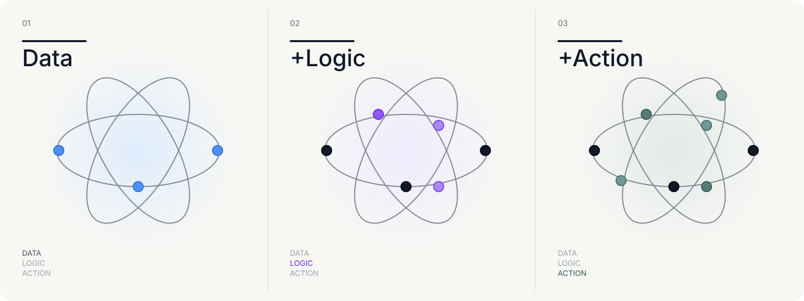

# UI interaction polish reference register

Created: 2026-08-03

This directory records the user-provided visual references and the implementation-safe derivative used for the next UI session.

## User-provided attachments

| ID | Conversation file ID | Original dimensions | Purpose |
|---|---|---:|---|
| A | `file_0000000037588209b2fd6b1e130eeb28` | 2048×1285 | Current Dashboard density, typography inconsistency, board chrome and left context rail review |
| B | `file_0000000025108209932a49e2a822861f` | 2048×1285 | Current sign-in screen typography, scale and empty-space review |
| C | `file_0000000006788209b41953e35ebe03fe` | 1648×622 | `Data → Logic → Action` lifecycle animation concept |

The connector cannot directly copy conversation binary attachments into the local checkout. Attachment A has an equivalent committed project capture at:

```text
docs/ui/palantir-overhaul/final/1440x1000/dashboard.png
```

Attachment B should be re-captured from the current `/login` route before implementation so the exact checked-out code becomes the baseline.

Attachment C is represented locally by this original, logo-free reconstruction:

```text
docs/ui/interaction-polish-reference/data-logic-action-orbit-reconstruction.svg
```



## Usage and rights boundary

- The user-provided image is a visual behavior reference, not a production asset license.
- Do not include Palantir logos, proprietary fonts, copied website bundles, or the exact source artwork in the product.
- Implement the loader as original SVG/CSS/React animation using the Ontology Dashboard brand and tokens.
- `Data`, `Logic`, and `Action` may be used as generic lifecycle terms.
- The animation must support `prefers-reduced-motion` and a static fallback.

## Visual observations

### Current Dashboard

- Small labels, table cells, board metadata and toolbar text use visibly different scales.
- Some text falls below a comfortable reading size while other headings dominate.
- Board headers and runtime metadata do not share one consistent type hierarchy.
- The interface needs a user-facing display-size control instead of a hidden binary density toggle.

### Current sign-in screen

- The centered form is visually disconnected from the large canvas.
- The left rail, top bar, form heading, field labels, helper copy and footer use too many unrelated font sizes.
- A global type scale and line-height system should apply to unauthenticated screens as well as Workbenches.

### Lifecycle loader

- Three progressive phases: Data, Logic and Action.
- Orbit lines remain continuous while nodes, glow and active text advance through each phase.
- The sequence should loop smoothly without pretending to show exact percentage progress.
- The primary implementation should be lightweight SVG/CSS; animated GIF/WebP is only a fallback/export format.
